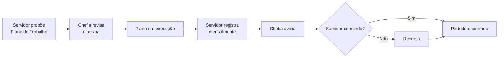
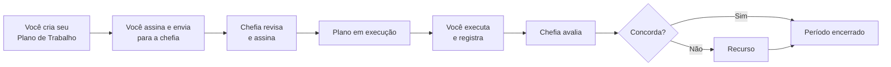
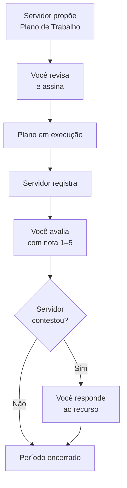
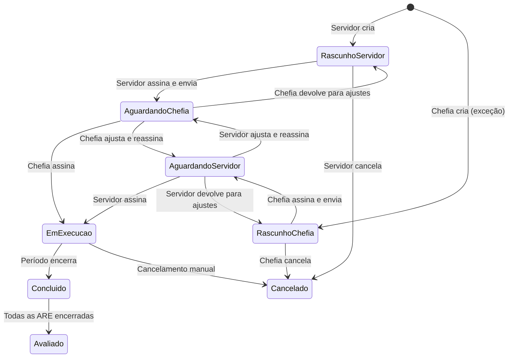

# Plano — Atualização da documentação para Pactuação Bilateral

> **Insumo da Fase 12** do plano `portal/_plan/pactuacao-frontend-impl.md`. Os 3 subagentes (A: seed, B: capture, C: docs) executam o que está aqui especificado.

---

## Resumo executivo

O backend e frontend já entregam o workflow novo de **pactuação bilateral** do Plano de Trabalho:

- Servidor é o **autor padrão** do PT (criar → assinar → enviar). Chefia é exceção.
- 8 status novos no PT (`RASCUNHO_PARTICIPANTE`, `RASCUNHO_CHEFIA`, `AGUARDANDO_ASSINATURA_*`, `EM_EXECUCAO`, `CONCLUIDO`, `AVALIADO`, `CANCELADO`).
- Rotas novas: `/meu-plano/criar`, `/meu-plano/[id]/editar`, `/meu-plano/[id]/revisar`, `/equipe/planos-trabalho/[id]/revisar`, `/equipe/planos-trabalho/[id]/editar` (+ ajustes no `/equipe`, `/equipe/planos-trabalho/novo`, dashboard).
- Componentes novos: `OwnershipBanner`, `AssinaturaCard`, `EdicoesTimeline`, `CloneDialog`, `StatusBadge V2`.

A docs atual (24 páginas, 22 PNGs) descreve **o fluxo antigo** ("chefia cria PT, servidor só executa"). É preciso reescrever as páginas de servidor e chefia, recapturar ~13 screenshots novos, ajustar o seed para gerar dados visualmente ricos (audit logs, plano anterior da Ana, persona em estado "AGUARDANDO_ASSINATURA_PARTICIPANTE") e adicionar 3 páginas novas.

**Volume estimado:**
- **9 páginas markdown** atualizadas + **5 páginas novas** + **1 renomeada**
- **13 screenshots novos**, **2 substituídos** (mesmo path, conteúdo diferente)
- **6 mudanças no `seed_demo.py`** (1 persona nova, 1 plano histórico, audit logs sintéticos, 1 PT em AGUARDANDO_ASSINATURA_PARTICIPANTE)
- **1 mudança grande no `capture-screenshots.ts`** (+ ~13 capturas, novos personas)
- **1 atualização no `mkdocs.yml`** (nav)

---

## Seção 1 · Auditoria do estado atual

### 1.1 Páginas markdown existentes

| Página | Cobre | Status |
|---|---|---|
| `index.md` | Home com cards por papel | **Manter** (sem mudanças) |
| `sobre/pgd-libre.md` | Proposta de valor, base legal, stack | **Atualizar** (mencionar pactuação bilateral como diferencial) |
| `conceitos/programa.md` | Ciclo PGD (diagrama "plano → registro → avaliação") | **Atualizar** (diagrama: pactuação bilateral antes do registro) |
| `conceitos/papeis.md` | O que cada papel pode fazer | **Atualizar** (servidor agora cria PT; chefia revisa/assina) |
| `conceitos/glossario.md` | Termos do PGD | **Atualizar** (+entradas: Pactuação, Rascunho, Assinatura, Diff) |
| `demo/acesso.md` | Como logar, lista de personas, organograma | **Atualizar** (adicionar Felipe; revisar estados de Lucas, Pedro, Ana) |
| `demo/jornada-servidor.md` | Jornadas 1-2 (registrar, contestar) | **Reescrever** (começa pela criação do PT, depois registrar) |
| `demo/jornada-chefia.md` | Jornadas 3-6 (avaliar, recurso, criar, convocar) | **Reescrever** (focar revisão/assinatura; criar vira jornada de exceção) |
| `demo/jornada-gestor.md` | Jornadas 7-9 (PE, relatório, admin) | **Manter** (não há mudança no fluxo de gestor) |
| `servidor/visao-geral.md` | O que servidor faz, dashboard | **Atualizar** (diagrama com criar→assinar→executar; dashboard novo) |
| `servidor/meu-plano.md` | Visualização do plano ativo | **Atualizar** (incluir estado vazio + status de pactuação + ownership) |
| `servidor/registrar-execucao.md` | Tutorial de registro | **Manter** (só ajustar pré-condição "plano em EM_EXECUCAO") |
| `servidor/avaliacoes.md` | Notas, página de avaliação | **Manter** |
| `servidor/contestar-avaliacao.md` | Recurso | **Manter** |
| `servidor/referencia-rapida.md` | Cheat sheet | **Atualizar** (novos status de PT, ações da pactuação) |
| **NOVA** `servidor/criar-plano.md` | Wizard `/meu-plano/criar` | **Criar** |
| **NOVA** `servidor/revisar-plano.md` | Revisar ajustes da chefia, assinar/devolver | **Criar** |
| **NOVA** `servidor/clonar-plano.md` | Reaproveitar plano anterior via `CloneDialog` | **Criar** (pode ficar como seção de `criar-plano.md` se ficar pequeno) |
| `chefia/visao-geral.md` | O que chefia faz, dashboard | **Atualizar** (foco em revisar/assinar; criar vira exceção) |
| `chefia/minha-equipe.md` | Tabela de equipe, badges | **Atualizar** (banner "X aguardando assinatura"; badges V2) |
| `chefia/criar-plano.md` | Wizard 5 passos | **Renomear → `chefia/criar-plano-excecao.md`** + reescrever (caso exceção) |
| `chefia/avaliar-registros.md` | Avaliação de ARE | **Manter** |
| `chefia/responder-recurso.md` | Resposta a recurso | **Manter** |
| `chefia/emitir-convocacao.md` | Convocação | **Manter** |
| `chefia/referencia-rapida.md` | Cheat sheet | **Atualizar** (novos badges + ações de pactuação) |
| **NOVA** `chefia/revisar-plano.md` | Revisar PT do servidor, assinar/devolver | **Criar** |
| `gestor/visao-geral.md` | Papel do gestor | **Manter** |
| `gestor/dashboard.md` | KPIs do gestor | **Manter** |
| `gestor/aprovar-planos.md` | Aprovar PE | **Manter** |
| `gestor/conformidade.md` | Sync API | **Manter** |
| **NOVA** `conceitos/pactuacao-bilateral.md` | Conceito + diagrama de estados + base legal | **Criar** |
| **NOVA (opcional)** `chefia/aguardando-acao.md` | Card de dashboard "X PTs aguardando" | **Criar** somente se conteúdo não couber no dashboard.md de gestor; provavelmente não é necessário. |

**Totais:** 9 atualizar, 5 criar (4 confirmados + 1 condicional), 1 renomear, 9 manter.

### 1.2 Screenshots existentes

| Arquivo | Referenciado em | Status |
|---|---|---|
| `demo/dashboard-servidor.png` | `demo/jornada-servidor.md` | **Refazer** (dashboard com card "Aguardando sua ação") |
| `demo/dashboard-chefia.png` | `demo/jornada-chefia.md` | **Refazer** (banner consolidado "X aguardando assinatura") |
| `demo/dashboard-gestor.png` | `demo/jornada-gestor.md` | **Manter** |
| `admin/participantes.png` | `demo/jornada-gestor.md` | **Manter** |
| `admin/institucional.png` | `demo/jornada-gestor.md` | **Manter** |
| `chefia/dashboard.png` | `chefia/visao-geral.md` | **Refazer** (card "aguardando ação") |
| `chefia/minha-equipe.png` | `chefia/minha-equipe.md` | **Refazer** (badges V2 + banner + linha com action) |
| `chefia/participante-detalhe.png` | `chefia/minha-equipe.md` | **Manter** (a tela mudou pouco) |
| `chefia/avaliar-registros.png` | `chefia/avaliar-registros.md` | **Manter** |
| `chefia/criar-plano-passo1.png` | `chefia/criar-plano-excecao.md` (renomeada) | **Refazer** (com passo 0 de confirmação de exceção visível) |
| `chefia/criar-plano-contribuicoes.png` | `chefia/criar-plano-excecao.md` | **Manter** |
| `chefia/criar-plano-confirmacao.png` | `chefia/criar-plano-excecao.md` | **Manter** (com label "Assinar e enviar para servidor") |
| `servidor/dashboard.png` | `servidor/visao-geral.md` | **Refazer** (com card "Aguardando sua ação") |
| `servidor/meu-plano.png` | `servidor/meu-plano.md` | **Refazer** (com OwnershipBanner se houver plano em pactuação) |
| `servidor/registrar-execucao.png` | `servidor/registrar-execucao.md` | **Manter** |
| `servidor/avaliacao-detalhe.png` | `servidor/avaliacoes.md` | **Manter** |
| `servidor/contestar-avaliacao.png` | `servidor/contestar-avaliacao.md` | **Manter** |
| `servidor/notificacoes.png` | `servidor/visao-geral.md` | **Manter** |
| `gestor/dashboard.png` | `gestor/visao-geral.md`, `gestor/dashboard.md` | **Manter** |
| `gestor/relatorios.png` | `gestor/dashboard.md` | **Manter** |
| `gestor/conformidade.png` | `gestor/conformidade.md` | **Manter** |
| `gestor/aprovar-planos-detalhe.png` | `gestor/aprovar-planos.md` | **Manter** |

**Totais:** 7 refazer (mesmo path, novo conteúdo), 13 manter, 0 obsoleto-deletar.

### 1.3 Screenshots a CRIAR (novos paths)

Confirmando a Fase 11.4 do plano-mãe, ajustada após a auditoria:

| # | Arquivo (novo) | Persona / contexto | Rota / interação |
|---|---|---|---|
| 1 | `servidor/meu-plano-vazio.png` | Felipe Costa (sem PT) | `/meu-plano` (branch estado vazio com 2 CTAs + asides) |
| 2 | `servidor/criar-plano-passo1.png` | Felipe | `/meu-plano/criar` step 1 (período + vínculo PE) |
| 3 | `servidor/criar-plano-contribuicoes.png` | Felipe | `/meu-plano/criar` step 4 (contribuições) |
| 4 | `servidor/criar-plano-revisao.png` | Felipe | `/meu-plano/criar` step 5 (revisão + CTA "Assinar e enviar") |
| 5 | `servidor/clonar-modal.png` | Ana Silva | `/meu-plano` com `CloneDialog` aberto |
| 6 | `servidor/editar-rascunho.png` | Lucas (PT em RASCUNHO_PARTICIPANTE) | `/meu-plano/[id]/editar` (OwnershipBanner + auto-save + timeline) |
| 7 | `servidor/revisar-ajuste.png` | Felipe (PT em AGUARDANDO_ASSINATURA_PARTICIPANTE) | `/meu-plano/[id]/revisar` (banner + AssinaturaCard + diff "chefia ajustou X") |
| 8 | `servidor/dashboard-aguardando.png` | Felipe (PT aguarda assinatura dele) | `/` (card "Aguardando sua ação" destacado) |
| 9 | `chefia/equipe-banner-pendentes.png` | Carlos | `/equipe` com banner consolidado + badges V2 |
| 10 | `chefia/revisar-pt.png` | Carlos revisando PT do Pedro | `/equipe/planos-trabalho/[id]/revisar` (OwnershipBanner + leitura + AssinaturaCard) |
| 11 | `chefia/assinatura-card.png` | Carlos | recorte (`AssinaturaCard.svelte` com 3 checks marcados, botão habilitado) |
| 12 | `chefia/novo-pt-excecao.png` | Carlos | `/equipe/planos-trabalho/novo` step 0 (card de confirmação de exceção) |
| 13 | `chefia/dashboard-aguardando.png` | Carlos | `/` (card "X PTs aguardando sua assinatura") |

**Total: 13 PNGs novos + 7 refeitos = 20 capturas a (re)gerar.**

Capturas mobile (`mobile/*.png`) ficam **fora desta primeira leva** — a docs ainda não tem seção mobile e priorizar isso bloqueia entrega. Adicionar como TODO no `mkdocs.yml` comentado.

---

## Seção 2 · Mapeamento das mudanças de jornada

### 2.1 Antes vs. Depois (narrativa)

**Antes** (atual nas docs):
1. Chefia cria o PT no wizard `/equipe/planos-trabalho/novo` (5 passos).
2. PT vai para status "Aprovado" → "Em execução" imediatamente.
3. Servidor recebe notificação, executa, registra mensalmente.
4. Chefia avalia; servidor pode contestar.

**Depois** (workflow novo):
1. **Servidor** (padrão) cria o PT em `/meu-plano/criar`. Pode também **clonar** um plano anterior via `CloneDialog`.
2. PT nasce em `RASCUNHO_PARTICIPANTE`. Servidor edita livremente em `/meu-plano/[id]/editar` (auto-save).
3. Servidor clica "Assinar e enviar para chefia". PT vai para `AGUARDANDO_ASSINATURA_CHEFIA`.
4. **Chefia** recebe notificação. Em `/equipe`, vê banner "X PTs aguardando sua assinatura" e badge V2.
5. Em `/equipe/planos-trabalho/[id]/revisar`, chefia:
   - **Assina** (3 checks + botão) → status vai para `EM_EXECUCAO`. Plano pactuado.
   - **Devolve para ajustes** → status volta para `RASCUNHO_PARTICIPANTE`, servidor reedita.
   - **Ajusta diretamente** → status vai para `AGUARDANDO_ASSINATURA_PARTICIPANTE`, servidor reassina.
6. **Caso exceção** (servidor ausente, recém-chegado, etc.): chefia cria em `/equipe/planos-trabalho/novo`. Wizard ganha step 0 de confirmação de exceção. PT termina em `AGUARDANDO_ASSINATURA_PARTICIPANTE` → servidor assina em `/meu-plano/[id]/revisar`.
7. Após PT em `EM_EXECUCAO`, o ciclo de registro/avaliação/recurso é o mesmo (não muda).

### 2.2 Implicações por persona

**Servidor** (impacto alto):
- Ganha 3 rotas novas: criar, editar (rascunho), revisar (ajuste da chefia).
- Dashboard mostra card "Aguardando sua ação" quando PT está em RASCUNHO_PARTICIPANTE ou AGUARDANDO_ASSINATURA_PARTICIPANTE.
- Conceito novo a aprender: **assinatura** (3 checks + texto explicativo).
- Conceito novo: **histórico de edições** (`EdicoesTimeline`).
- Conceito novo: **clonar** plano anterior.
- Conceito novo: estados de "rascunho" e "aguardando assinatura".

**Chefia** (impacto médio):
- Fluxo padrão muda de "criar" para "revisar e assinar".
- Wizard de criação vira caminho de exceção (ainda existe, mas com step 0 explicando).
- Tela `/equipe` ganha banner consolidado de pendências + badges V2.
- Pode **devolver** o PT para ajustes (zera assinatura do outro lado) ou **ajustar diretamente** (vai para AGUARDANDO_ASSINATURA_PARTICIPANTE).
- Mesmo workflow de avaliação/recurso depois.

**Gestor** (impacto zero):
- Nenhuma mudança no fluxo de aprovação de PE, conformidade, relatórios.
- Pode mencionar tangencialmente: relatório "Servidores sem PT" agora reflete melhor a realidade (servidor cria, então a contagem fica baixa rapidamente).

**Admin** (impacto zero):
- Sem mudanças (não há novas tabelas de admin; estados de PT são monitorados pela conformidade já existente).

---

## Seção 3 · Mudanças no `seed_demo.py`

### 3.1 Justificativa geral

O seed atual já tem:
- **Lucas** em `RASCUNHO_PARTICIPANTE` (perfeito para `editar-rascunho.png`).
- **Pedro** em `AGUARDANDO_ASSINATURA_CHEFIA` (perfeito para `chefia/revisar-pt.png`).
- **Ana, João, Carla** em `EM_EXECUCAO`.

**Faltam:**
1. Persona em `AGUARDANDO_ASSINATURA_PARTICIPANTE` (para `servidor/revisar-ajuste.png` + diff).
2. Plano anterior CONCLUIDO/AVALIADO da Ana (para card "Planos anteriores" + `CloneDialog`).
3. Audit logs sintéticos no PT do Lucas (ou Pedro) para popular `EdicoesTimeline` em screenshots de edição/revisão.
4. Persona "Felipe" sem PT para ilustrar estado vazio + criar do zero.

### 3.2 Diff resumido

Bloco 1 — **Nova persona Felipe** (após Lucas, ~linha 152):

```python
u_felipe = User(
    email="servidor6@pgd-demo.gov.br", name="Felipe Costa",
    role=UserRole.SERVIDOR, cod_unidade_autorizadora=COD_AUTORIZADORA,
)
```

Adicionar `u_felipe` ao `session.add_all([...])` no §1.

Bloco 2 — **Participante Felipe** (após Lucas, ~linha 270):

```python
p_felipe = _participante(
    "Felipe Costa", "servidor6@pgd-demo.gov.br",
    "67890123456", "6789012", 2, unid_cgpgd, u_felipe,
)
# acrescentar p_felipe ao session.add_all([...]) do §3
```

Bloco 3 — **TCR para Felipe** (~linha 297):

```python
tcr_felipe = TCR(
    participante_id=p_felipe.id, chefia_user_id=u_chefe_cgpgd.id,
    modalidade_execucao=2, regime_execucao=RegimeExecucao.PARCIAL, **_tcr_base,
)
```

Bloco 4 — **PT do Felipe em AGUARDANDO_ASSINATURA_PARTICIPANTE** (chefia ajustou e devolveu para servidor assinar) (~linha 434, antes de `pt_lucas`):

```python
pt_felipe = _plano_trabalho(
    "PT-2025-FELIPE-001", p_felipe, tcr_felipe,
    STATUS_PT_AGUARDANDO_ASSINATURA_PARTICIPANTE,
    today - timedelta(days=10), today + timedelta(days=170), 880, pe_cgpgd,
    criado_por=CriadoPorRole.PARTICIPANTE,
    data_assinatura_chefia=datetime.now(timezone.utc) - timedelta(hours=8),
    # data_assinatura_participante propositadamente None — falta servidor reassinar
)
# acrescentar pt_felipe ao session.add_all([...])
# acrescentar 2 contribuições para Felipe (60% + 40%)
```

Bloco 5 — **Plano histórico CONCLUIDO da Ana** (após `pt_ana` atual, ~linha 412):

```python
# Plano do semestre anterior — concluído. Habilita "Planos anteriores" e CloneDialog.
pt_ana_anterior = _plano_trabalho(
    "PT-2024-ANA-002", p_ana, tcr_ana, STATUS_PT_CONCLUIDO,
    plan_start - timedelta(days=185), plan_start - timedelta(days=5), 960, pe_cgpgd,
    criado_por=CriadoPorRole.PARTICIPANTE,
    data_assinatura_participante=pact_ts - timedelta(days=190),
    data_assinatura_chefia=pact_ts - timedelta(days=189),
)
# 1-2 contribuições para o PT histórico (não precisam ser elaboradas — só existirem)
```

Importar `STATUS_PT_CONCLUIDO` no bloco de imports `from src.models.plano import (...)`.

Bloco 6 — **Audit logs sintéticos** (novo bloco §6.5, após contribuições, antes das ARE):

```python
from src.models.audit import AuditLog, AuditAction

def _audit(table: str, record_id: str, action: AuditAction,
           user: User, old: dict | None, new: dict | None,
           offset_minutes: int) -> AuditLog:
    return AuditLog(
        table_name=table, record_id=record_id, action=action,
        user_id=user.id, user_email=user.email,
        old_values=old, new_values=new,
        created_at=now - timedelta(minutes=offset_minutes),
    )

# Timeline rica para PT do Lucas (cria → edita 2x → edita)
session.add_all([
    _audit("planos_trabalho", str(pt_lucas.id), AuditAction.CREATE,
        u_lucas, None,
        {"acao": "criar", "status": 5, "data_inicio": str(pt_lucas.data_inicio)},
        2880),  # 2 dias atrás
    _audit("planos_trabalho", str(pt_lucas.id), AuditAction.UPDATE,
        u_lucas,
        {"carga_horaria_disponivel": 720},
        {"carga_horaria_disponivel": 880, "acao": "editar"},
        1440),  # 1 dia atrás
    _audit("planos_trabalho", str(pt_lucas.id), AuditAction.UPDATE,
        u_lucas,
        {"criterios_avaliacao": "Critérios iniciais."},
        {"criterios_avaliacao": _criterios, "acao": "editar"},
        180),  # 3h atrás
])

# Timeline para PT do Felipe — chefia ajustou e devolveu (cria → assina → chefia ajusta + assina → devolve)
session.add_all([
    _audit("planos_trabalho", str(pt_felipe.id), AuditAction.CREATE,
        u_felipe, None,
        {"acao": "criar", "status": 5},
        14400),  # 10 dias atrás
    _audit("planos_trabalho", str(pt_felipe.id), AuditAction.UPDATE,
        u_felipe,
        {"status": 5}, {"status": 2, "acao": "enviar_para_outro_lado"},
        13000),
    _audit("planos_trabalho", str(pt_felipe.id), AuditAction.UPDATE,
        u_chefe_cgpgd,
        {"carga_horaria_disponivel": 800, "data_termino": str(today + timedelta(days=160))},
        {"carga_horaria_disponivel": 880, "data_termino": str(today + timedelta(days=170)),
         "acao": "editar"},
        720),  # 12h atrás
    _audit("planos_trabalho", str(pt_felipe.id), AuditAction.UPDATE,
        u_chefe_cgpgd,
        {"status": 6}, {"status": 7, "acao": "assinar"},
        480),  # 8h atrás
])

# Timeline para PT do Pedro — só CREATE + envio (mais simples)
session.add_all([
    _audit("planos_trabalho", str(pt_pedro.id), AuditAction.CREATE,
        u_pedro, None, {"acao": "criar", "status": 5}, 4320),
    _audit("planos_trabalho", str(pt_pedro.id), AuditAction.UPDATE,
        u_pedro, {"status": 5}, {"status": 2, "acao": "enviar_para_outro_lado"}, 2880),
])
```

> **Atenção:** Confirmar nomes dos campos `acao`/`new_values` lendo `pgd-libre/src/services/audit.py` para que `EdicoesTimeline` consuma corretamente. O frontend tem `portal/src/lib/audit-to-timeline.ts` — fonte da verdade para o shape esperado.

Bloco 7 — **Notificações para Felipe** (após bloco §11, ~linha 640):

```python
Notificacao(
    tipo_evento=TipoEvento.PLANO_APROVADO,  # ou criar TipoEvento.PLANO_AGUARDA_ASSINATURA se existir
    destinatario_user_id=u_felipe.id,
    destinatario_email="servidor6@pgd-demo.gov.br",
    conteudo="A chefia ajustou e assinou seu Plano de Trabalho. Revise e assine para iniciar.",
    contexto={"plano_trabalho_id": str(pt_felipe.id)},
    enviada=True, enviada_em=now - timedelta(hours=8),
),
```

Bloco 8 — **Atualizar print final do main()**:

```python
print("   Usuários: 10 | Participantes: 6 | PlanoTrabalho: 7 | ARE: 5")
print("   PT-Ana, PT-João, PT-Carla: EM_EXECUCAO (pactuados)")
print("   PT-Ana-Anterior: CONCLUIDO (para clonagem)")
print("   PT-Pedro: AGUARDANDO_ASSINATURA_CHEFIA")
print("   PT-Felipe: AGUARDANDO_ASSINATURA_PARTICIPANTE (chefia ajustou)")
print("   PT-Lucas: RASCUNHO_PARTICIPANTE (editando)")
print("   Audit logs sintéticos: 10+ entradas para timelines visuais")
```

### 3.3 Atualizar docs do CLAUDE.md (no repo `pgdgovbr/`)

Adicionar linha na tabela "Demo seed personas":

```
| servidor6@pgd-demo.gov.br | Felipe Costa | servidor | PT aguardando sua assinatura (chefia ajustou) |
```

> Esta mudança é trivial mas precisa estar no PR para que a docs `demo/acesso.md` faça sentido com o seed.

---

## Seção 4 · Mudanças no `capture-screenshots.ts`

### 4.1 Constantes e personas

Adicionar Felipe ao objeto `PERSONAS`:

```typescript
servidor6:  { email: 'servidor6@pgd-demo.gov.br', name: 'Felipe Costa', role: 'servidor' },
```

### 4.2 Capturas NOVAS (13 PNGs novos)

Adicionar nova função `capturePactuacao(browser)` chamada por `main()` antes de `captureExtra`. Dentro dela:

```typescript
// ── Felipe — estado vazio + criar + dashboard aguardando ─────────────
const ctxF = await browser.newContext({ viewport: { width: 1280, height: 720 } });
await login(ctxF, PERSONAS.servidor6);
const pageF = await ctxF.newPage();

// 1. Estado vazio? Felipe TEM PT em AGUARDANDO_ASSINATURA_PARTICIPANTE.
//    Precisa-se de servidor SEM PT para o estado vazio. Usar persona auxiliar
//    OU criar lógica que delete o PT do Felipe e capture imediatamente.
//
// DECISÃO: criar persona dummy de captura "servidor_vazio" sem PT — alterar seed
// para incluir um terceiro servidor "Marta Silva" (CGPGD) sem PT, dedicada a esse shot.
//
// ALTERNATIVA mais simples: usar Lucas com PT deletado via API antes do shot.
// Recomendado: incluir no seed (bloco 3.X) uma 7ª persona `servidor7@pgd-demo.gov.br`
// "Marta Silva" sem PT. Renomear nesta tabela conforme decisão final.
//
// Para este plano, assumimos persona auxiliar `servidor_vazio` (Marta) já no seed.

// [se Marta no seed]
const ctxM = await browser.newContext({ viewport: { width: 1280, height: 720 } });
await login(ctxM, PERSONAS.servidor_vazio);
const pageM = await ctxM.newPage();
await go(pageM, '/meu-plano');
await shot(pageM, 'servidor/meu-plano-vazio.png');

// 2-4. Felipe (ou Marta): wizard de criação — preencher passos
await go(pageM, '/meu-plano/criar');
// ... preencher datas, vínculo PE
await shot(pageM, 'servidor/criar-plano-passo1.png');
// avançar para step 4 (contribuições)
await pageM.getByRole('button', { name: /próximo/i }).click();  // step 2
await pageM.getByRole('button', { name: /próximo/i }).click();  // step 3
await pageM.getByRole('button', { name: /próximo/i }).click();  // step 4
await addContrib(pageM, 'Apoio em projetos transversais da CGPGD', 60);
await addContrib(pageM, 'Documentação e reuniões de equipe', 40);
await shot(pageM, 'servidor/criar-plano-contribuicoes.png');
await pageM.getByRole('button', { name: /próximo/i }).click();  // step 5
await shot(pageM, 'servidor/criar-plano-revisao.png');
await ctxM.close();

// 5. Ana — CloneDialog aberto
const ctxA = await browser.newContext({ viewport: { width: 1280, height: 720 } });
await login(ctxA, PERSONAS.servidor1);
const pageA = await ctxA.newPage();
await go(pageA, '/meu-plano');
// Como Ana tem PT ativo, o estado vazio + clonar pode estar em uma sidebar/aside.
// Procurar botão "Clonar plano anterior" e clicar para abrir modal.
await pageA.getByRole('button', { name: /clonar.*anterior/i }).click();
await pageA.waitForTimeout(300);
await shot(pageA, 'servidor/clonar-modal.png');
await pageA.keyboard.press('Escape');
await ctxA.close();

// 6. Lucas — editar rascunho (com EdicoesTimeline rica)
const ctxL = await browser.newContext({ viewport: { width: 1280, height: 720 } });
await login(ctxL, PERSONAS.servidor4);  // Lucas Ramos
const pageL = await ctxL.newPage();
// Descobrir id do PT do Lucas via GraphQL (ou hardcode "PT-2025-LUCAS-001"
// se houver lookup por id_plano_trabalho)
const lucasResp = await ctxL.request.post(`${BACKEND}/graphql`, {
  data: { query: '{ meusPlanosTrabalho { id status } }' },
});
const lucasPt = (await lucasResp.json())?.data?.meusPlanosTrabalho?.[0];
await go(pageL, `/meu-plano/${lucasPt.id}/editar`);
await shot(pageL, 'servidor/editar-rascunho.png');
await ctxL.close();

// 7. Felipe — revisar ajuste (com diff "chefia ajustou X campos")
await go(pageF, '/');  // dashboard primeiro
await shot(pageF, 'servidor/dashboard-aguardando.png');  // #8 (oportunista)
const felipeResp = await ctxF.request.post(`${BACKEND}/graphql`, {
  data: { query: '{ meusPlanosTrabalho { id status } }' },
});
const felipePt = (await felipeResp.json())?.data?.meusPlanosTrabalho?.[0];
await go(pageF, `/meu-plano/${felipePt.id}/revisar`);
await shot(pageF, 'servidor/revisar-ajuste.png');
await ctxF.close();

// 9-13. Carlos — /equipe banner + revisar PT do Pedro + AssinaturaCard + novo exceção + dashboard
const ctxC = await browser.newContext({ viewport: { width: 1280, height: 720 } });
await login(ctxC, PERSONAS.chefe1);
const pageC = await ctxC.newPage();

await go(pageC, '/');
await shot(pageC, 'chefia/dashboard-aguardando.png');  // #13

await go(pageC, '/equipe');
await shot(pageC, 'chefia/equipe-banner-pendentes.png');  // #9

// #10: revisar PT de Pedro
//    Pedro é da CGTI (chefiada por Beatriz), não pela CGPGD.
//    Carlos não pode revisar PT do Pedro. Usar Beatriz em vez disso:
await ctxC.close();
const ctxB = await browser.newContext({ viewport: { width: 1280, height: 720 } });
await login(ctxB, PERSONAS.chefe2);  // adicionar chefe2 a PERSONAS
const pageB = await ctxB.newPage();
const ptsResp = await ctxB.request.post(`${BACKEND}/graphql`, {
  data: { query: '{ planosTrabalhoEquipe { id status } }' },  // confirmar nome da query
});
const pedroPt = (await ptsResp.json())?.data?.planosTrabalhoEquipe
  ?.find((p: any) => p.status === 2);  // AGUARDANDO_ASSINATURA_CHEFIA
await go(pageB, `/equipe/planos-trabalho/${pedroPt.id}/revisar`);
await shot(pageB, 'chefia/revisar-pt.png');  // #10

// #11: AssinaturaCard close-up — marcar 3 checks, fazer crop ou só shot completo
const checks = pageB.locator('input[type="checkbox"]');
for (let i = 0; i < 3; i++) await checks.nth(i).check();
await pageB.waitForTimeout(200);
// Idealmente cortar para a região do card; por ora, shot da tela inteira:
await shot(pageB, 'chefia/assinatura-card.png');  // #11

// #12: Carlos — wizard novo com step 0 (exceção)
await ctxB.close();
const ctxC2 = await browser.newContext({ viewport: { width: 1280, height: 720 } });
await login(ctxC2, PERSONAS.chefe1);
const pageC2 = await ctxC2.newPage();
await go(pageC2, '/equipe/planos-trabalho/novo');
await shot(pageC2, 'chefia/novo-pt-excecao.png');  // #12 — assumindo step 0 é a default landing
await ctxC2.close();
```

### 4.3 Capturas REFEITAS (mesmo path, novo conteúdo)

Não exigem código novo — apenas re-executar as funções existentes após o seed atualizado:

| Path | Função atual | Mudança esperada |
|---|---|---|
| `servidor/dashboard.png` | `captureServidor` | Card "Aguardando sua ação" agora aparece (precisa Ana ter PT em pactuação? Avaliar — se não, este shot fica igual). **Alternativa:** capturar com Felipe em vez de Ana para esta variação. |
| `servidor/meu-plano.png` | `captureServidor` | Se Ana ainda está em EM_EXECUCAO, fica igual. O shot novo é o `meu-plano-vazio.png` (Marta). |
| `demo/dashboard-servidor.png` | `captureDemo` (João) | João não tem PT em pactuação — fica igual. Considerar trocar a persona para Felipe (dashboard mais rico). |
| `demo/dashboard-chefia.png` | `captureDemo` (Carlos) | Banner novo aparece pois Felipe/Pedro têm PTs em estados de pactuação. **REFAZER**. |
| `chefia/dashboard.png` | `captureChefe` | Idem acima — **REFAZER**. |
| `chefia/minha-equipe.png` | `captureChefe` | Tabela ganha banner + badges V2 + coluna "Ação" — **REFAZER**. |
| `chefia/criar-plano-passo1.png` | `captureWizard` | Step 0 de exceção precede — ajustar `captureWizard` para clicar "Confirmar e continuar" antes de capturar passo 1 (ou capturar ANTES, e renomear shot atual para `novo-pt-excecao.png` — economia). |

**Refatoração proposta no `captureWizard`:**
- Renomear primeiro shot para `chefia/novo-pt-excecao.png` (captura step 0).
- Adicionar click em "Confirmar e continuar" antes de continuar com passo 1.
- Manter shots subsequentes com nomes atuais.

### 4.4 Helper auxiliar

Extrair `addContrib` do escopo interno de `captureWizard` para função top-level (já está; só precisa receber `page` como parâmetro).

### 4.5 Ordem de execução final do `main()`

```typescript
await captureServidor(browser);
await captureChefe(browser);
await captureGestor(browser);
await captureAdmin(browser);
await captureDemo(browser);
await capturePactuacao(browser);  // NOVO — depende do seed atualizado
await captureExtra(browser);
```

---

## Seção 5 · Mudanças nas páginas markdown

### 5.1 Páginas a ATUALIZAR

#### `sobre/pgd-libre.md`
- Adicionar 1 frase no §"O que o PGD Libre oferece": após "Planos de trabalho", incluir _"com pactuação bilateral — servidor propõe, chefia revisa e assina."_
- Sem mudança estrutural.

#### `conceitos/programa.md`
- **Substituir o diagrama mermaid** por uma versão que inclui a etapa de pactuação:



- Adicionar linha em "Quem participa": _"Servidor e chefia constroem o plano juntos — não é mais imposto pela chefia."_

#### `conceitos/papeis.md`
- **Servidor — "O que pode fazer"**: adicionar 2 itens no topo:
  - "Criar seu próprio Plano de Trabalho (do zero ou clonando um plano anterior)"
  - "Assinar o plano após revisão e enviar para a chefia aprovar"
- **Chefia — "O que pode fazer"**: substituir "Criar Planos de Trabalho para servidores sem plano vigente" por "**Revisar e assinar** os Planos de Trabalho propostos pelos servidores; ajustar quando necessário; criar PT diretamente apenas em casos de exceção (servidor ausente, recém-chegado)"

#### `conceitos/glossario.md`
- Adicionar entradas (em ordem alfabética):
  - **Pactuação** — Processo de construção bilateral do Plano de Trabalho. Servidor propõe, chefia revisa e assina; ambos assinam a mesma versão para o plano entrar em execução.
  - **Rascunho** — Estado inicial do Plano de Trabalho enquanto está sendo elaborado por uma das partes (servidor ou chefia). Pode ser editado livremente sem afetar o outro lado.
  - **Aguardando assinatura** — Estado em que uma parte (servidor ou chefia) já assinou e enviou o plano para a outra revisar e assinar.
  - **Diff de pactuação** — Comparação entre a versão que o servidor enviou e a versão atual (com ajustes da chefia). Aparece quando o servidor revisa um plano ajustado.

#### `demo/acesso.md`
- Atualizar tabela de personas:
  - Adicionar linha: `servidor6@pgd-demo.gov.br | Felipe Costa | Servidor | Plano aguardando sua assinatura (chefia ajustou)`
  - Adicionar linha (se persona auxiliar Marta for criada): `servidor7@pgd-demo.gov.br | Marta Silva | Servidor | Sem plano (pode criar do zero)`
  - Atualizar linha de Lucas: substituir "Sem Plano de Trabalho (a chefia pode criar)" por "Plano em rascunho (editando)"
  - Atualizar linha de Pedro: substituir "CGTI; erros de sync com a API Central" por "CGTI; plano aguardando assinatura da chefia + erros de sync"
- Atualizar organograma com Felipe e Marta.

#### `demo/jornada-servidor.md`
- **Reescrever as Jornadas 1-2** seguindo a nova narrativa:
  - **Jornada 0 — Criar meu Plano de Trabalho** (persona: Marta Silva, sem PT). Cobre `/meu-plano` vazio → "Criar do zero" → wizard 5 passos → "Assinar e enviar para chefia". Embed `servidor/meu-plano-vazio.png` + `criar-plano-passo1.png` + `criar-plano-contribuicoes.png` + `criar-plano-revisao.png`.
  - **Jornada 1a — Reaproveitar plano anterior (clonar)** (persona: Ana). Embed `servidor/clonar-modal.png`.
  - **Jornada 1b — Editar meu rascunho** (persona: Lucas). Embed `servidor/editar-rascunho.png`.
  - **Jornada 1c — Revisar ajustes da chefia e assinar** (persona: Felipe). Embed `servidor/revisar-ajuste.png`.
  - **Jornada 2 — Registrar execução** (persona: Ana, PT em EM_EXECUCAO). Igual ao atual, sem mudança de conteúdo.
  - **Jornada 3 — Contestar avaliação** (Ana). Igual ao atual.
- Renumerar as jornadas no topo.

#### `demo/jornada-chefia.md`
- **Reescrever Jornada 5 ("Criar PT para Lucas")** → **Jornada 3a — Revisar e assinar PT do servidor** (Beatriz revisando Pedro). Embed `chefia/revisar-pt.png` + `chefia/assinatura-card.png`.
- **Adicionar Jornada 3b — Devolver para ajustes** (Beatriz devolve PT do Pedro para reedição).
- **Adicionar Jornada 3c — Ajustar diretamente** (Beatriz ajusta e devolve para Pedro reassinar — entendendo que o status fica AGUARDANDO_ASSINATURA_PARTICIPANTE).
- **Manter Jornada 4 — Avaliar registro** (Carlos avaliando João). Sem mudança.
- **Manter Jornada 5 — Responder recurso** (Carlos / Ana). Sem mudança.
- **Renomear Jornada 6 — "Criar PT para Lucas"** → **Jornada 7 — Criar PT (caso excepcional)** com aviso destacado: _"Este caminho é exceção. O fluxo padrão é o próprio servidor criar."_ Embed `chefia/novo-pt-excecao.png`.
- **Manter Jornada 8 — Emitir convocação**. Sem mudança.

#### `servidor/visao-geral.md`
- **Substituir o diagrama mermaid** por:



- Reordenar lista "Guias disponíveis" para colocar **Criar meu Plano** primeiro:
  - [Criar meu Plano de Trabalho](criar-plano.md) **(NOVO)**
  - [Revisar plano ajustado pela chefia](revisar-plano.md) **(NOVO)**
  - [Meu Plano de Trabalho](meu-plano.md)
  - [Registrar Execução](registrar-execucao.md)
  - [Minhas Avaliações](avaliacoes.md)
  - [Contestar uma Avaliação](contestar-avaliacao.md)
  - [Referência rápida](referencia-rapida.md)
- Atualizar texto introdutório: _"Como servidor no PGD Libre, **você é o autor do seu Plano de Trabalho** — propõe o que vai fazer, e a chefia revisa e assina junto com você. Depois, executa as atividades e registra mensalmente."_

#### `servidor/meu-plano.md`
- **Adicionar nova seção "Quando você não tem plano ainda"** logo após a introdução, com embed `servidor/meu-plano-vazio.png`. Explicar 2 CTAs: "Criar do zero" e "Clonar plano anterior".
- **Adicionar seção "Estados de pactuação"** depois de "Status do plano". Tabela:

| Estado | O que significa | O que você pode fazer |
|---|---|---|
| **Rascunho (você)** | Você está elaborando o plano | Editar livremente; assinar e enviar quando pronto |
| **Aguardando chefia** | Você enviou; chefia precisa revisar e assinar | Aguardar; pode cancelar se quiser refazer |
| **Aguardando você** | Chefia ajustou e assinou; falta sua assinatura | Revisar o que mudou, assinar (ou devolver) |
| **Em execução** | Plano pactuado e ativo | Registrar execução mensal |

- Reescrever §"Quando seu plano não aparece" para apontar para a nova `criar-plano.md`.

#### `servidor/referencia-rapida.md`
- **Atualizar tabela "Ações frequentes"** — adicionar linhas:
  - Criar meu plano | Meu Plano → "Criar do zero" | `/meu-plano/criar`
  - Editar rascunho | Meu Plano → meu plano → "Editar" | `/meu-plano/<id>/editar`
  - Revisar ajuste da chefia | Notificação → "Revisar" | `/meu-plano/<id>/revisar`
  - Clonar plano anterior | Meu Plano → "Clonar plano anterior" | (abre modal) |
- **Atualizar tabela "Status do plano de trabalho"** — substituir pelos 8 estados novos com labels amigáveis.
- **Atualizar tabela "Status dos períodos avaliativos"** — sem mudança.

#### `chefia/visao-geral.md`
- **Substituir o diagrama mermaid** por:



- Reescrever §"Suas responsabilidades no ciclo":

| Quando | O que você faz |
|---|---|
| Servidor envia plano | Revisar, assinar e ativar o plano (ou devolver para ajustes, ou ajustar diretamente) |
| Durante o período | Acompanhar a equipe; emitir convocações se necessário |
| Ao final do período | Avaliar os registros enviados pelos servidores |
| Após a avaliação | Responder aos recursos, se abertos (prazo: 7 dias) |
| Em casos excepcionais | Criar o Plano de Trabalho diretamente (servidor ausente, recém-chegado) |

- Reordenar "Guias disponíveis":
  - [Minha Equipe](minha-equipe.md)
  - [Revisar e assinar Plano de Trabalho](revisar-plano.md) **(NOVO — destaque no topo)**
  - [Avaliar Registros](avaliar-registros.md)
  - [Responder um Recurso](responder-recurso.md)
  - [Criar Plano de Trabalho (exceção)](criar-plano-excecao.md) **(renomeado)**
  - [Emitir Convocação](emitir-convocacao.md)
  - [Referência rápida](referencia-rapida.md)

#### `chefia/minha-equipe.md`
- **Substituir o screenshot** por versão refeita (`chefia/minha-equipe.png` re-capturada).
- **Adicionar §"Banner de pendências"** logo após a introdução: explicar que o topo da tela mostra "X planos aguardando sua assinatura" com CTA "Ver primeiro pendente".
- **Atualizar tabela "Badges e indicadores"** — adicionar:
  - `Aguardando sua assinatura` (amarelo) — servidor enviou o plano, você precisa revisar e assinar.
  - `Você ajustou — aguardando servidor` (cinza) — você ajustou e devolveu para servidor reassinar.
  - `Rascunho do servidor` (cinza claro) — servidor está elaborando, ainda não enviou.
- Remover `Sem PT` (não mais um estado de ação para chefia — servidor cria por si só).

#### `chefia/referencia-rapida.md`
- **Atualizar tabela "Ações frequentes"** — adicionar:
  - Revisar plano enviado por servidor | Equipe → "Revisar e assinar" | `/equipe/planos-trabalho/<id>/revisar`
  - Ajustar plano antes de assinar | Equipe → plano → "Ajustar" | `/equipe/planos-trabalho/<id>/editar`
- **Substituir tabela "Badges da tela de Equipe"** com os novos badges (ver acima).
- **Atualizar tabela "Status de plano de trabalho"** com os 8 estados.

### 5.2 Páginas NOVAS

#### `servidor/criar-plano.md`
- **Título**: "Criar meu Plano de Trabalho"
- **Outline:**
  - Quando criar (servidor entrou no PGD; plano anterior encerrou; quer atualizar contribuições)
  - 2 caminhos: do zero vs. clonar (link para seção clonar)
  - Passo a passo do wizard `/meu-plano/criar` (5 passos)
    - Passo 1: período + vínculo PE — embed `criar-plano-passo1.png`
    - Passo 2: carga horária
    - Passo 3: critérios de avaliação (mensagem: "o que você combinou com a chefia")
    - Passo 4: contribuições — embed `criar-plano-contribuicoes.png`
    - Passo 5: revisão + "Assinar e enviar para chefia" — embed `criar-plano-revisao.png`
  - O que acontece depois (chefia recebe notificação, status muda para AGUARDANDO_ASSINATURA_CHEFIA)
  - "Posso salvar como rascunho?" (sim, em qualquer passo)
  - Link para `clonar-plano.md` (se separado) ou seção embutida

#### `servidor/revisar-plano.md`
- **Título**: "Revisar plano ajustado pela chefia"
- **Outline:**
  - Quando essa tela aparece (chefia ajustou e devolveu — status AGUARDANDO_ASSINATURA_PARTICIPANTE)
  - Como acessar (notificação ou Meu Plano → "Revisar e assinar")
  - O que você vê — embed `servidor/revisar-ajuste.png`
    - Banner do que mudou ("A chefia ajustou 2 campos")
    - Histórico de edições (`EdicoesTimeline`)
    - Card de assinatura com 3 checks
  - 3 ações:
    - **Assinar** (3 checks → botão habilita → "Assinar e ativar plano") — embed `chefia/assinatura-card.png` se aplicável (ou criar variante servidor)
    - **Devolver para ajustes** (aviso: zera a assinatura da chefia)
    - **Cancelar plano**
  - Pós-assinatura: status muda para EM_EXECUCAO, pode começar a registrar

#### `servidor/clonar-plano.md` (opcional — pode virar §de `criar-plano.md`)
- **Título**: "Reaproveitar um plano anterior"
- **Outline:**
  - Por que clonar (economia de tempo se atividades são parecidas)
  - Quando aparece o botão "Clonar plano anterior" (existe pelo menos 1 PT em CONCLUIDO/AVALIADO)
  - Passo a passo: clicar no card → modal abre — embed `servidor/clonar-modal.png`
  - Preencher datas do novo plano
  - "Clonar e editar" → leva para `/meu-plano/<novo_id>/editar` (já está em RASCUNHO_PARTICIPANTE com tudo copiado, pronto para ajustes)
  - O que é copiado: contribuições, critérios, carga horária. NÃO copia: assinaturas, datas, vínculo PE.

#### `chefia/revisar-plano.md`
- **Título**: "Revisar e assinar Plano de Trabalho"
- **Outline:**
  - Quando você revisa (servidor enviou — status AGUARDANDO_ASSINATURA_CHEFIA; banner aparece na Equipe)
  - Como acessar (banner "X aguardando sua assinatura" ou Equipe → linha com badge → "Revisar e assinar")
  - O que você vê — embed `chefia/revisar-pt.png`
    - Plano em modo leitura
    - Histórico de edições do servidor
    - Card de assinatura com 3 checks (texto exato dos 3 itens)
  - 3 ações:
    - **Assinar e ativar plano** (3 checks → botão habilita) — embed `chefia/assinatura-card.png`
    - **Devolver para ajustes** (servidor vai reeditar) — aviso de que zera a assinatura do servidor
    - **Ajustar diretamente** (vai para a tela `/editar`; depois "Assinar e enviar" envia para servidor reassinar)
  - Pós-assinatura: status EM_EXECUCAO, servidor recebe notificação.
  - Dicas: o que olhar (contribuições somam 100%; critérios são verificáveis; carga horária bate com o período).

#### `chefia/criar-plano-excecao.md` (renomeado de `criar-plano.md`)
- **Título**: "Criar Plano de Trabalho (caso excepcional)"
- **Lead destacado** (admonition warning):
  > **O caminho padrão é o próprio servidor criar.** Use este wizard apenas em exceções: servidor recém-chegado, ausência prolongada, ou outros casos em que não é viável o servidor propor.
- Manter o conteúdo do wizard atual (5 passos), mas:
  - **Adicionar passo 0 — "Confirmar exceção"** — embed `chefia/novo-pt-excecao.png`. Explicar o radio com motivo da exceção.
  - **Atualizar passo 5 "Revisão e envio"**: o CTA final agora é _"Assinar e enviar para servidor"_ (não "Aprovar"). Status fica AGUARDANDO_ASSINATURA_PARTICIPANTE.
  - **Pós-envio**: servidor recebe notificação para revisar e assinar; só depois disso o plano entra em execução.

#### `conceitos/pactuacao-bilateral.md`
- **Título**: "Pactuação bilateral do Plano de Trabalho"
- **Outline:**
  - O que é (construção a 2 mãos: servidor propõe, chefia revisa, ambos assinam)
  - Por que (alinhamento, autonomia do servidor, registro formal de acordo)
  - **Diagrama de estados** (mermaid) — o ciclo completo:



  - **Tabela de transições** (quem pode fazer o quê):

| De | Para | Quem |
|---|---|---|
| (vazio) | Rascunho servidor | Servidor |
| (vazio) | Rascunho chefia | Chefia (exceção) |
| Rascunho servidor | Aguardando chefia | Servidor (assinar e enviar) |
| Aguardando chefia | Em execução | Chefia (assinar) |
| Aguardando chefia | Rascunho servidor | Chefia (devolver) |
| Aguardando chefia | Aguardando servidor | Chefia (ajustar + assinar) |
| Aguardando servidor | Em execução | Servidor (assinar) |
| ... | ... | ... |

  - **Base legal** (curta menção): _"A pactuação bilateral atende ao Art. X da IN SEGES/MGI nº 24/2023, que prevê acordo formal entre servidor e chefia para definição do PT."_
  - **Links**: para guias de servidor (criar, revisar) e chefia (revisar).

### 5.3 Páginas a RENOMEAR

| De | Para | Motivo |
|---|---|---|
| `chefia/criar-plano.md` | `chefia/criar-plano-excecao.md` | Wizard de chefia é exceção agora |

> **Atenção:** atualizar todos os links que apontam para `chefia/criar-plano.md` (busca: `grep -rn "criar-plano" docs/docs/`).

### 5.4 Atualização do `mkdocs.yml`

Substituir o bloco `nav:` por:

```yaml
nav:
  - Início: index.md
  - O que é o PGD Libre: sobre/pgd-libre.md
  - Conceitos do PGD:
    - O Programa de Gestão: conceitos/programa.md
    - Pactuação bilateral do Plano: conceitos/pactuacao-bilateral.md   # NOVO
    - Papéis e responsabilidades: conceitos/papeis.md
    - Glossário: conceitos/glossario.md
  - Experimente a Demo:
    - Como acessar: demo/acesso.md
    - Jornada do Servidor: demo/jornada-servidor.md
    - Jornada da Chefia: demo/jornada-chefia.md
    - Jornada do Gestor e Admin: demo/jornada-gestor.md
  - Sou Servidor:
    - Visão geral do papel: servidor/visao-geral.md
    - Criar meu Plano de Trabalho: servidor/criar-plano.md            # NOVO
    - Revisar plano ajustado pela chefia: servidor/revisar-plano.md   # NOVO
    - Meu Plano de Trabalho: servidor/meu-plano.md
    - Registrar Execução: servidor/registrar-execucao.md
    - Minhas Avaliações: servidor/avaliacoes.md
    - Contestar uma Avaliação: servidor/contestar-avaliacao.md
    - Referência rápida: servidor/referencia-rapida.md
  - Sou Chefia Imediata:
    - Visão geral do papel: chefia/visao-geral.md
    - Minha Equipe: chefia/minha-equipe.md
    - Revisar e assinar Plano de Trabalho: chefia/revisar-plano.md    # NOVO
    - Avaliar Registros: chefia/avaliar-registros.md
    - Responder um Recurso: chefia/responder-recurso.md
    - Criar Plano de Trabalho (exceção): chefia/criar-plano-excecao.md  # RENOMEADO
    - Emitir Convocação: chefia/emitir-convocacao.md
    - Referência rápida: chefia/referencia-rapida.md
  - Sou Gestor de Unidade:
    - Visão geral do papel: gestor/visao-geral.md
    - Dashboard e KPIs: gestor/dashboard.md
    - Aprovar Planos de Entregas: gestor/aprovar-planos.md
    - Painel de Conformidade: gestor/conformidade.md
```

Se `clonar-plano.md` for criado como página própria (não recomendado — preferir seção em `criar-plano.md`):
- Adicionar entre "Criar meu Plano" e "Revisar plano".

---

## Seção 6 · Ordem de execução da Fase 12

### 6.1 Dependências entre subagentes

```
Subagente A (seed)  ──────┐
                          ├──► Subagente B (capture) ──┐
Subagente C (docs)        │                            ├──► Validação final
  (pode iniciar paralelo) │                            │   (mkdocs build + serve)
                          └────────────────────────────┘
```

- **A precede B**: capture-screenshots precisa do seed atualizado para que Felipe, Marta (se criada), plano anterior da Ana e audit logs estejam no banco.
- **C pode iniciar em paralelo com A/B**: as páginas markdown podem ser escritas com referências a screenshots ainda não capturados (os links quebram só na validação visual). Mas a **revisão final** (visual review + commit) só após B entregar PNGs.
- **A não depende de C**: o seed é independente da docs.

### 6.2 Spec de cada subagente

#### Subagente A — Seed

**Repo:** `pgdgovbr/pgd-libre`
**Branch sugerida:** `seed/pactuacao-demo-data`
**Arquivos a tocar:**
- `pgd-libre/scripts/seed_demo.py` (mudanças da Seção 3)
- (opcional) `pgd-libre/CLAUDE.md` linha referente ao Felipe na tabela de personas (já está na raiz `pgdgovbr/CLAUDE.md`, mas o pgd-libre também tem)

**Tarefas:**
1. Adicionar persona Felipe (`servidor6@pgd-demo.gov.br`).
2. (Decisão pendente) Adicionar persona Marta (`servidor7@pgd-demo.gov.br`) sem PT, ou usar persona existente reset. **Recomendação:** adicionar Marta para que o shot de "estado vazio" seja determinístico.
3. Adicionar `pt_felipe` em AGUARDANDO_ASSINATURA_PARTICIPANTE + contribuições.
4. Adicionar `pt_ana_anterior` em CONCLUIDO + 1-2 contribuições.
5. Adicionar bloco de audit logs sintéticos (Lucas: 3 entradas; Felipe: 4 entradas; Pedro: 2 entradas).
6. Adicionar notificação para Felipe ("chefia ajustou seu plano").
7. Atualizar print final do `main()`.
8. Executar local: `docker exec pgd-libre-app-1 python scripts/seed_demo.py` → confirmar zero erros.
9. Validar via GraphQL que:
   - Felipe tem PT em status 7 (AGUARDANDO_ASSINATURA_PARTICIPANTE).
   - Ana tem 2 PTs (1 em status 3 + 1 em status 4).
   - `historicoPlanoTrabalho(plano_trabalho_id: <PT_Lucas>)` retorna ≥ 3 entradas.
10. Commit + PR.

**Critérios de aceitação:**
- Seed roda sem erros (idempotente como hoje).
- `pytest -q` continua verde no `pgd-libre`.
- Personas + PTs + audit logs aparecem corretamente via GraphQL.

**Estimativa:** 2-3h.

#### Subagente B — Capture script

**Repo:** `pgdgovbr/portal`
**Branch sugerida:** `docs/capture-pactuacao`
**Pré-requisito:** Subagente A merged (ou pelo menos seed local rodado com sucesso).
**Arquivos a tocar:**
- `portal/capture-screenshots.ts` (mudanças da Seção 4)

**Tarefas:**
1. Adicionar `PERSONAS.servidor6` (Felipe), `PERSONAS.servidor7` (Marta se criada), `PERSONAS.chefe2` (Beatriz — já há email no seed; falta no script).
2. Refatorar `captureWizard` para também emitir `novo-pt-excecao.png` (step 0).
3. Adicionar função `capturePactuacao(browser)` com os 13 shots novos.
4. Adicionar ao `main()`: `await capturePactuacao(browser);`.
5. Rodar local: backend + frontend up; seed atualizado; `cd portal && npx tsx capture-screenshots.ts`.
6. Validar que 13 PNGs novos aparecem em `docs/docs/assets/screenshots/` + 7 refeitos têm conteúdo novo.
7. Spot-check visual em 3-4 PNGs (abrir em viewer).
8. Commit dos novos PNGs no `pgdgovbr/docs` (a docs vive em repo separado).
9. PR no portal com o script atualizado; PR no docs com os PNGs.

**Critérios de aceitação:**
- Script roda sem erros (timeout, 404 etc.) ponta-a-ponta.
- 13 PNGs novos + 7 refeitos com tamanho > 5KB cada (não-vazios).
- Filenames batem com a Seção 1.3 deste plano.

**Estimativa:** 3-4h.

#### Subagente C — Markdown docs

**Repo:** `pgdgovbr/docs`
**Branch sugerida:** `docs/pactuacao-bilateral`
**Arquivos a tocar:** os listados na Seção 5.

**Tarefas:**
1. Renomear `chefia/criar-plano.md` → `chefia/criar-plano-excecao.md` (git mv).
2. Criar páginas novas (escrever sem screenshots primeiro — placeholders ``):
   - `conceitos/pactuacao-bilateral.md`
   - `servidor/criar-plano.md`
   - `servidor/revisar-plano.md`
   - `chefia/revisar-plano.md`
3. Atualizar páginas existentes (9 páginas — ver Seção 5.1).
4. Atualizar `mkdocs.yml` (nav — Seção 5.4).
5. Verificar links: `grep -rn "criar-plano.md" docs/docs/` — atualizar para `criar-plano-excecao.md` onde for da chefia.
6. Rodar `mkdocs build --strict` localmente (precisa screenshots em disco, ou que `attr_list` aceite missing files; preferível rodar APÓS B entregar PNGs).
7. Rodar `mkdocs serve` e navegar manualmente pelas 14 páginas tocadas.
8. Commit + PR.

**Critérios de aceitação:**
- `mkdocs build --strict` retorna 0 erros (após PNGs de B estarem em disco).
- Todas as 14 páginas tocadas + 4 páginas novas carregam sem 404 na navegação.
- Busca encontra "pactuação", "rascunho", "assinatura".
- Nav reflete a nova ordem.

**Estimativa:** 4-6h (mais texto a escrever).

### 6.3 Ordem temporal sugerida

```
Dia 1:
  - Subagente A: roda em paralelo com C (texto)
  - Subagente C: escreve markdown sem screenshots (placeholders)

Dia 2 (após A merged):
  - Subagente B: roda capture com seed atualizado, commita PNGs no docs

Dia 2 (após B + C):
  - Validação final: mkdocs build --strict, serve, navegação
  - Ajustes finais nas legendas dos screenshots
  - Squash + merge dos PRs
```

**Estimativa total:** 1.5 dias com 3 subagentes em paralelo; ~3 dias serial.

---

## Seção 7 · Critérios de aceitação

### 7.1 Backend / seed (Subagente A)
- [ ] `python scripts/seed_demo.py` roda sem exceções.
- [ ] `pytest -q` no `pgd-libre` continua verde.
- [ ] GraphQL `meusPlanosTrabalho` para Felipe retorna 1 PT em status 7.
- [ ] GraphQL `meusPlanosTrabalho` para Ana retorna 2 PTs (1 EM_EXECUCAO + 1 CONCLUIDO).
- [ ] GraphQL `historicoPlanoTrabalho` para o PT do Lucas retorna ≥ 3 entradas com `acao` populado.

### 7.2 Capture (Subagente B)
- [ ] 13 PNGs novos em `pgdgovbr/docs/docs/assets/screenshots/` nos paths da Seção 1.3.
- [ ] 7 PNGs refeitos têm tamanho diferente do anterior (conteúdo mudou).
- [ ] Nenhum PNG está vazio (< 5KB indica erro de captura).
- [ ] Spot-check visual: `chefia/equipe-banner-pendentes.png` mostra o banner novo; `servidor/revisar-ajuste.png` mostra o diff "X campos ajustados".

### 7.3 Docs (Subagente C)
- [ ] `mkdocs build --strict` retorna 0 erros e 0 warnings.
- [ ] 4 páginas novas existem:
  - `conceitos/pactuacao-bilateral.md`
  - `servidor/criar-plano.md`
  - `servidor/revisar-plano.md`
  - `chefia/revisar-plano.md`
- [ ] `chefia/criar-plano.md` foi renomeada para `chefia/criar-plano-excecao.md` (git tracking preservado via `git mv`).
- [ ] 9 páginas atualizadas (sobre, conceitos×3, demo×2, servidor×3, chefia×3) compilam e renderizam corretamente.
- [ ] `mkdocs.yml` nav reflete nova estrutura (4 entradas novas + 1 renomeada + 1 conceito novo).
- [ ] Nenhum link interno quebrado (mkdocs strict mode reporta).

### 7.4 Site renderizado (validação final)
- [ ] `mkdocs serve` local → navegação pelas 18 páginas tocadas (4 novas + 9 atualizadas + 5 que referenciam novas) sem 404.
- [ ] Busca por "pactuação" retorna `conceitos/pactuacao-bilateral.md` no topo.
- [ ] Busca por "rascunho" retorna `servidor/criar-plano.md` ou `servidor/meu-plano.md`.
- [ ] Diagramas mermaid renderizam (state diagram em `pactuacao-bilateral.md` + flowcharts atualizados).
- [ ] Hierarquia visual da nav é consistente: cada papel tem uma sequência lógica (geral → ações principais → ações secundárias → referência).

### 7.5 Cross-cutting
- [ ] CLAUDE.md raiz (`pgdgovbr/CLAUDE.md`) ganha linha do Felipe na tabela de personas.
- [ ] Nenhum dos repositórios fica com PR em estado "blocked by external dependency" (cada PR é mergeable na ordem A → B → C).

---

## Apêndice A · Decisões pendentes (devem ser confirmadas no início da Fase 12)

1. **Persona Marta Silva (sem PT)** — adicionar no seed para isolar o estado vazio? **Recomendação: sim**, caso contrário o shot `meu-plano-vazio.png` exige resetar o PT do Lucas no momento da captura, criando race condition. Custo: ~10 linhas no seed.
2. **`clonar-plano.md` separado ou seção em `criar-plano.md`?** **Recomendação: seção em `criar-plano.md`** (não há volume de conteúdo para uma página inteira).
3. **Screenshots mobile** — incluir? **Recomendação: postergar** (a docs ainda não tem seção mobile; foco primeiro em desktop).
4. **`chefia/criar-plano-excecao.md` ou manter nome `criar-plano.md` com aviso de exceção?** **Recomendação: renomear** para evitar confusão (URL pública também muda — adicionar redirect no `mkdocs.yml` se possível, ou aceitar quebra para essa página específica).
5. **Audit logs no seed: gerar via SQLAlchemy direto ou via API?** **Recomendação: direto** (mais simples; o `EdicoesTimeline` só lê do DB, não importa como entrou).

---

## Apêndice B · Arquivos críticos referenciados (paths absolutos)

| Categoria | Path |
|---|---|
| Plano-mãe (Fase 11) | `/Users/nitai/dev/destaquesgovbr/pgdgovbr/portal/_plan/pactuacao-frontend-impl.md` |
| Seed | `/Users/nitai/dev/destaquesgovbr/pgdgovbr/pgd-libre/scripts/seed_demo.py` |
| Audit model | `/Users/nitai/dev/destaquesgovbr/pgdgovbr/pgd-libre/src/models/audit.py` |
| Audit service | `/Users/nitai/dev/destaquesgovbr/pgdgovbr/pgd-libre/src/services/audit.py` |
| Plano model (status constants) | `/Users/nitai/dev/destaquesgovbr/pgdgovbr/pgd-libre/src/models/plano.py` |
| Capture script | `/Users/nitai/dev/destaquesgovbr/pgdgovbr/portal/capture-screenshots.ts` |
| Helper audit→timeline (front) | `/Users/nitai/dev/destaquesgovbr/pgdgovbr/portal/src/lib/audit-to-timeline.ts` |
| Design das telas | `/Users/nitai/dev/destaquesgovbr/pgdgovbr/portal/_design/from-claude-design/project/pactuacao-screens.jsx` |
| Design dos componentes | `/Users/nitai/dev/destaquesgovbr/pgdgovbr/portal/_design/from-claude-design/project/pactuacao-components.jsx` |
| Docs raiz | `/Users/nitai/dev/destaquesgovbr/pgdgovbr/docs/` |
| Mkdocs config | `/Users/nitai/dev/destaquesgovbr/pgdgovbr/docs/mkdocs.yml` |
| Screenshots existentes | `/Users/nitai/dev/destaquesgovbr/pgdgovbr/docs/docs/assets/screenshots/` |
| CLAUDE.md raiz | `/Users/nitai/dev/destaquesgovbr/pgdgovbr/CLAUDE.md` |
