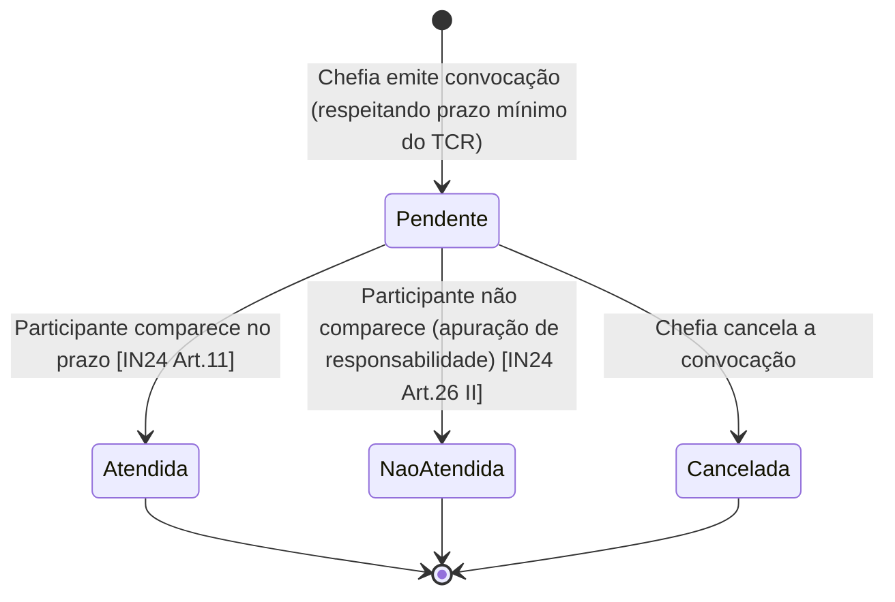

# Modelo de Dados e Workflows — PGD Libre

**Versão:** 0.2 — 2026-05-13  
**Contexto:** Plataforma na ponta (instalada no órgão). O modelo local precisa suportar toda a gestão interna E produzir os dados exatos esperados pela API PGD Central.

---

## 1. Domínio e Entidades

### 1.1 Visão Geral do Domínio

```
Órgão
  └── UnidadeAutorizadora (cod_unidade_autorizadora, origem: SIAPE | SIORG)
        └── UnidadeInstituidora  (nível Secretaria ou equivalente)
              ├── EscalaAvaliacaoCustomizada  (escala própria → padrão, opcional)
              └── UnidadeExecucao  (qualquer unidade com plano de entregas)
                    ├── PlanoEntregas  (1 por período, máx. 1 ano)
                    │     └── Entrega[]
                    ├── TimeVolante  (projeto específico com participantes de diversas unidades)
                    │     └── MembroTimeVolante[]
                    └── Participante  (agente público com TCR ativo)
                          ├── TCR  (Termo de Ciência e Responsabilidade)
                          │     └── HistoricoTCR[]  (versões anteriores)
                          ├── Convocacao[]  (convocações presenciais)
                          └── PlanoTrabalho  (1 ativo por período, máx. 1 ano)
                                ├── Contribuicao[]
                                └── AvaliacaoRegistrosExecucao[]
```

---

### 1.2 Entidades do Domínio

#### UnidadeAutorizadora

Representa a unidade com poder de autorização do PGD (geralmente nível Ministério / autarquia / fundação). É a "tenant" principal da instalação.

| Campo | Tipo | Descrição |
|-------|------|-----------|
| `id` | UUID | PK interno |
| `origem_unidade` | Enum | `SIAPE` \| `SIORG` |
| `cod_unidade_autorizadora` | BigInt | Código SIAPE (≤5 dígitos ou 14 dígitos para Uorg Lv2+) ou SIORG (≤6 dígitos) |
| `nome` | String | Nome do órgão/entidade |
| `sigla` | String | Sigla |
| `pgd_autorizado` | Boolean | Se há ato de autorização ativo |
| `ato_autorizacao_ref` | String | Referência ao ato de autorização |
| `data_autorizacao` | Date | Data do ato de autorização |
| `status` | Enum | `ativo` \| `suspenso` \| `revogado` |
| `created_at` | DateTime | |
| `updated_at` | DateTime | |

#### UnidadeInstituidora

Nível não inferior a Secretaria. Gerencia o PGD em seu escopo e pode ter várias unidades de execução subordinadas. A avaliação do plano de entregas **não se aplica** à própria unidade instituidora `[IN24 Art.22 §2º]`.

| Campo | Tipo | Descrição |
|-------|------|-----------|
| `id` | UUID | PK |
| `unidade_autorizadora_id` | FK | → UnidadeAutorizadora |
| `cod_unidade_instituidora` | BigInt | Código SIAPE/SIORG |
| `nome` | String | |
| `sigla` | String | |
| `ato_instituicao_ref` | String | Referência ao ato de instituição (portaria da autoridade máxima) `[D11 Art.4º]` |
| `data_instituicao` | Date | |
| `tipos_atividades` | Text | Tipos de atividades permitidas no PGD `[D11 Art.4º I]` |
| `modalidades_autorizadas` | JSON | Lista das modalidades/regimes autorizados `[IN24 Art.6º II]` |
| `vagas_percentual_presencial` | Int | % de vagas para presencial (em relação ao total de agentes da unidade) `[IN24 Art.6º III]` |
| `vagas_percentual_tt_parcial` | Int | % de vagas para teletrabalho parcial `[IN24 Art.6º III]` |
| `vagas_percentual_tt_integral` | Int | % de vagas para teletrabalho integral `[IN24 Art.6º III]` |
| `vagas_percentual_tt_exterior` | Int nullable | % de vagas para teletrabalho no exterior (máx. 2% do total em PGD) `[IN24 Art.12 §único]` |
| `vedacoes_participacao` | Text nullable | Vedações à participação, se houver `[D11 Art.4º III]` |
| `nivel_produtividade_adicional_tt` | Text nullable | Eventual nível de produtividade adicional exigido para teletrabalho `[D11 Art.4º IV]` |
| `prazo_antecedencia_convocacao_dias` | Int | Prazo mínimo (dias) para convocação presencial `[D11 Art.4º VI]` |
| `conteudo_minimo_tcr` | Text | Conteúdo mínimo do TCR definido no ato `[D11 Art.4º V]` |
| `procedimento_registro_comparecimento` | Text nullable | Procedimento de registro de comparecimento para auxílio-transporte e outras finalidades `[IN24 Art.6º §5º]` |
| `criterios_selecao_adicionais` | Text nullable | Critérios específicos de seleção além dos legais `[D11 Art.7º §1º]` |
| `status` | Enum | `em_vigor` \| `suspenso` \| `revogado` |
| `data_suspensao_revogacao` | Date nullable | Data da suspensão ou revogação, com prazo de 30 dias para retorno `[D11 Art.10º]` |
| `motivo_suspensao_revogacao` | Text nullable | Fundamentação da suspensão/revogação `[D11 Art.3º §3º]` |

#### EscalaAvaliacaoCustomizada

Entidade independente para armazenar o mapeamento de escala própria de avaliação para a escala padrão da API PGD Central. A unidade instituidora pode adotar escala própria, mas deve converter antes de enviar à API `[IN24 Art.30]`.

| Campo | Tipo | Descrição |
|-------|------|-----------|
| `id` | UUID | PK |
| `unidade_instituidora_id` | FK | → UnidadeInstituidora |
| `valor_customizado` | String(100) | Rótulo na escala própria (ex.: "Ótimo") |
| `valor_padrao` | Int | Valor correspondente na escala padrão (1–5) |
| `descricao` | Text nullable | Descrição/critério de uso deste valor |
| `ordem_exibicao` | Int | Ordem de apresentação na interface |
| `ativo` | Boolean | Default: true |
| `created_at` | DateTime | |

#### UnidadeExecucao

Qualquer unidade com plano de entregas pactuado. Pode coincidir com a instituidora `[IN24 Art.3º XV]`.

| Campo | Tipo | Descrição |
|-------|------|-----------|
| `id` | UUID | PK |
| `unidade_instituidora_id` | FK | → UnidadeInstituidora |
| `cod_unidade_executora` | BigInt | Código SIAPE/SIORG |
| `nome` | String | |
| `sigla` | String | |
| `chefia_user_id` | FK | → User (chefia da unidade) |
| `nivel_superior_user_id` | FK nullable | → User (nível hierárquico superior; avalia PlanoEntregas) `[IN24 Art.18 §1º]` |
| `coincide_com_instituidora` | Boolean | Se a unidade de execução é a própria instituidora (isenta da avaliação do PE) `[IN24 Art.22 §2º]` |

#### Participante

Agente público cadastrado no PGD da unidade. Mapeia 1:1 com a entidade `Participante` da API PGD Central.

| Campo | Tipo | Descrição |
|-------|------|-----------|
| `id` | UUID | PK interno |
| `origem_unidade` | Enum | `SIAPE` \| `SIORG` |
| `cod_unidade_autorizadora` | BigInt | FK implícita para UnidadeAutorizadora |
| `cod_unidade_lotacao` | BigInt | Unidade de lotação do participante |
| `matricula_siape` | String(7) | 7 dígitos, não podem ser todos iguais |
| `cod_unidade_instituidora` | BigInt | Unidade instituidora do PGD |
| `cpf` | String(11) | 11 dígitos, dígitos verificadores validados |
| `nome` | String | Nome completo |
| `email` | String | E-mail institucional |
| `situacao` | Int | `0=Inativo` \| `1=Ativo` (tipo Int, conforme API) |
| `modalidade_execucao` | Int | 1–5 (conforme API PGD Central): 1=Presencial, 2=TT parcial, 3=TT integral, 4=TT exterior inc.VIII, 5=TT exterior §7º |
| `data_assinatura_tcr` | Date | Data de assinatura do TCR original; **não se altera em repactuação** `[models.py comentário]`. Mínimo: 2023-07-31 `[schemas.py MIN_ALLOWED_PT_TCR_DATE]` |
| `data_ingresso_pgd` | Date nullable | Data efetiva de ingresso no PGD (pode ser posterior à assinatura do TCR) |
| `data_desligamento` | Date nullable | Preenchida quando situacao passa a 0 |
| `motivo_desligamento` | Enum nullable | `a_pedido` \| `interesse_administracao` \| `mudanca_unidade` \| `pgd_revogado` `[IN24 Art.27]` |
| `cumpriu_estagio_probatorio` | Boolean nullable | Obrigatório para TT (modalidade 2, 3, 4 ou 5): mínimo 1 ano `[IN24 Art.10 §2º]` |
| `data_fim_estagio_probatorio` | Date nullable | Data de conclusão do estágio probatório |
| `tipo_vinculo` | Enum | `efetivo` \| `comissionado` \| `empregado_publico` \| `contrato_determinado` \| `estagiario` `[D11 Art.2º §1º]` |
| `user_id` | FK nullable | → User (conta de acesso ao sistema) |
| `unidade_execucao_id` | FK | → UnidadeExecucao (unidade de exercício atual) |
| `created_at` | DateTime | |
| `updated_at` | DateTime | |

**Chave de negócio (PK composta para API):** `(origem_unidade, cod_unidade_autorizadora, cod_unidade_lotacao, matricula_siape)`

#### TCR — Termo de Ciência e Responsabilidade

Instrumento de gestão pelo qual chefia e participante pactuam as regras de participação no PGD `[IN24 Art.15]`. **Toda alteração nas condições enseja a pactuação de novo TCR** `[IN24 Art.15 §único]`.

| Campo | Tipo | Descrição |
|-------|------|-----------|
| `id` | UUID | PK |
| `participante_id` | FK | → Participante |
| `chefia_user_id` | FK | → User (chefia da unidade de execução) |
| `modalidade_execucao` | Int | 1–5 |
| `regime_execucao` | Enum | `integral` \| `parcial` |
| `prazo_antecedencia_convocacao_dias` | Int | Prazo mínimo para convocação presencial `[IN24 Art.15 III]` |
| `canais_comunicacao` | JSON | Canal(is) de comunicação da equipe `[IN24 Art.15 IV]` |
| `responsabilidades` | Text | Responsabilidades do participante `[IN24 Art.15 I]` |
| `ciencia_instalacoes_ergonomia` | Boolean | Ciência sobre requisitos de ergonomia e segurança `[IN24 Art.15 V.a]` |
| `ciencia_nao_direito_adquirido` | Boolean | Ciência de que a participação no PGD não é direito adquirido `[IN24 Art.15 V.b]` |
| `ciencia_custeio_estrutura` | Boolean | Ciência de que o participante custeia a estrutura física/tecnológica `[IN24 Art.15 V.c; D11 Art.9º IV]` |
| `acoes_melhoria` | Text nullable | Ações de melhoria (obrigatório quando plano anterior = 4 "inadequado") `[IN52 Art.3º]` |
| `outras_providencias_inadequado` | Text nullable | Outras possíveis providências em caso de avaliação inadequada `[IN52 Art.3º]` |
| `saldo_banco_horas` | Int nullable | Saldo de horas a compensar (débito) ou usufruir (crédito) na entrada no PGD `[IN52 Art.18 §1º]` |
| `prazo_compensacao_banco_horas` | Date nullable | Prazo máximo (6 meses do ingresso no PGD) para compensar/usufruir o saldo `[IN52 Art.18 §1º]` |
| `carga_horaria_compensacao` | Int nullable | Horas a compensar por inexecução parcial/integral do plano anterior `[IN52 Art.4º]`. Permite que soma de percentuais > 100% `[IN52 Art.5º]` |
| `prazo_compensacao_inexecucao` | Date nullable | Prazo para compensação de horas por inexecução `[IN52 Art.4º §único]` |
| `data_assinatura_participante` | DateTime | |
| `data_assinatura_chefia` | DateTime | |
| `status` | Enum | `ativo` \| `substituido` \| `cancelado` |
| `tcr_anterior_id` | FK nullable | Auto-referência para versão anterior (histórico de repactuações) |
| `created_at` | DateTime | |

#### PlanoEntregas

Mapeia 1:1 com `PlanoEntregas` da API PGD Central. A aprovação é feita pelo nível hierárquico superior à chefia da unidade de execução `[IN24 Art.18 §1º]`. A avaliação **não se aplica à unidade instituidora** `[IN24 Art.22 §2º]`.

| Campo | Tipo | Descrição |
|-------|------|-----------|
| `id` | UUID | PK interno |
| `id_plano_entregas` | String | ID gerado pelo sistema; único por `(origem_unidade, cod_unidade_autorizadora)` — UC na API |
| `origem_unidade` | Enum | `SIAPE` \| `SIORG` |
| `cod_unidade_autorizadora` | BigInt | PositiveInt ≤ 2^63-1 (SIAPE: ≤5 dígitos ou 14 dígitos; SIORG: ≤6 dígitos) |
| `cod_unidade_instituidora` | BigInt | PositiveInt ≤ 2^63-1 |
| `cod_unidade_executora` | BigInt | PositiveInt ≤ 2^63-1 |
| `unidade_execucao_id` | FK | → UnidadeExecucao |
| `status` | Int | `1=Cancelado` \| `2=Aprovado` \| `3=Em Execução` \| `4=Concluído` \| `5=Avaliado`. Envio obrigatório à API nos status 3, 4 e 5 |
| `data_inicio` | Date | |
| `data_termino` | Date | Máx. data_inicio + 1 ano `[IN24 Art.18 I]` |
| `avaliacao` | Int nullable | 1–5 (1=Excepcional…5=Não executado). Obrigatório para status=5. Converter de escala customizada se necessário `[IN24 Art.30]` |
| `data_avaliacao` | Date nullable | Não pode ser anterior a data_inicio; obrigatória para status=5. Prazo: até 30 dias após término `[IN24 Art.22 §1º]` |
| `avaliado_por_user_id` | FK nullable | → User (nível hierárquico superior à chefia) `[IN24 Art.22]` |
| `aprovado_por_user_id` | FK nullable | → User (nível hierárquico superior) `[IN24 Art.18 §1º]` |
| `data_aprovacao` | Date nullable | Data da aprovação pelo nível superior |
| `ajustes_comunicados_em` | DateTime nullable | Data em que eventuais ajustes foram comunicados ao nível superior `[IN24 Art.18 §1º]` |
| `api_sincronizado_em` | DateTime nullable | Última sincronização bem-sucedida com API Central |
| `created_at` | DateTime | |
| `updated_at` | DateTime | |

#### Entrega

Cada entrega pertence a um PlanoEntregas. A UC da API exige que `id_entrega` seja único dentro de `(origem_unidade, cod_unidade_autorizadora, id_plano_entregas)`.

| Campo | Tipo | Descrição |
|-------|------|-----------|
| `id` | UUID | PK interno |
| `id_entrega` | String | Único dentro do plano (UC na API: origem + cod_autorizadora + id_plano + id_entrega) |
| `plano_entregas_id` | FK | → PlanoEntregas (FK composta na API: origem + cod_autorizadora + id_plano_entregas) |
| `nome_entrega` | String(300) | Título do produto/serviço gerado pela unidade `[max_length=300 schemas.py STR_FIELD_MAX_SIZE]` |
| `meta_entrega` | Int | Quantidade unitária ou percentual; valor ≥ 0 (NonNegativeInt na API) |
| `tipo_meta` | Enum | `unidade` \| `percentual` |
| `data_entrega` | Date | Data prevista para alcance da meta |
| `nome_unidade_demandante` | String(300) | Nome da unidade que demandou a entrega `[max_length=300]` |
| `nome_unidade_destinataria` | String(300) | Nome da unidade destinatária/beneficiária `[max_length=300]` |
| `entrega_cancelada` | Boolean | Default: false; NULL é interpretado como false pela API |

#### PlanoTrabalho

Mapeia 1:1 com `PlanoTrabalho` da API PGD Central. A PK composta na API é `(origem_unidade, cod_unidade_autorizadora, id_plano_trabalho)`. O plano deve ter `data_inicio >= data_inicio` do PlanoEntregas referenciado `[api.py validação]`.

| Campo | Tipo | Descrição |
|-------|------|-----------|
| `id` | UUID | PK interno |
| `id_plano_trabalho` | String | Único por `(origem_unidade, cod_unidade_autorizadora)` — UC na API |
| `origem_unidade` | Enum | `SIAPE` \| `SIORG` |
| `cod_unidade_autorizadora` | BigInt | PositiveInt ≤ 2^63-1 |
| `cod_unidade_executora` | BigInt | PositiveInt ≤ 2^63-1 |
| `cod_unidade_lotacao_participante` | BigInt | PositiveInt ≤ 2^63-1; pode diferir do cod_unidade_executora `[models.py comentário]` |
| `participante_id` | FK | → Participante (FK composta na API: origem + cod_autorizadora + matricula + cod_lotacao) |
| `cpf_participante` | String(11) | Desnormalizado para a API; 11 dígitos, validado |
| `matricula_siape` | String(7) | Desnormalizado para a API; 7 dígitos |
| `tcr_id` | FK | → TCR vigente no momento da pactuação |
| `status` | Int | `1=Cancelado` \| `2=Aprovado` \| `3=Em Execução` \| `4=Concluído`. Envio obrigatório à API nos status 3 e 4 |
| `data_inicio` | Date | Mínimo: 2023-07-31 `[schemas.py MIN_ALLOWED_PT_TCR_DATE]` |
| `data_termino` | Date | Deve ser >= data_inicio; máx. data_inicio + 1 ano |
| `carga_horaria_disponivel` | Int | Horas totais disponíveis (NonNegativeInt ≤ 2^31-1). Não inclui férias, afastamentos `[models.py comentário]` |
| `criterios_avaliacao` | Text | Critérios definidos pela chefia `[IN24 Art.19 IV]` |
| `plano_entregas_id` | FK nullable | → PlanoEntregas (referência interna; id_plano_entregas nas contribuições tipo 1) |
| `api_sincronizado_em` | DateTime nullable | |
| `created_at` | DateTime | |
| `updated_at` | DateTime | |

#### Contribuicao

Cada contribuição pertence a um PlanoTrabalho. Representa a alocação de percentual de carga horária `[IN24 Art.19 II]`. A soma deve ser = 100% da carga horária disponível, exceto quando há compensação de horas `[IN52 Art.5º]`.

| Campo | Tipo | Descrição |
|-------|------|-----------|
| `id` | UUID | PK |
| `id_contribuicao` | String | Único dentro do plano de trabalho |
| `plano_trabalho_id` | FK | → PlanoTrabalho (FK composta na API: origem + cod_autorizadora + id_plano_trabalho) |
| `tipo_contribuicao` | Int | `1=Própria unidade` \| `2=Não vinculada (apoio/gestão)` \| `3=Outra unidade/órgão` `[IN24 Art.19 II a,b,c]` |
| `percentual_contribuicao` | Int | 0–100 (a API aceita 0; a soma = 100% salvo compensação). Tipo 3 pode compor time volante `[IN24 Art.19 §2º III]` |
| `id_plano_entregas` | String nullable | id_plano_entregas do PlanoEntregas referenciado (obrigatório para tipo 1; proibido para tipo 2) |
| `id_entrega` | String nullable | id_entrega da Entrega referenciada (obrigatório para tipo 1; proibido para tipo 2) |
| `descricao` | Text | Descrição dos trabalhos a realizar `[IN24 Art.19 III]` |

#### AvaliacaoRegistrosExecucao

Registro mensal (ou por período) de execução e avaliação do plano de trabalho. Mapeia para `avaliacoes_registros_execucao` da API PGD Central. Os campos `avaliacao_registros_execucao` e `data_avaliacao_registros_execucao` são **obrigatórios** na API (não nullable) `[schemas.py AvaliacaoRegistrosExecucaoSchema]`; no sistema local são nullable até a chefia preencher.

| Campo | Tipo | Descrição |
|-------|------|-----------|
| `id` | UUID | PK |
| `id_periodo_avaliativo` | String | Único dentro do plano de trabalho |
| `plano_trabalho_id` | FK | → PlanoTrabalho (FK composta na API: origem + cod_autorizadora + id_plano_trabalho) |
| `data_inicio_periodo_avaliativo` | Date | Deve ser >= data_inicio do PlanoTrabalho `[schemas.py validação]`. Períodos não podem se sobrepor `[schemas.py avaliacoes_not_overlapping]` |
| `data_fim_periodo_avaliativo` | Date | Deve ser >= data_inicio_periodo_avaliativo |
| `descricao_execucao` | Text | Registros de atividades realizadas pelo participante `[IN24 Art.20 I]` |
| `ocorrencias` | Text nullable | Afastamentos, licenças, outros impedimentos `[IN24 Art.20 II]` |
| `data_registro_participante` | DateTime nullable | Data em que o participante finalizou o registro. Prazo: até 10 dias após encerramento (PT ≤30 dias) ou até 10° dia do mês seguinte (PT >30 dias) `[IN24 Art.20 §1º]` |
| `avaliacao_registros_execucao` | Int nullable | 1–5 (1=Excepcional…5=Não executado). **Obrigatório na API** (não nullable); localmente nullable até chefia avaliar. Converter de escala customizada se necessário `[IN24 Art.30]` |
| `data_avaliacao_registros_execucao` | Date nullable | **Obrigatório na API** (não nullable); não pode ser data futura nem anterior a data_inicio_periodo_avaliativo `[schemas.py validações]`. Prazo: até 20 dias após o prazo de registro `[IN24 Art.21 §1º]` |
| `avaliacao_justificativa` | Text nullable | Obrigatório para avaliações 1 (excepcional), 4 (inadequado) e 5 (não executado) `[IN24 Art.21 §3º]` |
| `avaliacao_escala_customizada` | String nullable | Valor na escala própria do órgão antes da conversão, se aplicável |
| `recurso_texto` | Text nullable | Justificativa do participante no recurso `[IN24 Art.21 §4º]` |
| `recurso_data` | DateTime nullable | Data em que o participante enviou o recurso. Prazo: 10 dias após notificação |
| `recurso_decisao` | Enum nullable | `acatado` \| `nao_acatado` `[IN24 Art.21 §5º]` |
| `recurso_decisao_justificativa` | Text nullable | Manifestação da chefia sobre o recurso (obrigatória se nao_acatado) |
| `recurso_decisao_data` | DateTime nullable | Data da decisão. Prazo: até 10 dias após o recurso `[IN24 Art.21 §5º]` |
| `status_recurso` | Enum nullable | `aberto` \| `encerrado` |

#### Convocacao

Registro de convocação presencial emitida pela chefia para participante em teletrabalho `[IN24 Art.11]`. A convocação deve respeitar o prazo mínimo definido no TCR.

| Campo | Tipo | Descrição |
|-------|------|-----------|
| `id` | UUID | PK |
| `participante_id` | FK | → Participante |
| `unidade_execucao_id` | FK | → UnidadeExecucao |
| `chefia_user_id` | FK | → User (quem emitiu a convocação) |
| `canal_comunicacao` | String | Canal utilizado para expedir a convocação (conforme TCR) `[IN24 Art.11 §único II]` |
| `data_convocacao` | Date | Data em que a convocação foi expedida |
| `data_comparecimento_prevista` | Date | Data prevista para o comparecimento presencial `[IN24 Art.11 §único III]` |
| `horario_comparecimento` | String | Horário definido para comparecimento `[IN24 Art.11 §único III]` |
| `local_comparecimento` | String | Local definido para comparecimento `[IN24 Art.11 §único III]` |
| `periodo_presencial_inicio` | Date | Início do período em que o participante atuará presencialmente `[IN24 Art.11 §único IV]` |
| `periodo_presencial_fim` | Date | Fim do período presencial |
| `motivo` | Text | Justificativa da convocação |
| `data_comparecimento_efetivo` | Date nullable | Data em que o participante efetivamente compareceu |
| `status` | Enum | `pendente` \| `atendida` \| `nao_atendida` \| `cancelada` |
| `created_at` | DateTime | |

#### TimeVolante

Equipe composta por participantes de unidades diversas para atuar em projetos específicos `[IN24 Art.3º XIII; Art.19 §2º III]`. As contribuições tipo 3 dos participantes são o vínculo formal.

| Campo | Tipo | Descrição |
|-------|------|-----------|
| `id` | UUID | PK |
| `unidade_instituidora_id` | FK | → UnidadeInstituidora (âmbito do time) |
| `nome` | String | Nome do time volante / projeto |
| `descricao` | Text nullable | Objetivo e escopo do projeto |
| `data_inicio` | Date | |
| `data_fim` | Date nullable | |
| `status` | Enum | `ativo` \| `encerrado` |
| `created_at` | DateTime | |

#### MembroTimeVolante

Associação entre participante e time volante.

| Campo | Tipo | Descrição |
|-------|------|-----------|
| `id` | UUID | PK |
| `time_volante_id` | FK | → TimeVolante |
| `participante_id` | FK | → Participante |
| `contribuicao_id` | FK nullable | → Contribuicao (contribuição tipo 3 que formaliza a alocação) |
| `data_entrada` | Date | |
| `data_saida` | Date nullable | |
| `papel` | String nullable | Papel do participante no time |

#### RegistroEnvioAPI

Controla o histórico de sincronizações com a API PGD Central.

| Campo | Tipo | Descrição |
|-------|------|-----------|
| `id` | UUID | PK |
| `entidade_tipo` | Enum | `participante` \| `plano_entregas` \| `plano_trabalho` |
| `entidade_id` | UUID | ID interno da entidade enviada |
| `endpoint` | String | URL do endpoint da API PGD Central |
| `http_status` | Int | Código de resposta HTTP |
| `resposta_body` | JSON nullable | Corpo da resposta (erros) |
| `sucesso` | Boolean | |
| `tentativa` | Int | Número da tentativa |
| `criado_em` | DateTime | |

#### User

Usuário do sistema PGD Libre.

| Campo | Tipo | Descrição |
|-------|------|-----------|
| `id` | UUID | PK |
| `email` | String | Único |
| `password_hash` | String | bcrypt |
| `nome` | String | |
| `perfil` | Enum | `admin` \| `rh` \| `chefia_instituidora` \| `chefia_execucao` \| `nivel_superior` \| `participante` \| `leitura` |
| `unidade_autorizadora_id` | FK | → UnidadeAutorizadora |
| `ativo` | Boolean | Default: true |
| `sistema_gerador` | String | "PGD Libre X.Y" (enviado à API PGD Central) |
| `last_login_at` | DateTime nullable | |
| `created_at` | DateTime | |
| `updated_at` | DateTime | |

#### AuditLog

Registro imutável de todos os eventos críticos.

| Campo | Tipo | Descrição |
|-------|------|-----------|
| `id` | UUID | PK |
| `entidade_tipo` | String | Nome da entidade afetada |
| `entidade_id` | UUID | ID da entidade |
| `acao` | Enum | `create` \| `update` \| `delete` \| `status_change` \| `api_sync` |
| `user_id` | FK nullable | → User (null = sistema) |
| `dados_anteriores` | JSON nullable | Snapshot antes da mudança |
| `dados_novos` | JSON nullable | Snapshot após a mudança |
| `created_at` | DateTime | Imutável |

---

## 2. Diagrama de Estados

### 2.1 PlanoEntregas

```mermaid
stateDiagram-v2
    [*] --> EmElaboracao : Chefia inicia elaboração
    EmElaboracao --> Aprovado : Aprovação pelo nível hierárquico superior [IN24 Art.18 §1º]
    Aprovado --> EmExecucao : Início do período (data_inicio alcançada)
    EmExecucao --> EmExecucao : Ajuste comunicado ao nível superior [IN24 Art.18 §1º]\n(repactuação dos PT afetados [IN24 Art.18 §2º])
    EmExecucao --> Concluido : Período encerrado (data_termino alcançada)
    Concluido --> Avaliado : Avaliação pelo nível superior (≤30 dias) [IN24 Art.22 §1º]
    EmElaboracao --> Cancelado : Cancelamento
    Aprovado --> Cancelado : Cancelamento
    EmExecucao --> Cancelado : Cancelamento
    Avaliado --> [*]
    Cancelado --> [*]

    note right of EmElaboracao : (estado local, não enviado à API)
    note right of Aprovado : status=2\nEnvio à API: opcional
    note right of EmExecucao : status=3\nEnvio à API: obrigatório
    note right of Concluido : status=4\nEnvio à API: obrigatório
    note right of Avaliado : status=5\nEnvio à API: obrigatório\navaliacao + data_avaliacao obrigatórios\nNão se aplica à unidade instituidora
```

**Nota:** A avaliação do PlanoEntregas **não se aplica** quando a unidade de execução coincide com a unidade instituidora `[IN24 Art.22 §2º]`.

### 2.2 PlanoTrabalho

```mermaid
stateDiagram-v2
    [*] --> EmElaboracao : Chefia inicia elaboração
    EmElaboracao --> Aprovado : Pactuação chefia + participante [D11 Art.11; IN24 Art.17 II]
    Aprovado --> EmExecucao : Início da execução (data_inicio alcançada)
    EmExecucao --> EmExecucao : Repactuação/ajuste pela chefia a qualquer momento [IN24 Art.20 §2º]\n(novo TCR se modalidade/condições mudarem [IN24 Art.15 §único])
    EmExecucao --> Concluido : Participante finaliza últimos registros → status=4
    EmElaboracao --> Cancelado : Cancelamento
    Aprovado --> Cancelado : Cancelamento
    EmExecucao --> Cancelado : Cancelamento
    Concluido --> [*]
    Cancelado --> [*]

    note right of EmElaboracao : (estado local, não enviado à API)
    note right of Aprovado : status=2\nEnvio à API: opcional
    note right of EmExecucao : status=3\nEnvio à API: obrigatório
    note right of Concluido : status=4\nEnvio à API: obrigatório\nRegistros de execução finalizados
```

### 2.3 AvaliacaoRegistrosExecucao (ciclo de avaliação)

```mermaid
stateDiagram-v2
    [*] --> AguardandoRegistro : Período iniciado
    AguardandoRegistro --> EmRegistro : Participante inicia registro de execução
    EmRegistro --> RegistradoPeloParticipante : Participante finaliza registro\n(prazo: 10° dia/mês seguinte ou 10 dias após encerramento ≤30d) [IN24 Art.20 §1º]
    AguardandoRegistro --> EmAtraso : Prazo vencido sem registro
    EmRegistro --> EmAtraso : Prazo vencido sem finalização
    RegistradoPeloParticipante --> AvaliadoPelaChefIA : Chefia avalia (≤20 dias após prazo de registro) [IN24 Art.21 §1º]
    EmAtraso --> AvaliadoPelaChefIA : Chefia avalia mesmo sem registro do participante
    AvaliadoPelaChefIA --> Encerrado : Avaliação 2 (alto desempenho) ou 3 (adequado)\n(sem recurso cabível)
    AvaliadoPelaChefIA --> AguardandoRecurso : Avaliação 1 (excepcional), 4 (inadequado) ou 5 (não executado)\n→ notificação ao participante [IN24 Art.21 §2º]\n→ recurso cabível para avaliação 4 ou 5 [IN24 Art.21 §4º]
    AguardandoRecurso --> Encerrado : Avaliação 1 → sem recurso; prazo de 10 dias expirou sem recurso
    AguardandoRecurso --> EmRecurso : Participante recorre (prazo: 10 dias após notificação) [IN24 Art.21 §4º]
    EmRecurso --> RecursoDecidido : Chefia decide em até 10 dias [IN24 Art.21 §5º]
    RecursoDecidido --> Encerrado : Decisão registrada (acatado → avaliação ajustada;\nnão acatado → avaliação mantida) [IN24 Art.21 §5º]
    Encerrado --> [*]

    note right of AvaliadoPelaChefIA : Avaliações 1, 4 e 5 exigem justificativa [IN24 Art.21 §3º]
    note right of RecursoDecidido : Se acatado: novo valor de avaliação\nSe avaliação 4 ou 5 mantida: TCR deve registrar\nações de melhoria [IN52 Art.3º] e compensação\nde horas no próximo período [IN52 Art.4º]
```

### 2.4 Participante

```mermaid
stateDiagram-v2
    [*] --> Candidato : Manifestação de interesse
    Candidato --> Selecionado : Chefia seleciona (critérios legais + específicos) [D11 Art.7º; IN24 Art.13-14]
    Candidato --> NaoSelecionado : Não atende critérios / vagas insuficientes
    Selecionado --> Ativo : TCR assinado (situacao=1) [IN24 Art.15]
    Ativo --> Ativo : Repactuação TCR (novo TCR, anterior → substituido) [IN24 Art.15 §único]
    Ativo --> Inativo : Desligamento (situacao=0): a pedido / interesse adm.\n/ mudança de unidade / PGD revogado [IN24 Art.27]
    Inativo --> Ativo : Reativação (novo TCR)
    NaoSelecionado --> [*]
    Inativo --> [*]

    note right of Ativo : TCR vigente obrigatório\nPrazo retorno: 30 dias (TT nacional)\n2 meses (TT exterior) [IN24 Art.27 §1º]
```

### 2.5 Convocacao



---

## 3. Workflows Principais

### 3.1 Workflow de Adesão da Unidade ao PGD

```
1. AUTORIZAÇÃO
   └── Autoridade máxima do órgão (Ministro/dirigente máximo) autoriza o PGD [D11 Art.3º]
   └── Administrador registra o ato de autorização no sistema (RF-001)
   └── Notificação ao Comitê Executivo PGD do MGI (e-mail institucional) [IN24 Art.5º]

2. INSTITUIÇÃO
   └── Autoridade da unidade instituidora (≥Secretaria) emite portaria [D11 Art.4º]
       (vedada delegação; exceção: Chefe de Gabinete para o âmbito do gabinete)
   └── Administrador registra o ato de instituição com todos os parâmetros (RF-002):
       ├── Tipos de atividades permitidas [D11 Art.4º I]
       ├── Modalidades e regimes autorizados [IN24 Art.6º II]
       ├── Quantitativo de vagas por modalidade em % [IN24 Art.6º III]
       │    (incl. vagas TT exterior se autorizado, máx. 2% dos participantes)
       ├── Vedações à participação, se houver [D11 Art.4º III]
       ├── Nível de produtividade adicional para TT, se exigido [D11 Art.4º IV]
       ├── Conteúdo mínimo do TCR [D11 Art.4º V]
       ├── Prazo de antecedência mínima para convocações presenciais [D11 Art.4º VI]
       └── Procedimento de registro de comparecimento (p/ auxílio-transporte) [IN24 Art.6º §5º]
   └── Sistema publica em sítio oficial do órgão [D11 Art.4º §3º]
   └── Notificação ao Comitê PGD do MGI [IN24 Art.6º §3º]

3. DIVULGAÇÃO DAS VAGAS
   └── Chefia divulga critérios de seleção no sistema [D11 Art.7º §2º]
   └── Interessados manifestam interesse no sistema (com dados de elegibilidade)

4. SELEÇÃO
   └── Sistema verifica elegibilidade básica:
       ├── Concluiu estágio probatório (≥1 ano) para TT [IN24 Art.10 §2º]
       ├── Aguardou 6 meses após movimentação (para TT em outro órgão) [IN24 Art.10 §3º]
       └── Não incide em vedação prevista no ato de instituição
   └── Se demanda > vagas: sistema ordena por prioridades legais (RF-006) [IN24 Art.14]:
       ├── 1º: PCD / pais de PCD
       ├── 2º: mobilidade reduzida (Lei 10.098/2000)
       ├── 3º: horário especial (Lei 8.112/90 Art.98 §§2º e 3º)
       └── 4º: critérios específicos definidos pela instituidora
   └── Chefia confirma/ajusta seleção com justificativa

5. PACTUAÇÃO DO TCR
   └── Sistema gera minuta do TCR a partir do ato de instituição
   └── Chefia e participante revisam e assinam digitalmente (RF-007)
   └── TCR deve conter: responsabilidades, modalidade/regime, prazo convocação,
       canais de comunicação, ciência sobre ergonomia/direito/custeio [IN24 Art.15]
   └── Se participante tem saldo de banco de horas: registrar no TCR [IN52 Art.18 §1º]
   └── Participante fica com status Ativo (situacao=1)

6. ENVIO À API PGD CENTRAL
   └── Sistema envia dados do participante via API (RF-021):
       PUT /organizacao/{origem}/{cod}/{cod_lotacao}/participante/{matricula}
```

### 3.2 Workflow do Ciclo do PGD (visão anual)

```
CICLO PGD (máx. 1 ano)
│
├── FASE 1: Plano de Entregas da Unidade
│   ├── Chefia elabora PlanoEntregas com lista de Entregas (RF-010) [IN24 Art.18]
│   │   └── Cada entrega contém: meta, prazo, demandante, destinatário
│   ├── Nível hierárquico superior aprova (RF-011) [IN24 Art.18 §1º]
│   │   └── Exceção: unidade instituidora não precisa de aprovação externa [IN24 Art.18 §3º]
│   ├── Status: Aprovado (2) → Em Execução (3)
│   └── Envio obrigatório à API Central (status 3)
│
├── FASE 2: Planos de Trabalho dos Participantes
│   ├── Para cada participante ativo com TCR vigente:
│   │   ├── Chefia + participante elaboram PlanoTrabalho (RF-014) [IN24 Art.19]
│   │   ├── Alocam carga horária em Contribuições (tipo 1, 2 ou 3)
│   │   │   └── Soma de percentuais = 100% (exceto se há compensação de horas)
│   │   ├── Definem critérios de avaliação [IN24 Art.19 IV]
│   │   ├── data_inicio do PT >= data_inicio do PE referenciado
│   │   ├── Status: Aprovado (2) → Em Execução (3)
│   │   └── Envio obrigatório à API Central (status 3)
│
├── FASE 3: Execução e Monitoramento (ciclo mensal ou por período)
│   │
│   ├── [MENSAL ou por período] Registro de execução pelo participante (RF-015) [IN24 Art.20]
│   │   ├── PT > 30 dias: prazo até 10° dia do mês seguinte [IN24 Art.20 §1º II]
│   │   └── PT ≤ 30 dias: prazo até 10 dias após encerramento [IN24 Art.20 §1º I]
│   │
│   ├── [APÓS REGISTRO] Avaliação pela chefia (RF-017) [IN24 Art.21]
│   │   ├── Prazo: até 20 dias após o prazo de registro [IN24 Art.21 §1º]
│   │   ├── Justificativa obrigatória para avaliações 1, 4 e 5 [IN24 Art.21 §3º]
│   │   └── Se avaliação 4 ou 5: abre prazo de recurso de 10 dias [IN24 Art.21 §4º]
│   │       └── Se recurso: chefia responde em até 10 dias (RF-018) [IN24 Art.21 §5º]
│   │           ├── Se acatado: avaliação ajustada
│   │           └── Se não acatado: avaliação mantida
│   │
│   ├── [CONFORME NECESSÁRIO] Ajustes no PlanoEntregas [IN24 Art.18 §1º]
│   │   ├── Comunicação ao nível hierárquico superior
│   │   └── Repactuação dos PlanoTrabalho afetados [IN24 Art.18 §2º]
│   │
│   └── [CONFORME NECESSÁRIO] Ajustes no PlanoTrabalho [IN24 Art.20 §2º]
│       ├── Repactuação pela chefia a qualquer momento
│       └── Se modalidade/condições mudarem: novo TCR obrigatório [IN24 Art.15 §único]
│
├── FASE 4: Conclusão dos Planos de Trabalho
│   ├── Participante finaliza últimos registros de execução
│   ├── Avaliação final do período pela chefia
│   ├── Se avaliação = 4 ou 5: TCR do próximo ciclo deve prever:
│   │   ├── Ações de melhoria (avaliação 4) [IN52 Art.3º]
│   │   └── Compensação de horas (avaliação 4 ou 5 por inexecução) [IN52 Art.4º]
│   ├── Status: Em Execução (3) → Concluído (4)
│   └── Envio obrigatório à API Central (status 4)
│
└── FASE 5: Avaliação Final do Plano de Entregas
    ├── Nível superior avalia PlanoEntregas (RF-013) [IN24 Art.22]
    │   └── Prazo: até 30 dias após término [IN24 Art.22 §1º]
    │   └── Não se aplica à unidade instituidora [IN24 Art.22 §2º]
    ├── Status: Concluído (4) → Avaliado (5)
    └── Envio obrigatório à API Central (status 5; avaliacao + data_avaliacao obrigatórios)
```

### 3.5 Workflow de Ajuste de Plano de Entregas Durante a Execução

```
[GATILHO: necessidade de ajuste durante status=3]

1. Chefia identifica necessidade de ajuste nas entregas (meta, prazo, nova entrega)

2. Chefia registra o ajuste no sistema:
   ├── Alteração de entrega existente (meta, data, status cancelada)
   └── Adição de nova entrega ao PlanoEntregas

3. Sistema registra data e hora do ajuste (ajustes_comunicados_em)

4. Comunicação ao nível hierárquico superior [IN24 Art.18 §1º]
   └── Sistema envia notificação; nível superior toma ciência no sistema

5. Identificação dos PlanoTrabalho afetados [IN24 Art.18 §2º]
   └── Sistema lista PT com Contribuicao tipo 1 referenciando a entrega ajustada

6. Para cada PT afetado:
   ├── Chefia acessa PT e ajusta as Contribuições impactadas
   └── Repactuação formalizada (novo status do PT ou aditivo interno)

7. Envio atualizado à API Central (PE com entregas atualizadas, status=3)
```

### 3.6 Workflow de Desligamento do Participante

```
[GATILHO: solicitação do participante, necessidade administrativa, mudança de unidade
          ou revogação/suspensão do PGD]

1. Registrar motivo do desligamento [IN24 Art.27]:
   ├── A pedido: a qualquer momento (exceto se PGD obrigatório) [IN24 Art.27 I]
   ├── Interesse da administração: com justificativa [IN24 Art.27 II]
   ├── Mudança de unidade de exercício [IN24 Art.27 III]
   └── PGD revogado/suspenso [IN24 Art.27 IV]

2. Definir prazo de retorno ao controle de frequência [IN24 Art.27 §1º]:
   ├── A pedido: prazo definido pelo órgão [IN24 Art.27 §1º I]
   ├── Demais hipóteses (TT nacional): 30 dias [IN24 Art.27 §1º II]
   └── TT exterior: 2 meses [IN24 Art.27 §1º III]

3. Participante mantém execução do PT até retorno efetivo [IN24 Art.27 §3º]

4. Finalizar PlanoTrabalho ativo:
   ├── Chefia registra avaliação final (se período em aberto)
   └── Status: Em Execução (3) → Concluído (4)

5. Atualizar situação na API Central (situacao=0):
   PUT /organizacao/{origem}/{cod}/{cod_lotacao}/participante/{matricula}

6. TCR vigente → status=cancelado; data_desligamento preenchida
```

### 3.3 Workflow de Registro Mensal (detalhe)

```
[No início do período mensal]
Participante acessa o sistema → Plano de Trabalho ativo

[Ao longo do mês]
Participante registra atividades realizadas e ocorrências

[Até o 10° dia do mês seguinte]
Participante finaliza o registro de execução do período
→ Sistema registra data/hora
→ Sistema notifica chefia

[Até 20 dias após o prazo de registro]
Chefia abre o registro
Chefia avalia (1–5) com justificativa se necessário
→ Sistema registra avaliação com data
→ Sistema notifica participante

[Se avaliação = 4 ou 5]
Sistema abre prazo de 10 dias para recurso
Participante pode enviar justificativa

[Até 10 dias após notificação]
Chefia acata ou não acata o recurso
→ Sistema registra decisão
→ Se acatado: avaliação atualizada
→ Se não acatado: avaliação mantida

[No próximo ciclo, se avaliação = 4 ou 5]
Sistema sinaliza necessidade de compensação de carga horária
Chefia atualiza TCR com ações de melhoria
```

### 3.4 Workflow de Submissão à API PGD Central

```
[GATILHO: agendamento periódico ou evento de mudança de status]

1. COLETA
   └── Sistema identifica registros pendentes de envio:
       ├── Participantes com situacao ou modalidade alterada
       ├── PlanoEntregas com status = 3, 4 ou 5 e api_sincronizado_em desatualizado
       └── PlanoTrabalho com status = 3 ou 4 e api_sincronizado_em desatualizado

2. AUTENTICAÇÃO
   └── Sistema obtém token JWT da API PGD Central (POST /token)
   └── Credenciais armazenadas em variável de ambiente (segredo)

3. ENVIO (por lote, sequencial por tipo)
   └── Para cada Participante pendente:
   │   └── PUT /organizacao/{origem}/{cod}/{cod_lotacao}/participante/{matricula}
   └── Para cada PlanoEntregas pendente:
   │   └── PUT /organizacao/{origem}/{cod}/plano_entregas/{id}
   └── Para cada PlanoTrabalho pendente:
       └── PUT /organizacao/{origem}/{cod}/plano_trabalho/{id}

4. TRATAMENTO DE RESPOSTA
   ├── 200 OK ou 201 Created → Sucesso: atualiza api_sincronizado_em
   ├── 422 Unprocessable Entity → Erro de validação: registra em RegistroEnvioAPI, alerta administrador
   └── 5xx / Timeout → Retentativa com backoff exponencial (máx. 3 tentativas)

5. RELATÓRIO
   └── Administrador visualiza painel de conformidade com:
       ├── Total enviado com sucesso
       ├── Total com erro (com detalhes)
       └── Total pendente
```

---

## 4. Mapeamento de Dados: Sistema Local → API PGD Central

### 4.1 Participante

**Endpoint:** `PUT /organizacao/{origem_unidade}/{cod_unidade_autorizadora}/{cod_unidade_lotacao}/participante/{matricula_siape}`

| Campo API Central | Campo Local | Notas |
|-------------------|-------------|-------|
| `origem_unidade` | `participante.origem_unidade` | Enum: `"SIAPE"` ou `"SIORG"` |
| `cod_unidade_autorizadora` | `participante.cod_unidade_autorizadora` | NonNegativeInt ≤ 2^63-1 |
| `cod_unidade_lotacao` | `participante.cod_unidade_lotacao` | NonNegativeInt ≤ 2^63-1 |
| `matricula_siape` | `participante.matricula_siape` | String(7), padrão `\d{7}`, não todos iguais |
| `cod_unidade_instituidora` | `participante.cod_unidade_instituidora` | NonNegativeInt ≤ 2^63-1 |
| `cpf` | `participante.cpf` | String(11), padrão `\d{11}`, dígitos verificadores válidos |
| `situacao` | `participante.situacao` | Int: 0=Inativo, 1=Ativo |
| `modalidade_execucao` | `participante.modalidade_execucao` | Int 1–5 |
| `data_assinatura_tcr` | `participante.data_assinatura_tcr` | **Tipo `date` (YYYY-MM-DD)** — API aceita datetime por compatibilidade, mas recomenda date; não muda em repactuação; mínimo 2023-07-31 |

### 4.2 PlanoEntregas

**Endpoint:** `PUT /organizacao/{origem_unidade}/{cod_unidade_autorizadora}/plano_entregas/{id_plano_entregas}`

| Campo API Central | Campo Local | Notas |
|-------------------|-------------|-------|
| `origem_unidade` | `plano_entregas.origem_unidade` | Enum: `"SIAPE"` ou `"SIORG"` |
| `cod_unidade_autorizadora` | `plano_entregas.cod_unidade_autorizadora` | PositiveInt ≤ 2^63-1; SIAPE: ≤5 dígitos ou 14 dígitos |
| `cod_unidade_instituidora` | `plano_entregas.cod_unidade_instituidora` | PositiveInt ≤ 2^63-1 |
| `cod_unidade_executora` | `plano_entregas.cod_unidade_executora` | PositiveInt ≤ 2^63-1 |
| `id_plano_entregas` | `plano_entregas.id_plano_entregas` | Deve coincidir com o parâmetro da URL |
| `status` | `plano_entregas.status` | Int 1–5; obrigatório envio apenas para 3, 4 e 5 |
| `data_inicio` | `plano_entregas.data_inicio` | Tipo `date` (YYYY-MM-DD) |
| `data_termino` | `plano_entregas.data_termino` | Tipo `date`; >= data_inicio; máx. data_inicio + 1 ano (novo PE) |
| `avaliacao` | `plano_entregas.avaliacao` | Optional Int 1–5; obrigatório para status=5; converter escala customizada → padrão `[IN24 Art.30]` |
| `data_avaliacao` | `plano_entregas.data_avaliacao` | Optional `date`; obrigatória para status=5; >= data_inicio |
| `entregas[].id_entrega` | `entrega.id_entrega` | String; único dentro do plano |
| `entregas[].entrega_cancelada` | `entrega.entrega_cancelada` | Optional Boolean; null=false |
| `entregas[].nome_entrega` | `entrega.nome_entrega` | String max 300 caracteres |
| `entregas[].meta_entrega` | `entrega.meta_entrega` | NonNegativeInt |
| `entregas[].tipo_meta` | `entrega.tipo_meta` | `"unidade"` ou `"percentual"` |
| `entregas[].data_entrega` | `entrega.data_entrega` | Tipo `date` |
| `entregas[].nome_unidade_demandante` | `entrega.nome_unidade_demandante` | String max 300 |
| `entregas[].nome_unidade_destinataria` | `entrega.nome_unidade_destinataria` | String max 300 |

**Restrição:** lista `entregas` não pode ser vazia quando status ≠ 1 (Cancelado). IDs de entrega devem ser únicos dentro do plano.

### 4.3 PlanoTrabalho

**Endpoint:** `PUT /organizacao/{origem_unidade}/{cod_unidade_autorizadora}/plano_trabalho/{id_plano_trabalho}`

| Campo API Central | Campo Local | Notas |
|-------------------|-------------|-------|
| `origem_unidade` | `plano_trabalho.origem_unidade` | Enum: `"SIAPE"` ou `"SIORG"`; deve coincidir com URL |
| `cod_unidade_autorizadora` | `plano_trabalho.cod_unidade_autorizadora` | PositiveInt ≤ 2^63-1; deve coincidir com URL |
| `id_plano_trabalho` | `plano_trabalho.id_plano_trabalho` | String; deve coincidir com URL; UC por (origem + cod_autorizadora + id_pt) |
| `status` | `plano_trabalho.status` | Int 1–4; obrigatório envio apenas para 3 e 4 |
| `cod_unidade_executora` | `plano_trabalho.cod_unidade_executora` | PositiveInt ≤ 2^63-1 |
| `cpf_participante` | `plano_trabalho.cpf_participante` | String(11), `\d{11}`, dígitos verificadores validados |
| `matricula_siape` | `plano_trabalho.matricula_siape` | String(7), `\d{7}` |
| `cod_unidade_lotacao_participante` | `plano_trabalho.cod_unidade_lotacao_participante` | PositiveInt ≤ 2^63-1; pode diferir de cod_unidade_executora |
| `data_inicio` | `plano_trabalho.data_inicio` | Tipo `date`; >= data_inicio do PE; >= 2023-07-31 |
| `data_termino` | `plano_trabalho.data_termino` | Tipo `date`; >= data_inicio; máx. data_inicio + 1 ano (novo PT) |
| `carga_horaria_disponivel` | `plano_trabalho.carga_horaria_disponivel` | NonNegativeInt ≤ 2^31-1; não inclui férias/afastamentos |
| `contribuicoes[].id_contribuicao` | `contribuicao.id_contribuicao` | String |
| `contribuicoes[].tipo_contribuicao` | `contribuicao.tipo_contribuicao` | Int 1, 2 ou 3 |
| `contribuicoes[].percentual_contribuicao` | `contribuicao.percentual_contribuicao` | Int 0–100 |
| `contribuicoes[].id_plano_entregas` | `contribuicao.id_plano_entregas` | Obrigatório e não-nulo para tipo 1; **deve ser null para tipo 2** |
| `contribuicoes[].id_entrega` | `contribuicao.id_entrega` | Obrigatório e não-nulo para tipo 1; **deve ser null para tipo 2** |
| `avaliacoes_registros_execucao[].id_periodo_avaliativo` | `avaliacao_registros_execucao.id_periodo_avaliativo` | String |
| `avaliacoes_registros_execucao[].data_inicio_periodo_avaliativo` | `avaliacao_registros_execucao.data_inicio_periodo_avaliativo` | Tipo `date`; >= data_inicio do PT; períodos não sobrepostos |
| `avaliacoes_registros_execucao[].data_fim_periodo_avaliativo` | `avaliacao_registros_execucao.data_fim_periodo_avaliativo` | Tipo `date`; >= data_inicio do período |
| `avaliacoes_registros_execucao[].avaliacao_registros_execucao` | `avaliacao_registros_execucao.avaliacao_registros_execucao` | **Int 1–5 obrigatório na API** (não nullable); converter escala customizada se necessário `[IN24 Art.30]` |
| `avaliacoes_registros_execucao[].data_avaliacao_registros_execucao` | `avaliacao_registros_execucao.data_avaliacao_registros_execucao` | **Tipo `date` obrigatório na API** (não nullable); não pode ser futura; >= data_inicio do período |

**Restrições:** lista `contribuicoes` não pode ser vazia quando status ≠ 1 (Cancelado). FK implícita para Participante via (origem + cod_autorizadora + matricula_siape + cod_lotacao_participante).

---

## 5. Dados Extras do Sistema Local (Não Enviados à API)

O sistema local armazena informações adicionais além do contrato mínimo da API PGD Central:

| Entidade | Dados extras |
|----------|-------------|
| Participante | Nome, e-mail, tipo de vínculo, data de ingresso/desligamento, motivo de desligamento, flag estágio probatório, vínculo com User do sistema |
| TCR | Texto completo (responsabilidades, ciências obrigatórias, ações de melhoria, compensação de banco de horas), histórico de versões com auto-referência, assinaturas digitais |
| PlanoTrabalho | Critérios de avaliação da chefia, TCR vinculado à pactuação, referência interna ao PlanoEntregas |
| PlanoEntregas | Data de aprovação, data de comunicação de ajustes ao nível superior |
| AvaliacaoRegistrosExecucao | Descrição da execução, ocorrências, datas de registro, recurso completo (texto, data, decisão, justificativa, data decisão) |
| Todos | AuditLog, RegistroEnvioAPI, timestamps de sincronização (api_sincronizado_em) |
| UnidadeAutorizadora | Ato e data de autorização, status (ativo/suspenso/revogado) |
| UnidadeInstituidora | Parâmetros completos do PGD (vagas, vedações, produtividade adicional, procedimento de comparecimento, critérios de seleção), data/motivo de suspensão/revogação |
| EscalaAvaliacaoCustomizada | Mapeamento completo de escala própria → padrão (entidade dedicada) |
| Convocacao | Registro de convocações presenciais com canal, local, horário, período, comparecimento efetivo |
| TimeVolante / MembroTimeVolante | Composição de times para projetos específicos, vínculo com contribuições tipo 3 |
| User | Perfil de acesso, unidade, hash de senha, último login |

---

## 6. Regras de Negócio Críticas (Resumo)

| # | Regra | Origem | Onde validar |
|---|-------|--------|-------------|
| RN-01 | Soma de percentuais de contribuição = 100% da carga horária disponível | IN24 Art.19 §1º | Criação/atualização PlanoTrabalho |
| RN-02 | Exceção à RN-01: soma pode superar 100% quando há compensação de carga horária por inexecução | IN52 Art.5º | Criação PlanoTrabalho (quando TCR tem carga_horaria_compensacao > 0) |
| RN-03 | Exceção à RN-01: soma pode ser inferior a 100% quando há crédito de banco de horas a usufruir | IN52 Art.18 §2º | Criação PlanoTrabalho |
| RN-04 | Plano de Entregas: máx. 1 ano de duração na criação; na atualização, a validação aplica-se somente a planos com data_inicio > 2025-05-31 | IN24 Art.18 I; api.py PT_PE_UPDATE_YEAR_VALIDATION_CUTOFF_DATE | Criação/atualização PlanoEntregas |
| RN-05 | Não pode haver dois PlanoEntregas ativos e não cancelados com períodos sobrepostos para a mesma unidade executora | API PGD Central | Criação PlanoEntregas |
| RN-06 | Não pode haver dois PlanoTrabalho ativos e não cancelados com períodos sobrepostos para o mesmo participante (mesma matricula_siape + cod_unidade_executora) | API PGD Central | Criação PlanoTrabalho |
| RN-07 | Períodos avaliativos de AvaliacaoRegistrosExecucao dentro do mesmo PT não podem se sobrepor | API PGD Central (schemas.py) | Criação/atualização AvaliacaoRegistrosExecucao |
| RN-08 | data_inicio_periodo_avaliativo >= data_inicio do PlanoTrabalho | API PGD Central (schemas.py) | Criação AvaliacaoRegistrosExecucao |
| RN-09 | data_avaliacao_registros_execucao não pode ser data futura nem anterior a data_inicio_periodo_avaliativo | API PGD Central (schemas.py) | Avaliação de execução |
| RN-10 | Teletrabalho (modalidade 2–5) exige mínimo 1 ano de estágio probatório | IN24 Art.10 §2º | Cadastro Participante (TT) |
| RN-11 | Participante em TT em outro órgão deve aguardar 6 meses após movimentação do presencial/frequência | IN24 Art.10 §3º | Cadastro Participante (TT em outro órgão) |
| RN-12 | data_inicio do PT >= data_inicio do PE referenciado nas contribuições | API PGD Central (api.py) | Criação PlanoTrabalho |
| RN-13 | Status 5 do PE só com avaliacao (Int 1–5) + data_avaliacao preenchidos | API PGD Central (schemas.py) | Avaliação PlanoEntregas |
| RN-14 | Avaliação do PlanoEntregas não se aplica à unidade instituidora | IN24 Art.22 §2º | Avaliação PlanoEntregas |
| RN-15 | Avaliações da execução 1 (excepcional), 4 (inadequado) e 5 (não executado) exigem justificativa da chefia | IN24 Art.21 §3º | Avaliação de execução |
| RN-16 | TCR ativo é pré-condição para criar PlanoTrabalho | D11 Art.11; IN24 Art.3º VIII | Criação PlanoTrabalho |
| RN-17 | CPF com exatamente 11 dígitos, sem formatação, com dígitos verificadores válidos e não todos iguais | API PGD Central (schemas.py cpf_validate) | Validação formulário |
| RN-18 | Matrícula SIAPE com exatamente 7 dígitos; não podem ser todos iguais | API PGD Central (schemas.py) | Validação formulário |
| RN-19 | Limite 2% de participantes em TT com residência no exterior (com fundamento no §7º do Art.12 do D11) em relação ao total de participantes em PGD | IN24 Art.12 §único | Cadastro Participante (TT ext. modalidade 5) |
| RN-20 | Contribuição tipo 1 requer id_plano_entregas + id_entrega (ambos não-nulos) | API PGD Central (schemas.py) | Criação Contribuição |
| RN-21 | Contribuição tipo 2 não pode ter id_plano_entregas nem id_entrega (ambos devem ser null) | API PGD Central (schemas.py) | Criação Contribuição |
| RN-22 | Lista de contribuições não pode ser vazia quando status do PT ≠ 1 (Cancelado) | API PGD Central (schemas.py) | Criação/atualização PlanoTrabalho |
| RN-23 | Lista de entregas não pode ser vazia quando status do PE ≠ 1 (Cancelado) | API PGD Central (schemas.py) | Criação/atualização PlanoEntregas |
| RN-24 | IDs de entrega devem ser únicos dentro do mesmo PlanoEntregas | API PGD Central (schemas.py) | Criação/atualização PlanoEntregas |
| RN-25 | data_assinatura_tcr no Participante não pode ser anterior a 2023-07-31 | API PGD Central (schemas.py MIN_ALLOWED_PT_TCR_DATE) | Cadastro Participante |
| RN-26 | data_inicio do PT não pode ser anterior a 2023-07-31 | API PGD Central (schemas.py MIN_ALLOWED_PT_TCR_DATE) | Criação PlanoTrabalho |
| RN-27 | Toda alteração nas condições do TCR (modalidade, regime, canais etc.) gera novo TCR; o anterior fica com status=substituido | IN24 Art.15 §único | Repactuação TCR |
| RN-28 | Saldo de banco de horas (débito ou crédito) na entrada no PGD deve ser registrado no TCR, com prazo de até 6 meses para compensar/usufruir | IN52 Art.18 §1º | Pactuação TCR |
| RN-29 | Avaliação "inadequado" (4) implica obrigatoriamente registro de ações de melhoria no TCR do período seguinte | IN52 Art.3º | Avaliação de execução / novo TCR |
| RN-30 | Avaliação por inexecução parcial/integral (4 ou 5 por inexecução) implica compensação de carga horária no período subsequente, com prazo definido no TCR | IN52 Art.4º; IN52 Art.4º §único | Avaliação de execução / novo TCR |
| RN-31 | Desconto em folha cabe quando: inexecução sem justificativa aceita OU não-compensação de horas no prazo | IN52 Art.6º | Processo de RH (fora do sistema; chefia envia à GP) |
| RN-32 | Participante em TT só pode ser convocado presencialmente respeitando o prazo mínimo definido no TCR | D11 Art.4º VI; IN24 Art.11 | Emissão de Convocacao |
| RN-33 | Convocação presencial deve ser expedida pela chefia, pelo canal definido no TCR, com horário, local e período definidos | IN24 Art.11 §único | Emissão de Convocacao |
| RN-34 | Aprovação do PE pelo nível hierárquico superior é obrigatória, exceto quando a unidade de execução é a própria instituidora | IN24 Art.18 §1º e §3º | Aprovação PlanoEntregas |
| RN-35 | Ajustes no PE devem ser comunicados ao nível superior; PT afetados devem ser repactuados | IN24 Art.18 §1º e §2º | Ajuste PlanoEntregas |
| RN-36 | Teletrabalho no exterior (modalidade 4) admitido apenas para efetivos que concluíram estágio probatório, em regime integral, por prazo determinado, com autorização específica | D11 Art.12 | Cadastro Participante (TT ext.) |
| RN-37 | Unidades instituidoras podem usar escalas próprias de avaliação, mas devem converter para a escala padrão (1–5) antes de enviar à API | IN24 Art.30 | Envio à API Central |
| RN-38 | Participante desligado mantém execução do PT até retorno efetivo ao controle de frequência | IN24 Art.27 §3º | Desligamento Participante |
| RN-39 | SIAPE: código de unidade ≤ 5 dígitos (Lv1) ou exatamente 14 dígitos (Lv2/Lv3); SIORG: ≤ 6 dígitos | API PGD Central (schemas.py OrigemUnidadeValidation) | Validação formulário unidade |

---

## 7. Notas da Revisão (v0.1 → v0.2)

### 7.1 Entidades Novas

| Entidade | Justificativa |
|----------|---------------|
| `EscalaAvaliacaoCustomizada` | A escala customizada estava modelada como JSON simples em `UnidadeInstituidora`. Extraída como entidade própria para permitir CRUD independente, exibição na interface e rastreabilidade de alterações. Fundamentada em `IN24 Art.30`. |
| `Convocacao` | Mencionada na seção 5 ("Dados extras") mas ausente na seção 1.2. Modelada com todos os campos exigidos pelo `IN24 Art.11 §único` (canal, horário, local, período, comparecimento efetivo). |
| `TimeVolante` | Conceito definido em `IN24 Art.3º XIII` e operacionalizado via contribuições tipo 3 (`IN24 Art.19 §2º III`). Entidade e membros adicionados para rastrear composição de times em projetos específicos. |
| `MembroTimeVolante` | Tabela de associação entre `TimeVolante` e `Participante`, com FK opcional para a `Contribuicao` tipo 3 que formaliza a alocação. |

### 7.2 Campos Adicionados ou Corrigidos em Entidades Existentes

| Entidade | Campo | Motivo |
|----------|-------|--------|
| `UnidadeInstituidora` | `vagas_percentual_tt_exterior`, `vedacoes_participacao`, `nivel_produtividade_adicional_tt`, `procedimento_registro_comparecimento`, `criterios_selecao_adicionais`, `data_suspensao_revogacao`, `motivo_suspensao_revogacao` | Campos obrigatórios pelo `D11 Art.4º` e `IN24 Art.6º` ausentes no modelo original. |
| `UnidadeExecucao` | `nivel_superior_user_id`, `coincide_com_instituidora` | Necessário para saber quem aprova o PE e se a unidade é isenta da avaliação do PE (`IN24 Art.22 §2º`). |
| `Participante` | `situacao` (tipo corrigido para Int), `data_ingresso_pgd`, `data_desligamento`, `motivo_desligamento`, `cumpriu_estagio_probatorio`, `data_fim_estagio_probatorio`, `tipo_vinculo`, `unidade_execucao_id` | (a) Tipo Int corrigido para espelhar o enum da API. (b) Campos para controlar o ciclo de vida do participante (`IN24 Art.27`). (c) Elegibilidade para TT (`IN24 Art.10 §2º`). (d) Tipo de vínculo para regras específicas (`D11 Art.2º §1º`). |
| `TCR` | `ciencia_instalacoes_ergonomia`, `ciencia_nao_direito_adquirido`, `ciencia_custeio_estrutura`, `outras_providencias_inadequado`, `carga_horaria_compensacao`, `prazo_compensacao_inexecucao` | Campos das ciências obrigatórias do TCR (`IN24 Art.15 V`) e da política de consequências (`IN52 Arts.3º e 4º`). |
| `PlanoEntregas` | `data_aprovacao`, `ajustes_comunicados_em`; tipos documentados para `cod_*` e limites | Controle do processo de aprovação e comunicação de ajustes (`IN24 Art.18 §1º`). Tipos e limites alinhados com `schemas.py` (PositiveInt ≤ 2^63-1). |
| `Entrega` | `meta_entrega` documentado como NonNegativeInt; limites de `nome_*` explicitados como 300 chars | Alinhamento com `schemas.py` (`meta_entrega: NonNegativeInt`, `STR_FIELD_MAX_SIZE = 300`). |
| `PlanoTrabalho` | `plano_entregas_id` (FK interna), `data_inicio` com mínimo documentado, tipos de `cod_*` e limites de `carga_horaria_disponivel` | FK interna útil para navegação. Limites alinhados com `models.py` (NonNegativeInt ≤ 2^31-1). |
| `Contribuicao` | `percentual_contribuicao` documentado como 0–100 (não 1–100); regra para tipo 3 adicionada | A API aceita 0 (`schemas.py`); percentual mínimo 0, não 1. Tipo 3 pode compor times volantes. |
| `AvaliacaoRegistrosExecucao` | Campos da API marcados como obrigatórios (não nullable); prazos detalhados; validações cruzadas documentadas | `avaliacao_registros_execucao` e `data_avaliacao_registros_execucao` são **não nullable na API** (`schemas.py`), mas nullable localmente até preenchimento. |

### 7.3 Correções nos Diagramas de Estado

| Diagrama | Correção |
|----------|----------|
| PlanoEntregas | Adicionado estado `EmElaboracao` (estado local sem correspondência na API). Adicionada auto-transição em `EmExecucao` para ajustes. Adicionada nota de inaplicabilidade da avaliação para instituidora. |
| PlanoTrabalho | Adicionado estado `EmElaboracao`. Adicionada auto-transição em `EmExecucao` para repactuação e ajuste de TCR. |
| AvaliacaoRegistrosExecucao | Desmembrado estado vago em `EmRegistro` e `EmAtraso`. Separado `AguardandoRecurso` (avaliação notificada) de `EmRecurso` (recurso enviado). Adicionado estado `Encerrado`. Corrigido: avaliação 1 não é passível de recurso (só 4 e 5). |
| Participante | Adicionados estados `Candidato`, `Selecionado`, `NaoSelecionado` para cobrir o ciclo completo de seleção. |
| Convocacao | Diagrama novo para ciclo de vida da convocação presencial. |

### 7.4 Correções nos Workflows

| Workflow | Correção/Adição |
|----------|----------------|
| 3.1 Adesão | Detalhados todos os campos obrigatórios do ato de instituição; adicionada verificação de elegibilidade (estágio probatório, 6 meses); detalhadas prioridades legais de seleção; adicionada verificação do banco de horas no TCR. Corrigido endpoint de participante (incluindo `{cod_unidade_lotacao}` na URL). |
| 3.2 Ciclo do PGD | Adicionada exceção da instituidora na aprovação do PE; detalhada a regra do prazo de registro (30 dias vs. mensal); adicionado sub-passo de compensação de horas; adicionado sub-passo de ajuste de TCR; corrigida a inaplicabilidade da avaliação do PE para instituidora. |
| 3.4 Submissão à API | Corrigido endpoint de participante (incluindo `{cod_unidade_lotacao}`). |
| 3.5 Ajuste de PE durante execução | **Novo workflow** detalhando o processo de ajuste de entregas e repactuação dos PT afetados (`IN24 Art.18 §§1º e 2º`). |
| 3.6 Desligamento do participante | **Novo workflow** cobrindo motivos, prazos de retorno e obrigações até o retorno (`IN24 Art.27`). |

### 7.5 Regras de Negócio Adicionadas (RN-02 a RN-39)

As RNs originais foram numeradas (RN-01 a RN-14 com ajustes). Adicionadas 25 novas regras cobrindo:
- Exceções à soma de 100% das contribuições (banco de horas e compensação)
- Regra de corte para validação do prazo de 1 ano em atualizações (data 2025-05-31 do `api.py`)
- Não sobreposição de períodos avaliativos
- Regras de datas das avaliações de execução
- Prazo diferenciado de registro (PT ≤ 30 dias vs. > 30 dias)
- Política de consequências (ações de melhoria, compensação de horas, desconto em folha)
- Regras de convocação presencial
- Aprovação do PE e exceção para instituidora
- Regras do TCR (ciências obrigatórias, banco de horas, repactuação)
- Elegibilidade TT após movimentação (6 meses)
- Regras do TT no exterior (D11 Art.12)
- Escalas customizadas e conversão obrigatória
- Validação dos códigos de unidade SIAPE/SIORG
