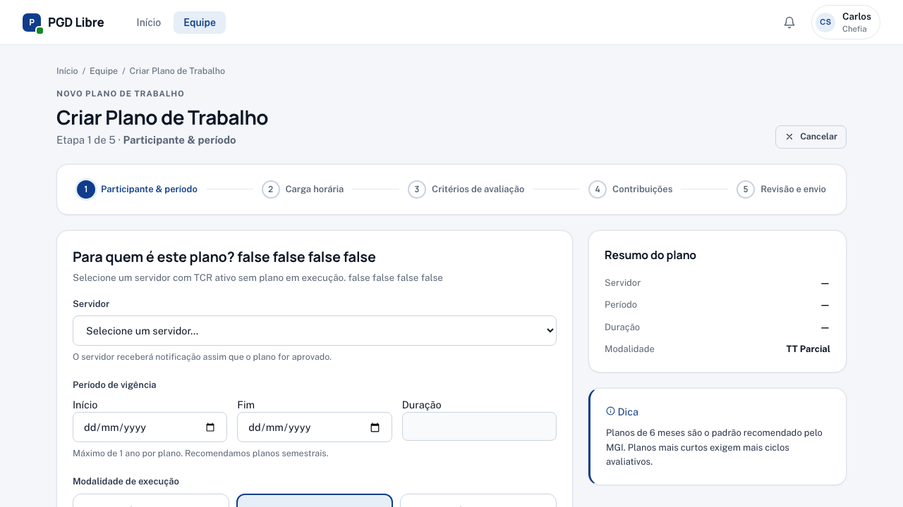

# Avaliar Registros

Quando um servidor envia o registro mensal de execução, você recebe uma notificação e precisa avaliá-lo com uma nota de 1 a 5.

> **Antes de começar:** o servidor deve ter enviado o registro. Você verá um badge "Avaliação pendente" na tela de Equipe.

## Passo a passo

### 1. Acesse o registro

Em **Equipe**, clique no servidor que tem avaliação pendente → clique no Plano de Trabalho → clique no período com status "Registrado — aguardando avaliação".

### 2. Leia o registro

Leia atentamente o que o servidor descreveu. Compare com as contribuições previstas no Plano de Trabalho e com os critérios de avaliação definidos.

### 3. Selecione a nota

Use o seletor de nota:

| Nota | Classificação | Quando usar |
|---|---|---|
| **1** | Excepcional | Servidor superou muito além do esperado |
| **2** | Alto desempenho | Servidor superou as expectativas |
| **3** | Adequado | Servidor cumpriu o combinado |
| **4** | Insuficiente | Servidor não cumpriu plenamente |
| **5** | Insatisfatório | Desempenho muito abaixo do esperado |

### 4. Adicione justificativa (quando necessário)

**Obrigatória para notas 1, 4 e 5.** Opcional para notas 2 e 3.

Escreva uma justificativa clara e objetiva, referenciando o que foi ou não entregue. Uma boa justificativa:

- Menciona o que o servidor fez bem (ou deixou de fazer)
- Referencia o Plano de Trabalho e os critérios de avaliação
- É factual — evita julgamentos pessoais

### 5. Confirme a avaliação

Clique em **"Confirmar avaliação"**. O servidor recebe notificação imediatamente.

## Após a avaliação

- O período muda para status "Avaliado"
- O servidor tem **10 dias** para contestar (abrir recurso)
- Se ele contestar, você recebe notificação e tem **7 dias** para [responder](responder-recurso.md)
- Se ele não contestar dentro do prazo, o período é encerrado automaticamente

## Dicas

!!! tip "Seja consistente"
    Use os critérios de avaliação definidos no Plano de Trabalho como referência principal. Isso reduz subjetividade e facilita a resposta a recursos.

!!! warning "Avalie dentro do prazo"
    Não há prazo legal fixo para a chefia avaliar, mas atrasos na avaliação atrapalham o fluxo do servidor e podem gerar notificações de inconformidade.
