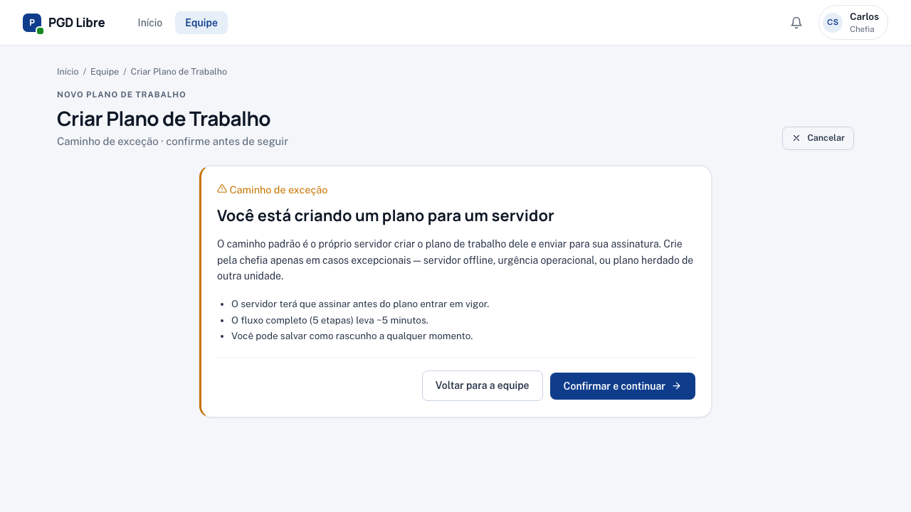
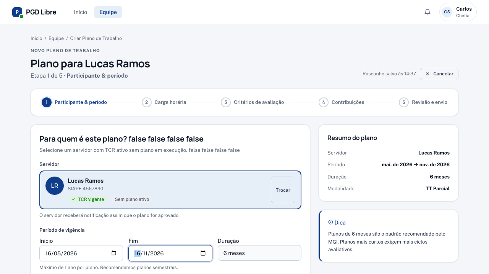
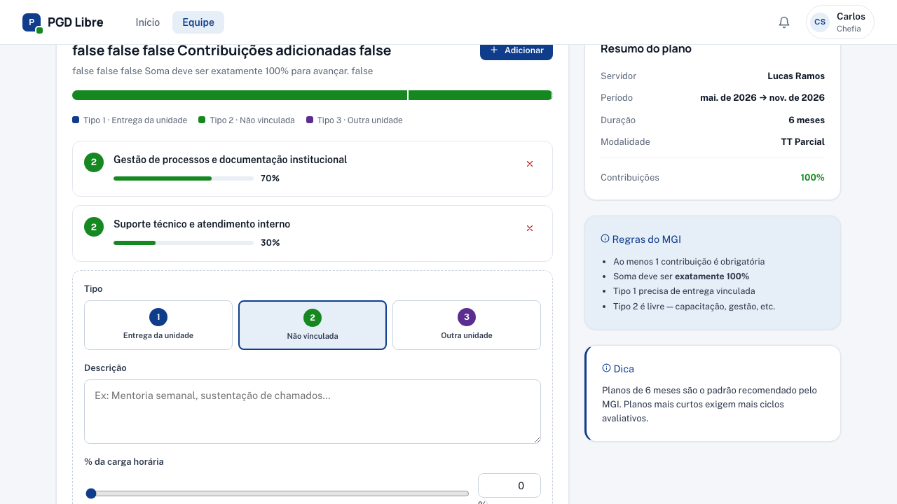
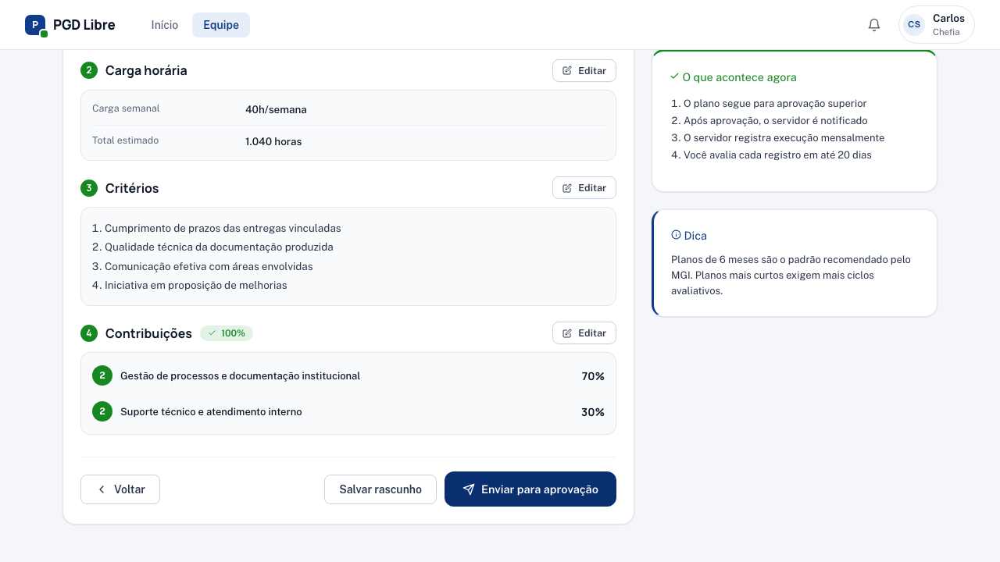

# Criar Plano de Trabalho (caso excepcional)

!!! warning "O caminho padrão é o próprio servidor criar"
    No PGD Libre, **o fluxo padrão é o servidor propor o Plano de Trabalho**. Use este wizard apenas em exceções: servidor recém-chegado, ausência prolongada, ou outros casos em que não é viável o servidor propor.

## Quando criar diretamente

- Servidor recém-chegado que ainda não tem acesso ou domínio do sistema
- Servidor em ausência prolongada (licença, afastamento) cujo plano precisa ser pactuado
- Casos pontuais em que a chefia precisa adiantar a pactuação por razões operacionais

Em todos os outros casos, oriente o servidor a criar o plano em [/meu-plano/criar](../servidor/criar-plano.md).

## Passo a passo

Acesse **Equipe** → clique no servidor → clique em **"Criar Plano de Trabalho"**

Ou acesse diretamente: `/equipe/planos-trabalho/novo`

O wizard tem 6 passos (com o passo 0 de confirmação da exceção):

---

### Passo 0 — Confirmar exceção



Antes de prosseguir, você precisa selecionar o **motivo da exceção**:

- Servidor recém-chegado
- Servidor em ausência prolongada
- Outro motivo (com campo de justificativa)

Esse registro fica no histórico de edições do plano, deixando transparente que ele foi criado por exceção.

Clique em **"Confirmar e continuar"** para abrir o wizard.

---

### Passo 1 — Participante e período



- **Selecione o participante** — o servidor para quem você está criando o plano
- **Data de início** — quando o plano começa a vigorar
- **Data de fim** — quando o plano encerra (pode ser renovado)

!!! tip "Duração recomendada"
    Planos de até 12 meses são mais fáceis de acompanhar. Você pode criar planos mais curtos para servidores em período de experiência.

---

### Passo 2 — Carga horária

- **Total de horas disponíveis** no período (descontadas férias, afastamentos previstos, feriados)

---

### Passo 3 — Critérios de avaliação

Descreva os critérios que você vai usar para avaliar o servidor. Seja específico:

**Exemplos de critérios:**

- "Qualidade e pontualidade das entregas conforme cronograma acordado"
- "Participação ativa nas reuniões de equipe"
- "Resolução de chamados dentro dos SLAs definidos"

Os critérios ficam visíveis para o servidor e guiam a auto-descrição dos registros.

---

### Passo 4 — Contribuições



As contribuições são as atividades que o servidor vai executar. A soma dos percentuais deve ser **exatamente 100%**.

| Campo | O que preencher |
|---|---|
| **Descrição** | O que a atividade envolve (seja claro e verificável) |
| **Percentual** | Quanto do tempo do servidor essa atividade representa |
| **Tipo** | 1 (atividade da unidade), 2 (atividade de suporte), 3 (cross-unit) |

**Exemplo:**

```
70% → Desenvolvimento de sistemas internos (tipo 1)
20% → Suporte técnico à equipe (tipo 2)
10% → Participação em projetos da CGTI (tipo 3 — cross-unit)
```

---

### Passo 5 — Revisão e envio



Revise todas as informações. O CTA final é **"Assinar e enviar para servidor"** — você assina nesta etapa.

Para assinar, você confirma os 3 itens:

1. Li e entendi o conteúdo do Plano de Trabalho.
2. Concordo com as contribuições, percentuais e critérios.
3. Estou ciente de que esta assinatura tem valor formal de pactuação.

## O que acontece depois

- O plano fica com status **"Aguardando assinatura do servidor"**.
- O servidor recebe notificação para [revisar e assinar a sua versão](../servidor/revisar-plano.md).
- O plano **só entra em execução** depois que o servidor também assinar — a pactuação é sempre bilateral.

Se o servidor discordar, ele pode devolver o plano para ajustes (volta para você) ou cancelar.

## Quando o servidor ainda não tem TCR

O TCR (Termo de Ciência e Responsabilidade) precisa estar ativo antes de criar o plano. Se o servidor ainda não assinou o TCR, entre em contato com o admin para regularizar.

## Veja também

- [Revisar e assinar Plano de Trabalho](revisar-plano.md) — fluxo padrão (quando o servidor cria)
- [Pactuação bilateral](../conceitos/pactuacao-bilateral.md) — conceito e diagrama de estados
