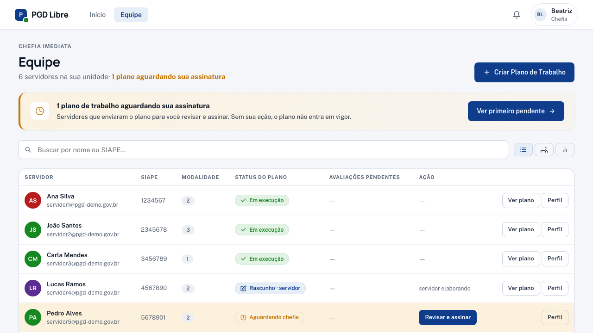
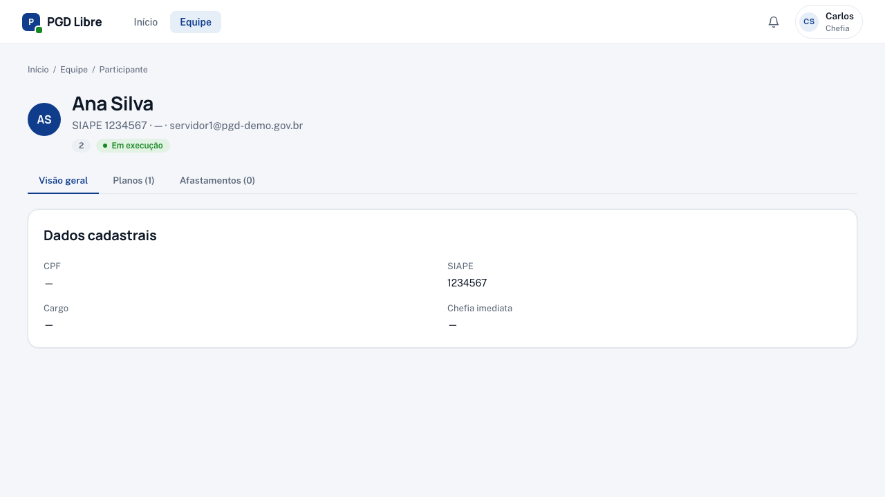

# Minha Equipe

A tela **Equipe** é seu painel de controle da equipe. Ela mostra todos os servidores sob sua chefia, as pendências de cada um e — no topo — um banner consolidado com as ações que aguardam você.

## Como acessar

Menu superior → **Equipe** (ou acesse `/equipe`)

## Banner de pendências

No topo da tela, um **banner consolidado** resume o que aguarda sua ação. Por exemplo: _"3 planos aguardando sua assinatura"_, com botão **"Ver primeiro pendente"** que abre direto a tela de revisão.

Use o banner como ponto de partida: revisar planos pendentes geralmente desbloqueia o servidor para começar a executar.

## O que você vê na tabela

Para cada servidor, a tabela exibe:

| Coluna | O que significa |
|---|---|
| **Nome e SIAPE** | Identificação do servidor |
| **Modalidade** | Teletrabalho Integral, Parcial ou Presencial |
| **Status do PT** | Estado atual da pactuação ou execução |
| **Pendências** | Badges com ações pendentes |
| **Ação** | Botão direto (ex.: "Revisar e assinar") |

## Badges e indicadores

| Badge | Significado |
|---|---|
| `Aguardando sua assinatura` (amarelo) | O servidor enviou o plano; você precisa revisar e assinar |
| `Você ajustou — aguardando servidor` (cinza) | Você ajustou e devolveu; servidor precisa reassinar |
| `Rascunho do servidor` (cinza claro) | Servidor está elaborando; ainda não enviou |
| `Em execução` (verde) | Plano pactuado e ativo |
| `Avaliação pendente` | O servidor enviou um registro aguardando sua avaliação |
| `Recurso aberto` | O servidor contestou uma avaliação; você tem 7 dias para responder |
| `Convocação pendente` | Você emitiu uma convocação que o servidor ainda não atendeu |

## O que fazer em cada caso

**Servidor com badge "Aguardando sua assinatura":**
→ Clique em **"Revisar e assinar"** ou abra pelo banner. [Guia completo](revisar-plano.md)

**Servidor com "Avaliação pendente":**
→ Clique no servidor → acesse o Plano de Trabalho → [Avaliar o registro](avaliar-registros.md)

**Servidor com "Recurso aberto":**
→ [Responda ao recurso](responder-recurso.md) dentro do prazo de 7 dias

**Servidor sem plano vigente:**
→ No fluxo padrão, o próprio servidor cria. Se houver impedimento (servidor recém-chegado, ausência), você pode criar via [wizard de exceção](criar-plano-excecao.md).

## Acessando o perfil de um servidor

Clique no nome do servidor para ver o perfil completo com planos e histórico:

No perfil você encontra o Plano de Trabalho ativo com:

- Contribuições e percentuais
- Histórico de períodos avaliativos
- Botão para avaliar o período pendente

## Plano de Entregas da unidade

No topo da tela de Equipe, você também vê o **Plano de Entregas** da sua unidade. Ele foi aprovado pelo gestor e define as metas coletivas do período.
