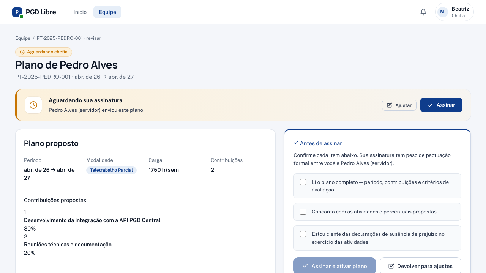
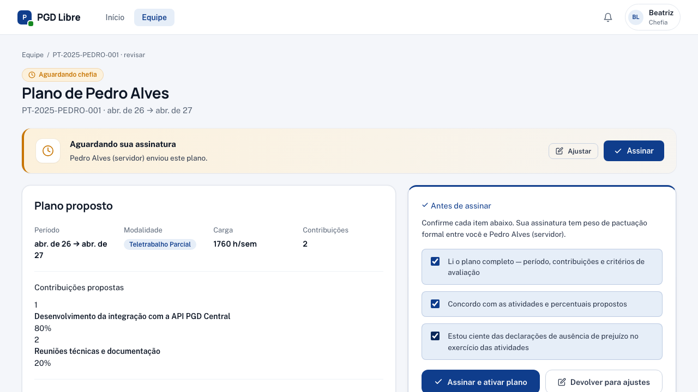
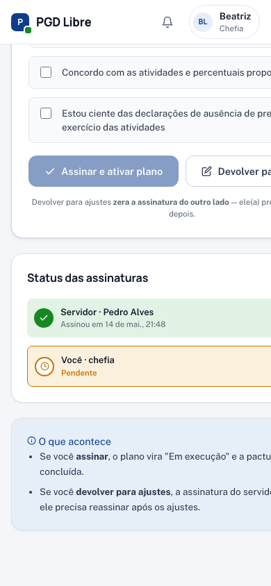

# Revisar e assinar Plano de Trabalho

No fluxo padrão, **o servidor cria o Plano de Trabalho** e envia para você revisar e assinar. Esta página explica como conduzir essa revisão e quais ações você tem.

## Quando você revisa um plano

A revisão acontece quando o plano está no status **"Aguardando sua assinatura"** (em código: `AGUARDANDO_ASSINATURA_CHEFIA`). Você é notificado por dois caminhos:

- **Notificação** ("O servidor X enviou um Plano de Trabalho para sua assinatura").
- **Banner consolidado na tela Equipe** ("X planos aguardando sua assinatura"), com botão para abrir o primeiro pendente.

## Como acessar

Em `/equipe`, identifique a linha do servidor com badge **"Aguardando sua assinatura"** e clique em **"Revisar e assinar"**. Você vai para `/equipe/planos-trabalho/<id>/revisar`.

## O que você vê na tela

A tela tem três blocos:

### 1. Plano em modo leitura

Todas as informações que o servidor enviou: período, vínculo com PE, carga horária, critérios de avaliação e contribuições (com percentuais).

### 2. Histórico de edições do servidor

A **linha do tempo** mostra como o servidor construiu o plano:

| Quando | Quem | O que fez |
|---|---|---|
| 3 dias atrás | Servidor | Criou o plano |
| 2 dias atrás | Servidor | Editou contribuições |
| 1 dia atrás | Servidor | Assinou e enviou para você |

### 3. Card de assinatura

À direita, o **card de assinatura** com 3 checks:

1. Li e entendi o conteúdo do Plano de Trabalho.
2. Concordo com as contribuições, percentuais e critérios.
3. Estou ciente de que esta assinatura tem valor formal de pactuação.

Marcando os três, o botão **"Assinar e ativar plano"** é habilitado.

## Suas 3 ações

### Assinar e ativar o plano

Use quando o plano está adequado e você concorda com a versão enviada pelo servidor.

1. Marque os 3 checks.
2. Clique em **"Assinar e ativar plano"**.

**Resultado:** status muda para **"Em execução"**. O servidor recebe notificação de que o plano foi pactuado.

### Devolver para ajustes

Use quando precisa de mudanças, mas prefere que **o próprio servidor** faça (ex.: faltou detalhe na descrição de uma contribuição, percentuais não fazem sentido, critérios precisam de exemplo concreto).

1. Clique em **"Devolver para ajustes"**.
2. Adicione uma justificativa: o que precisa mudar e por quê.

**Resultado:** o plano volta para **"Rascunho do servidor"**. O servidor edita, assina de novo e devolve para você revisar.

!!! tip "Quando devolver vs. quando ajustar"
    **Devolver** quando o ajuste é interpretativo ou exige conhecimento que o servidor tem. **Ajustar diretamente** quando é um detalhe operacional (data, valor, redação) que você já sabe corrigir.

### Ajustar diretamente

Use quando você prefere fazer o ajuste e devolver para o servidor reassinar a sua versão.

1. Clique em **"Ajustar"**. Você vai para a tela `/equipe/planos-trabalho/<id>/editar`.
2. Faça os ajustes necessários (datas, carga horária, contribuições, critérios).
3. Clique em **"Assinar e enviar para servidor"**.

**Resultado:** o plano vai para **"Aguardando assinatura do servidor"**. O servidor revisa o que você mudou (vê o diff destacado) e assina, devolve ou cancela.

!!! warning "A assinatura do servidor é zerada"
    Quando você ajusta, a assinatura prévia do servidor é invalidada. Ele precisa revisar e assinar a sua versão antes do plano entrar em execução. Use essa opção apenas quando o ajuste é necessário — caso contrário, prefira assinar diretamente.

## O que olhar durante a revisão

Antes de assinar, confira:

| Aspecto | Pergunta |
|---|---|
| **Percentuais** | Somam exatamente 100%? |
| **Critérios** | São verificáveis ou são vagos demais? |
| **Carga horária** | Bate com o período (descontando férias/feriados conhecidos)? |
| **Vínculo com PE** | Está vinculado ao Plano de Entregas vigente da unidade? |
| **Contribuições** | Refletem o que vocês combinaram em conversa prévia? |

## No celular

A revisão de plano pela chefia funciona igual ao caso do servidor: o card de assinatura fica fixo no rodapé, e a grade de informações se ajusta para 2 colunas.

{ width="320" }

Dica: ao "Devolver para ajustes" no celular, confirme antes de tocar — a ação zera a assinatura do servidor (se ele já tinha assinado uma versão anterior) e exige que ele reassine.

## Veja também

- [Minha Equipe](minha-equipe.md) — banner consolidado e badges
- [Criar Plano de Trabalho (caso excepcional)](criar-plano-excecao.md) — quando você cria em vez do servidor
- [Pactuação bilateral](../conceitos/pactuacao-bilateral.md) — diagrama completo de estados
