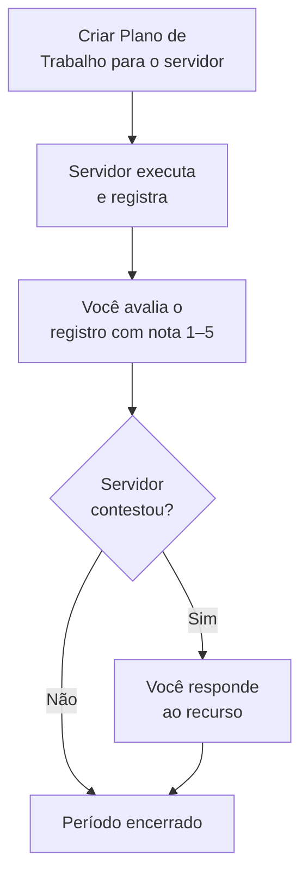

# Visão geral — Chefia Imediata

Como chefia imediata, você gerencia sua equipe direta no PGD: cria os planos de trabalho, avalia os registros mensais e responde aos recursos.

## O que você faz no sistema

## Sua tela principal

Ao fazer login, você vê o **Dashboard** com:

- **KPIs da equipe** — total de servidores, avaliações pendentes, recursos em aberto
- **Alertas de ação** — registros aguardando avaliação, recursos sem resposta
- **Plano de Entregas da unidade** — status atual

## Suas responsabilidades no ciclo

| Quando | O que você faz |
|---|---|
| Início do período | Cria ou revisa o Plano de Trabalho de cada servidor |
| Durante o período | Acompanha a equipe; pode emitir convocações |
| Ao final do período | Avalia os registros enviados pelos servidores |
| Após a avaliação | Responde aos recursos, se abertos (prazo: 7 dias) |

## Guias disponíveis

- [Minha Equipe](minha-equipe.md) — como ver o panorama da equipe e identificar pendências
- [Avaliar Registros](avaliar-registros.md) — como dar nota e justificar
- [Responder um Recurso](responder-recurso.md) — como lidar com contestações
- [Criar Plano de Trabalho](criar-plano.md) — wizard passo a passo
- [Emitir Convocação](emitir-convocacao.md) — para servidores em teletrabalho integral
- [Referência rápida](referencia-rapida.md) — atalhos para o dia a dia
