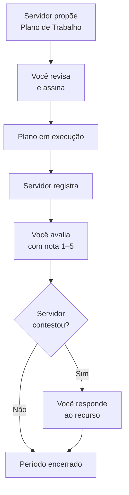
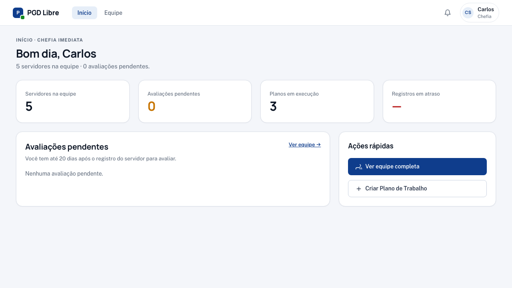
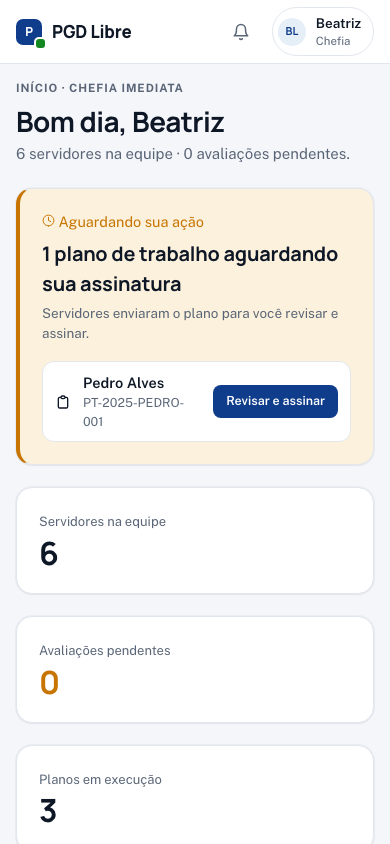

# Visão geral — Chefia Imediata

Como chefia imediata, você acompanha sua equipe direta no PGD: **revisa e assina os Planos de Trabalho propostos pelos servidores**, avalia os registros mensais e responde aos recursos. Criar o PT diretamente passa a ser caso de exceção.

## O que você faz no sistema

## Sua tela principal

Ao fazer login, você vê o **Dashboard** com:

- **Aguardando sua ação** — planos pendentes de sua assinatura, recursos sem resposta, avaliações pendentes
- **KPIs da equipe** — total de servidores, planos em execução, planos em pactuação
- **Plano de Entregas da unidade** — status atual

## Suas responsabilidades no ciclo

| Quando | O que você faz |
|---|---|
| Servidor envia plano | Revisar, assinar e ativar o plano (ou devolver para ajustes, ou ajustar diretamente) |
| Durante o período | Acompanhar a equipe; emitir convocações se necessário |
| Ao final do período | Avaliar os registros enviados pelos servidores |
| Após a avaliação | Responder aos recursos, se abertos (prazo: 7 dias) |
| Em casos excepcionais | Criar o Plano de Trabalho diretamente (servidor ausente, recém-chegado) |

## Guias disponíveis

- [Minha Equipe](minha-equipe.md) — banner de pendências, badges e como ver o panorama
- [Revisar e assinar Plano de Trabalho](revisar-plano.md) — fluxo padrão de pactuação **(novo)**
- [Avaliar Registros](avaliar-registros.md) — como dar nota e justificar
- [Responder um Recurso](responder-recurso.md) — como lidar com contestações
- [Criar Plano de Trabalho (exceção)](criar-plano-excecao.md) — quando o servidor não pode propor
- [Emitir Convocação](emitir-convocacao.md) — para servidores em teletrabalho integral
- [Referência rápida](referencia-rapida.md) — atalhos para o dia a dia

## No celular

A chefia recebe notificações de planos aguardando assinatura e pode revisar do celular. O dashboard tem um banner consolidado no topo quando há pendências.

{ width="320" }
