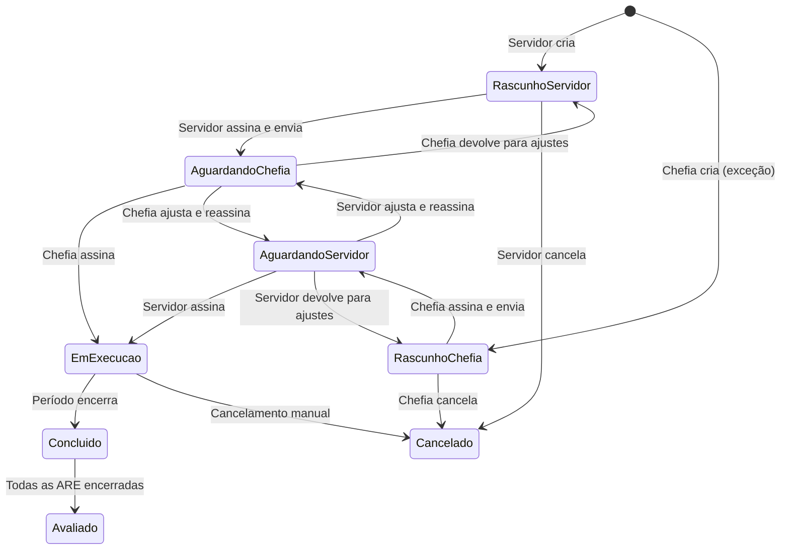

# Pactuação bilateral do Plano de Trabalho

A **pactuação bilateral** é o processo pelo qual o Plano de Trabalho deixa de ser um documento imposto pela chefia e passa a ser construído em conjunto com o servidor. Servidor propõe, chefia revisa, e ambos assinam a mesma versão antes do plano entrar em execução.

## Por que pactuação bilateral

Antes, a chefia criava o Plano de Trabalho sozinha e o servidor apenas executava. A pactuação bilateral muda esse paradigma:

- **Alinhamento real** — As atividades e percentuais refletem o que o servidor de fato vai entregar.
- **Autonomia do servidor** — Quem conhece o trabalho propõe a estrutura inicial.
- **Registro formal do acordo** — As duas assinaturas comprovam que ambos os lados consentiram com o conteúdo.
- **Rastreabilidade** — O histórico de edições deixa visível quem mudou o quê e quando.

## Quem cria o plano

| Cenário | Quem cria |
|---|---|
| **Padrão** | O **servidor** cria o seu plano em `/meu-plano/criar` (do zero ou clonando um plano anterior). |
| **Exceção** | A **chefia** cria o plano em `/equipe/planos-trabalho/novo`. Usado quando o servidor está ausente, recém-chegado ou impossibilitado de propor. |

Em ambos os casos, o plano só entra em execução depois que **as duas partes assinaram a mesma versão**.

## Diagrama de estados

## Tabela de transições

Quem pode mover o plano de um estado para outro:

| De | Para | Quem | Quando |
|---|---|---|---|
| (vazio) | Rascunho servidor | Servidor | Cria o plano via `/meu-plano/criar` |
| (vazio) | Rascunho chefia | Chefia (exceção) | Cria via `/equipe/planos-trabalho/novo` |
| Rascunho servidor | Aguardando chefia | Servidor | Assina e envia |
| Rascunho chefia | Aguardando servidor | Chefia | Assina e envia |
| Aguardando chefia | Em execução | Chefia | Assina (3 checks + botão) |
| Aguardando chefia | Rascunho servidor | Chefia | Devolve para ajustes |
| Aguardando chefia | Aguardando servidor | Chefia | Ajusta e reassina |
| Aguardando servidor | Em execução | Servidor | Assina |
| Aguardando servidor | Rascunho chefia | Servidor | Devolve para ajustes |
| Aguardando servidor | Aguardando chefia | Servidor | Ajusta e reassina |
| Em execução | Concluído | Sistema | Período encerra |
| Concluído | Avaliado | Sistema | Todas as ARE encerradas |
| Em execução / Rascunho | Cancelado | Servidor ou chefia | Cancelamento manual |

!!! note "O que muda quando alguém ajusta"
    Quando uma das partes **ajusta** o plano após o outro já ter assinado, a assinatura prévia é **invalidada** automaticamente. O lado original precisa revisar o que mudou e assinar de novo. Isso garante que ninguém entra em execução com uma versão que não viu.

## Os 3 checks da assinatura

Para assinar, é preciso confirmar três pontos:

1. Li e entendi o conteúdo do Plano de Trabalho.
2. Concordo com as contribuições, percentuais e critérios.
3. Estou ciente de que esta assinatura tem valor formal de pactuação.

Só após marcar os três checks o botão "Assinar" é habilitado.

## Conceitos relacionados

- **Rascunho** — Estado em que uma das partes está elaborando o plano. Pode ser editado livremente sem afetar o outro lado.
- **Aguardando assinatura** — Uma parte já assinou e enviou. Falta a outra revisar e assinar.
- **Diff de pactuação** — Comparação entre a versão enviada e a versão atual (com ajustes). Aparece quando o lado original revisa um plano ajustado.
- **Histórico de edições** — Linha do tempo com todas as mudanças, autor e data. Visível em todas as telas de pactuação.

## Base legal

A pactuação bilateral atende ao **Decreto 11.072/2022** e à **IN SEGES/MGI nº 24/2023**, que preveem acordo formal entre servidor e chefia para definição do Plano de Trabalho. A assinatura eletrônica de ambas as partes constitui o registro de pactuação exigido pela norma.

## Próximos passos

- [Servidor — Criar meu Plano de Trabalho](../servidor/criar-plano.md)
- [Servidor — Revisar plano ajustado pela chefia](../servidor/revisar-plano.md)
- [Chefia — Revisar e assinar Plano de Trabalho](../chefia/revisar-plano.md)
- [Chefia — Criar Plano de Trabalho (exceção)](../chefia/criar-plano-excecao.md)
