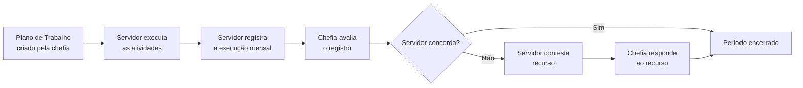

# O Programa de Gestão e Desempenho

O **Programa de Gestão e Desempenho (PGD)** é o instrumento pelo qual os órgãos do Poder Executivo Federal autorizam e gerenciam o teletrabalho de seus servidores, com foco em resultados e metas.

## O que é, em termos simples

Em vez de controlar a presença física do servidor, o PGD controla **o que foi entregue**. O servidor e a chefia combinam, no início de cada período, quais atividades serão realizadas e em que proporção. Ao final do período, o servidor registra o que fez, e a chefia avalia.

## O ciclo básico

## Por que existe

O PGD surgiu como resposta à necessidade de:

1. **Regulamentar o teletrabalho** com critérios claros de avaliação de desempenho
2. **Garantir conformidade** com a legislação federal (Decreto 11.072/2022)
3. **Substituir controles de ponto** por controle de entregas e resultados

## Quem participa

- **Servidor:** executa atividades e registra mensalmente o que foi feito
- **Chefia imediata:** cria o plano de trabalho e avalia os registros
- **Gestor de unidade:** aprova os planos de entregas da unidade e monitora KPIs
- **Admin:** gerencia participantes e acompanha a conformidade sistêmica

## Base legal resumida

| Norma | O que diz |
|---|---|
| Decreto 11.072/2022 | Institui o PGD como instrumento de gestão orientada a resultados |
| IN SEGES/MGI 24/2023 | Regulamenta o teletrabalho; define modalidades (integral, parcial, presencial) |
| IN SEGES/MGI 52/2023 | Atualiza procedimentos de avaliação e prazos |

!!! tip "Saiba mais"
    Para entender os termos técnicos usados no sistema, consulte o [Glossário](glossario.md).
