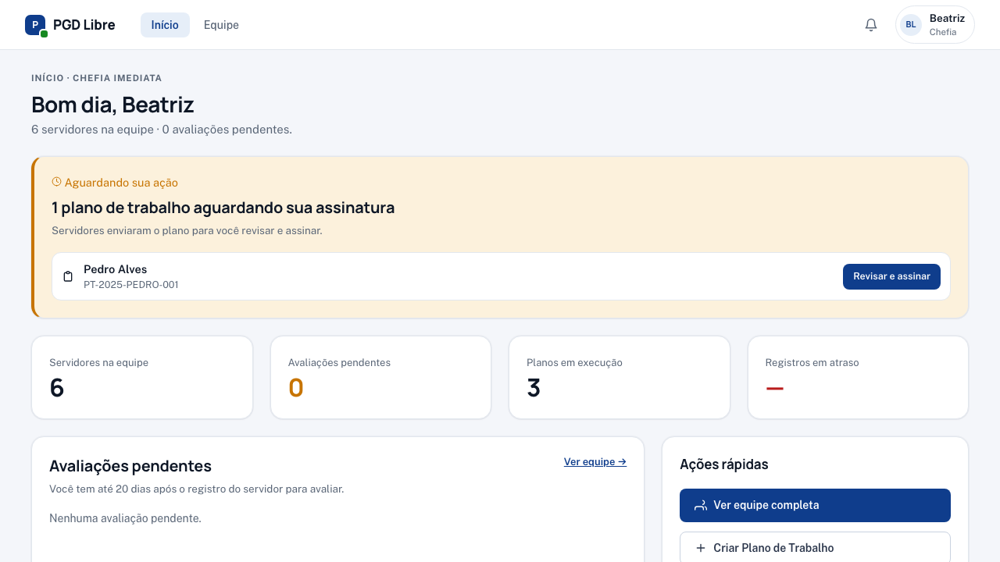

# Jornada da Chefia na Demo

Explore as funcionalidades da chefia imediata com personas que cobrem o novo fluxo de pactuação bilateral.

| Persona | Email | Estado interessante |
|---|---|---|
| Carlos Souza | `chefe1@pgd-demo.gov.br` | CGPGD; tem PT do Felipe ajustado pendente, recurso e avaliação |
| Beatriz Lima | `chefe2@pgd-demo.gov.br` | CGTI; PT do Pedro aguardando assinatura dela |

[Faça login →](acesso.md)

---

## Jornada 3a — Revisar e assinar PT do servidor

**Persona:** Beatriz Lima (`chefe2@pgd-demo.gov.br`)

**Situação:** Pedro Alves enviou um Plano de Trabalho. Beatriz precisa revisar e assinar.

### No dashboard (`/`)

Beatriz vê o card **"Aguardando sua ação"** com a contagem de planos pendentes.

### Na tela Equipe (`/equipe`)

- **Banner consolidado** no topo: "1 plano aguardando sua assinatura" + botão "Ver primeiro pendente"
- Pedro aparece com badge **"Aguardando sua assinatura"** e botão direto **"Revisar e assinar"**

### Revisando o plano (`/equipe/planos-trabalho/<id>/revisar`)

A tela mostra:

- Plano em modo leitura (período, carga horária, critérios, contribuições)
- Timeline de edições do servidor
- Card de assinatura com 3 checks

### Assinando

1. Beatriz marca os 3 checks:
   - Li e entendi o conteúdo do Plano de Trabalho.
   - Concordo com as contribuições, percentuais e critérios.
   - Estou ciente de que esta assinatura tem valor formal de pactuação.
2. Clica em **"Assinar e ativar plano"**

**Pós-condição:** plano vai para **"Em execução"**. Pedro recebe notificação.

→ [Guia completo de revisão](../chefia/revisar-plano.md)

---

## Jornada 3b — Devolver para ajustes

**Persona:** Beatriz Lima — revisando o mesmo PT do Pedro

**Situação:** Em vez de assinar, Beatriz vê que faltou detalhe nas descrições de contribuição.

1. Em `/equipe/planos-trabalho/<id>/revisar`, clica em **"Devolver para ajustes"**
2. Adiciona uma justificativa: _"Por favor, detalhar a contribuição de 'gestão' indicando o tipo de atividade."_
3. Confirma

**Pós-condição:** plano volta para **"Rascunho do servidor"**. A assinatura prévia do Pedro (se houvesse) é zerada — ele precisa editar e reassinar.

---

## Jornada 3c — Ajustar diretamente

**Persona:** Beatriz Lima — fluxo alternativo

**Situação:** Beatriz quer corrigir um detalhe operacional sem devolver para o servidor.

1. Em `/equipe/planos-trabalho/<id>/revisar`, clica em **"Ajustar"**
2. Vai para `/equipe/planos-trabalho/<id>/editar`
3. Faz os ajustes (ex.: corrige a carga horária)
4. Clica em **"Assinar e enviar para servidor"**

**Pós-condição:** plano vai para **"Aguardando assinatura do servidor"**. Pedro vê o diff "A chefia ajustou X campos" em `/meu-plano/<id>/revisar` e precisa assinar a nova versão.

---

## Jornada 4 — Avaliar registro pendente

**Persona:** Carlos Souza (`chefe1@pgd-demo.gov.br`)

**Situação:** João Santos registrou a execução do mês anterior. Aguarda avaliação.

1. **Equipe** → clicar em João
2. Acessar o Plano de Trabalho dele
3. Clicar no período ARE-JOAO-001 com status "Registrado — aguardando avaliação"
4. Clicar em **"Avaliar"**
5. Selecionar a nota (1–5) com o seletor visual
6. Adicionar justificativa (obrigatória para notas 1, 4 e 5)
7. Confirmar → João recebe notificação

---

## Jornada 5 — Responder um recurso

**Persona:** Carlos Souza

**Situação:** Ana contestou a nota 4. Carlos tem uma notificação de recurso aberto.

1. Dashboard → ver notificação de recurso
2. Clicar no link → abre a ARE-ANA-002
3. Ler o texto do recurso de Ana
4. Escolher: **Acatar** (revisa a nota) ou **Não acatar** (mantém com justificativa)
5. Confirmar → Ana recebe notificação da resposta

---

## Jornada 6 — Emitir convocação

**Persona:** Carlos Souza

**Situação:** João está em teletrabalho integral. Reunião presencial necessária.

!!! info "Na demo, já existe uma convocação"
    A convocação de João já foi emitida (status pendente). Esta jornada mostra o fluxo de criação.

1. **Equipe** → clicar em João
2. Clicar em **"Convocar"**
3. Preencher: data, horário, local, período presencial, motivo
4. Sistema verifica prazo mínimo de 5 dias
5. Confirmar → João recebe notificação

---

## Jornada 7 — Criar PT (caso excepcional)

**Persona:** Carlos Souza

!!! warning "Este é o caminho de exceção"
    O fluxo padrão é o próprio servidor criar. Use este wizard apenas quando o servidor não pode propor (recém-chegado, ausente prolongado).

1. **Equipe** → clicar no servidor → **"Criar Plano de Trabalho"**
2. **Passo 0 — Confirmar exceção**:

   

   Selecionar o motivo da exceção (servidor recém-chegado, ausência prolongada, outro)

3. **Passos 1–5** — preencher período, carga horária, critérios, contribuições
4. **Passo 5 — Revisão**: clicar em **"Assinar e enviar para servidor"**

**Pós-condição:** plano vai para **"Aguardando assinatura do servidor"**. Só entra em execução depois que o servidor assinar também.

→ [Guia completo](../chefia/criar-plano-excecao.md)

---

## O que explorar também

- **[Guia de revisar e assinar →](../chefia/revisar-plano.md)** — fluxo padrão
- **[Guia de avaliar registros →](../chefia/avaliar-registros.md)**
- **[Pactuação bilateral →](../conceitos/pactuacao-bilateral.md)**
