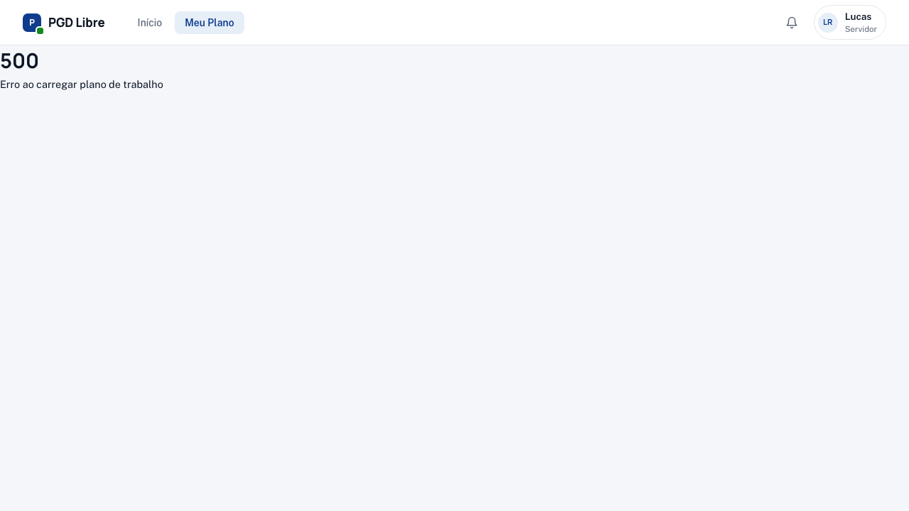
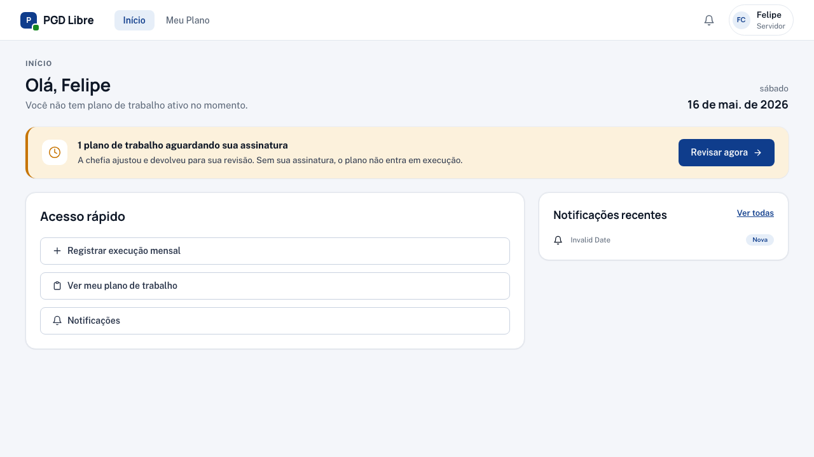
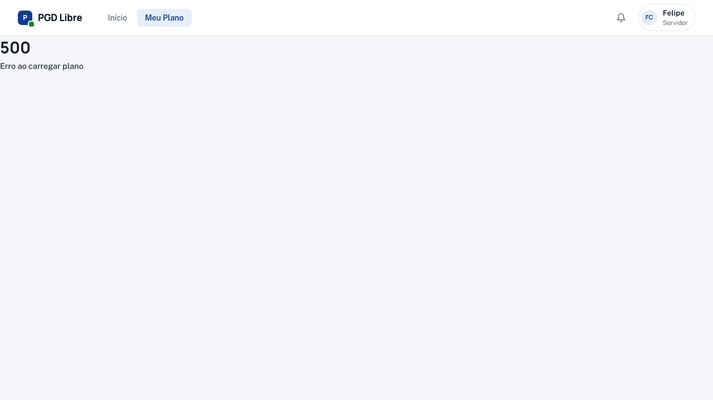

# Jornada do Servidor na Demo

Explore as funcionalidades do servidor com personas que cobrem todos os estados do novo workflow de pactuação bilateral.

| Persona | Email | Estado interessante |
|---|---|---|
| Marta Silva | `servidor7@pgd-demo.gov.br` | Sem plano — pode criar do zero |
| Ana Silva | `servidor1@pgd-demo.gov.br` | Plano em execução; tem plano anterior para clonar |
| Lucas Ramos | `servidor4@pgd-demo.gov.br` | Plano em rascunho (editando) |
| Felipe Costa | `servidor6@pgd-demo.gov.br` | Chefia ajustou e devolveu — aguarda assinatura dele |

[Faça login →](acesso.md)

---

## Jornada 0 — Criar meu Plano de Trabalho

**Persona:** Marta Silva (`servidor7@pgd-demo.gov.br`)

**Situação:** Marta entrou recentemente no PGD e ainda não tem Plano de Trabalho.

### Tela inicial vazia (`/meu-plano`)

Marta vê dois caminhos:

- **Criar do zero** — abre o wizard `/meu-plano/criar`
- **Clonar plano anterior** (não disponível para Marta, pois ela ainda não tem histórico)

### Wizard de criação — 5 passos

1. **Período e vínculo com PE**

   

2. **Carga horária** — total de horas disponíveis no período
3. **Critérios de avaliação** — o que a chefia vai usar para avaliar
4. **Contribuições**

   

5. **Revisão e envio**

   

Para assinar, Marta confirma os 3 checks e clica em **"Assinar e enviar para chefia"**.

**Pós-condição:** plano vai para "Aguardando assinatura da chefia". A chefia (Carlos Souza) recebe notificação.

→ [Guia completo de criação](../servidor/criar-plano.md)

---

## Jornada 1a — Reaproveitar plano anterior (clonar)

**Persona:** Ana Silva (`servidor1@pgd-demo.gov.br`)

**Situação:** Ana tem um plano em execução e também um plano concluído do semestre anterior. Quer reaproveitar a estrutura ao pactuar o próximo plano.

### Em `/meu-plano`

1. Ana clica em **"Clonar plano anterior"**
2. Um modal abre listando seus planos anteriores:

   

3. Ana escolhe o `PT-2024-ANA-002`, define as datas novas e clica em **"Clonar e editar"**

**Pós-condição:** novo plano em rascunho com todas as contribuições e critérios copiados; Ana ajusta o que precisa e segue para assinar.

---

## Jornada 1b — Editar meu rascunho

**Persona:** Lucas Ramos (`servidor4@pgd-demo.gov.br`)

**Situação:** Lucas está elaborando seu plano. Já fez 3 edições nas últimas 48 horas (visíveis na linha do tempo).

### Em `/meu-plano/<id>/editar`

Lucas vê:

- **Banner de ownership** — "Você está editando seu rascunho"
- **Auto-save** — alterações salvam automaticamente
- **Timeline de edições** — registro de quando ele criou e o que mudou

Quando estiver pronto, ele clica em **"Assinar e enviar para chefia"**.

---

## Jornada 1c — Revisar ajustes da chefia e assinar

**Persona:** Felipe Costa (`servidor6@pgd-demo.gov.br`)

**Situação:** Felipe enviou o plano há 10 dias. A chefia ajustou 2 campos (carga horária + data de término), assinou e devolveu para ele revisar.

### No dashboard (`/`)

Felipe vê o card **"Aguardando sua ação"** com o plano dele em destaque.

### Revisando o ajuste (`/meu-plano/<id>/revisar`)

Felipe vê:

- **Banner do que mudou** — "A chefia ajustou 2 campos"
- **Histórico de edições** — quem fez o quê e quando
- **Card de assinatura** — 3 checks para habilitar o botão

Ações disponíveis:

- **Assinar e ativar plano** — vai para "Em execução"
- **Devolver para ajustes** — volta para a chefia editar de novo (zera a assinatura dela)
- **Cancelar plano**

→ [Guia completo de revisão](../servidor/revisar-plano.md)

---

## Jornada 2 — Registrar execução (plano já pactuado)

**Persona:** Ana Silva — plano em execução

**Situação:** O período avaliativo atual está aberto. Ana precisa registrar o que fez no mês.

1. Acesse **Meu Plano**
2. Clique em **"Registrar execução"** → `/meu-plano/registrar`
3. Descreva o que foi feito; (opcional) adicione ocorrências
4. **Enviar registro**

**Pós-condição:** registro vai para a chefia avaliar.

---

## Jornada 3 — Contestar uma avaliação (recurso)

**Persona:** Ana Silva — usando a ARE-ANA-002 (nota 4)

!!! note "Na demo, o recurso já está aberto"
    Para ver o fluxo completo de abertura, use **João Santos** (`servidor2@pgd-demo.gov.br`).

1. Em **Meu Plano**, clique no período avaliativo com a nota que quer contestar
2. Leia a nota e a justificativa da chefia
3. Dentro dos 10 dias de prazo, clique em **"Contestar avaliação"**
4. Escreva o texto do recurso
5. **Enviar recurso**

**Pós-condição:** chefia recebe notificação e tem 7 dias para responder.

---

## O que explorar também

- **[Ver as avaliações →](../servidor/avaliacoes.md)** — entenda o que cada nota significa
- **[Guia de criar plano →](../servidor/criar-plano.md)**
- **[Pactuação bilateral — conceito →](../conceitos/pactuacao-bilateral.md)**
