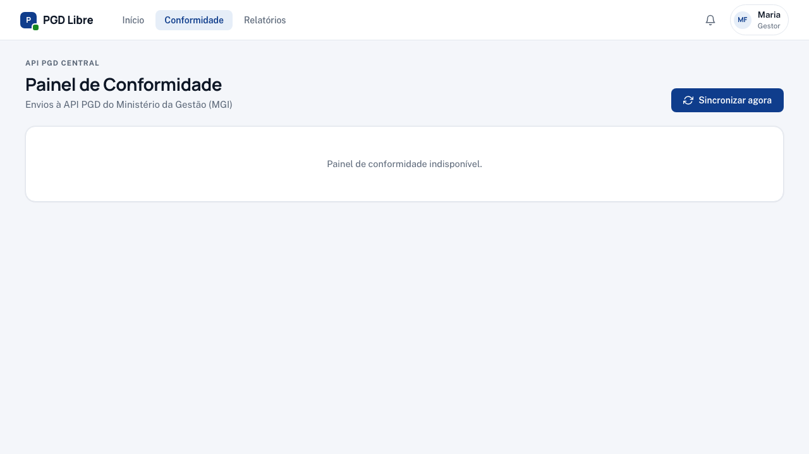

# Painel de Conformidade

O painel de conformidade mostra o status de sincronização com a **API PGD Central** do MGI. O PGD Libre sincroniza automaticamente os dados de participantes, planos e avaliações com a API Central. Quando a sincronização falha, aparece aqui.

## Como acessar

Menu superior → **Conformidade** (ou acesse `/conformidade`)

## O que você vê

A tela exibe uma tabela com todas as tentativas de envio para a API Central:

| Coluna | O que significa |
|---|---|
| **Participante** | Quem é o titular dos dados enviados |
| **Tipo de dado** | O que foi enviado (PlanoTrabalho, ARE, etc.) |
| **Data do envio** | Quando a tentativa ocorreu |
| **Status** | `OK` (sucesso) ou `ERRO` (falha) |
| **Mensagem** | Descrição do erro, quando houver |

## Interpretando os status

| Status | O que fazer |
|---|---|
| ✅ OK | Nenhuma ação necessária |
| ❌ ERRO | Investigar e tentar reenvio manual |

## Tipos de erro comuns

| Erro | Causa provável | O que fazer |
|---|---|---|
| `HTTP 500 — Timeout` | API Central do MGI instável | Aguardar e tentar reenvio |
| `HTTP 401 — Unauthorized` | Token de integração expirado | Contatar o admin para renovar o token |
| `HTTP 422 — Validation error` | Dados enviados fora do formato esperado | Contatar o admin técnico |

## Reenvio manual

1. Clique no registro de erro → acesse `/conformidade/erro/<id>`
2. Veja os detalhes: HTTP status, mensagem, timestamp, número de tentativas
3. Clique em **"Reenviar"** para disparar uma nova tentativa

!!! info "Tentativas automáticas"
    O sistema faz até 3 tentativas automáticas antes de marcar como erro permanente. O reenvio manual reinicia esse contador.

## Relatório de conformidade

Para exportar ou compartilhar o status de conformidade com a área técnica, acesse **Relatórios** → **Conformidade com a API Central**.

!!! warning "Erros persistentes"
    Se um registro continua falhando após múltiplos reenvios manuais, o problema pode estar na API Central (que é externa ao sistema) ou nos dados do participante. Acione o admin técnico para investigação.
