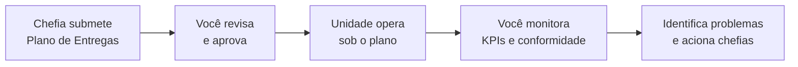

# Visão geral — Gestor de Unidade

Como gestor de unidade, você atua no nível estratégico: aprova os planos coletivos da unidade, monitora KPIs consolidados e acompanha a conformidade com a API PGD Central.

## O que você faz no sistema

## Sua tela principal

Ao fazer login, você vê o **Dashboard** com KPIs consolidados de todas as equipes:

- Total de servidores participantes
- Planos de Entregas ativos e pendentes de aprovação
- Status de sincronização com a API PGD Central
- Alertas de inconformidade

## Suas responsabilidades

| Quando | O que você faz |
|---|---|
| Início do ciclo | Revisa e aprova os Planos de Entregas das equipes |
| Durante o ciclo | Monitora KPIs; verifica servidores sem plano de trabalho |
| Continuamente | Acompanha o painel de conformidade (erros de sync com API Central) |

## Guias disponíveis

- [Dashboard e KPIs](dashboard.md) — como ler e interpretar os indicadores
- [Aprovar Planos de Entregas](aprovar-planos.md) — revisão e aprovação dos planos coletivos
- [Painel de Conformidade](conformidade.md) — erros de sincronização e como resolver
