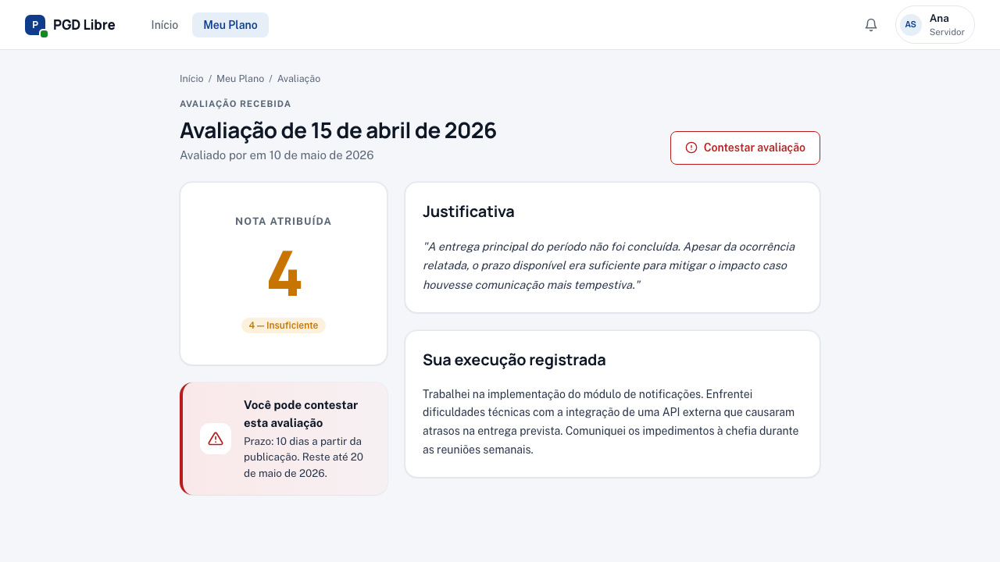

# Minhas Avaliações

Após você enviar o registro de execução, sua chefia imediata avalia o período com uma nota de 1 a 5.

## Como ver suas avaliações

**Meu Plano** → clique em qualquer período avaliativo com status "Avaliado" ou "Encerrado".

## O que cada nota significa

| Nota | Classificação | O que indica |
|---|---|---|
| **1** | Excepcional | Superou significativamente as expectativas |
| **2** | Alto desempenho | Superou as expectativas |
| **3** | Adequado | Atendeu plenamente às expectativas |
| **4** | Insuficiente | Não atendeu plenamente; requer melhoria |
| **5** | Insatisfatório | Desempenho muito abaixo do esperado |

!!! tip "A maioria cai aqui"
    Nota 3 (Adequado) é a nota padrão para quem cumpriu o que foi combinado no plano. Notas 4 e 5 são acompanhadas de justificativa obrigatória da chefia.

## O que você encontra na página de avaliação

- **Nota** — exibida com badge colorido
- **Justificativa da chefia** — texto explicando a nota (obrigatório para notas 1, 4 e 5)
- **Data da avaliação**
- **Nome do avaliador**
- **Botão "Contestar"** — disponível por 10 dias após a avaliação

## Quando você recebe a notificação

Assim que a chefia confirmar a avaliação, você recebe uma notificação no sistema. Acesse o sino de notificações ou vá direto para o período avaliativo correspondente.

## Histórico de períodos

No **Meu Plano**, você vê todos os períodos do plano com seus status. Use o histórico para acompanhar a evolução do seu desempenho ao longo do tempo.

!!! info "Recurso disponível por 10 dias"
    Se você discordar da nota, tem 10 dias corridos a partir da avaliação para contestar. Veja como em [Contestar uma Avaliação](contestar-avaliacao.md).
