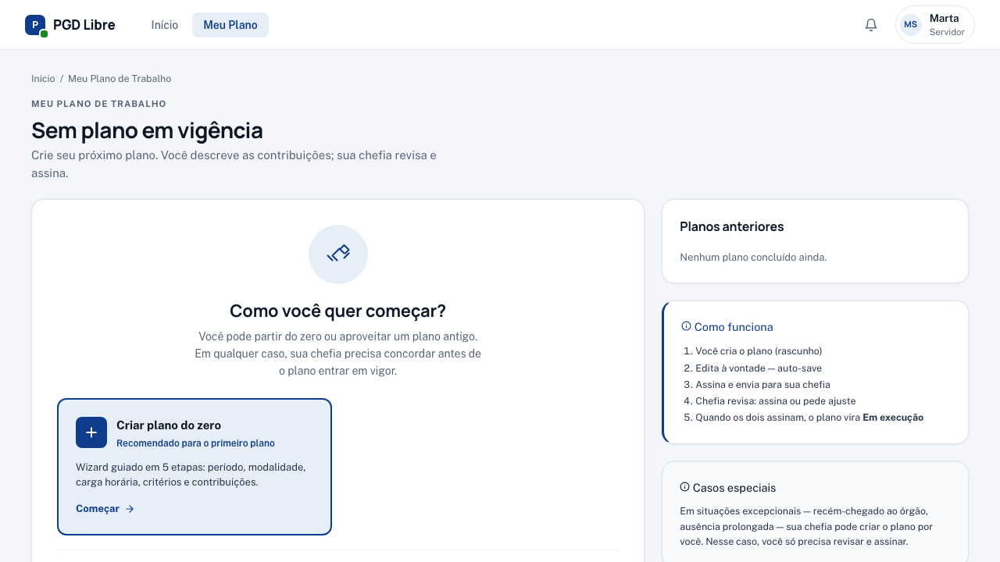
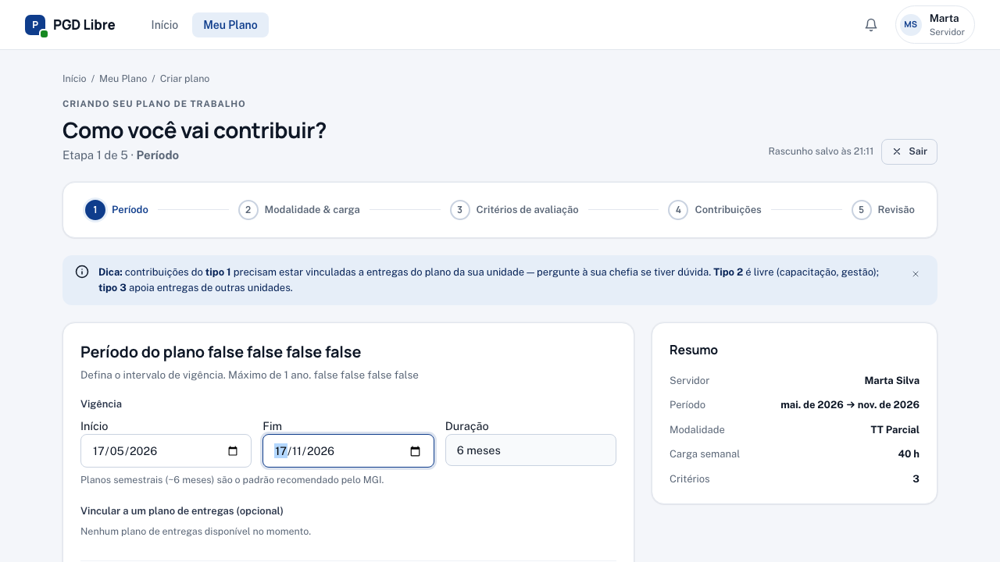
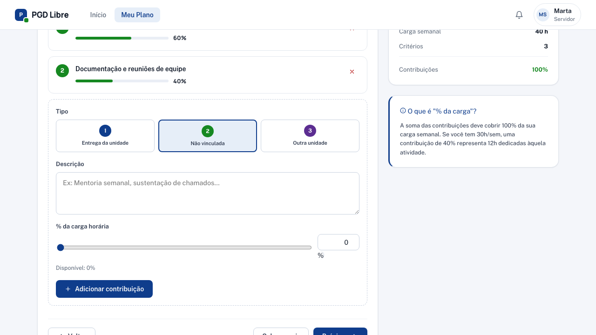
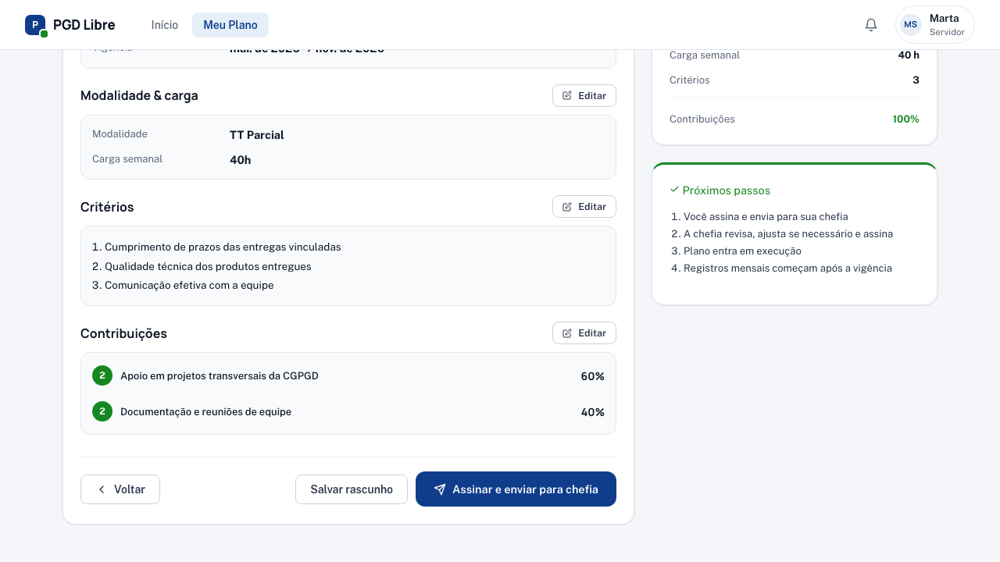
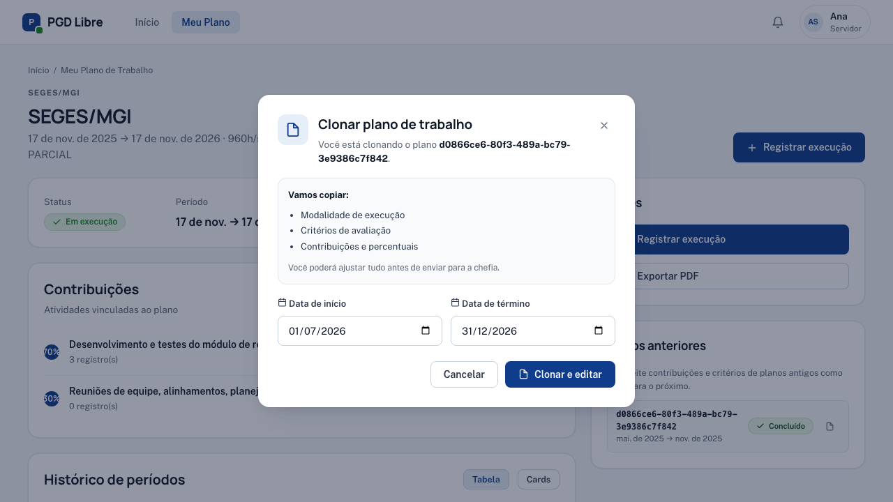
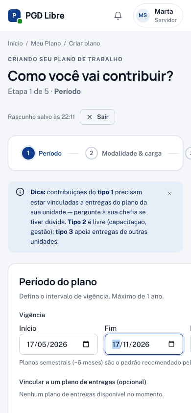
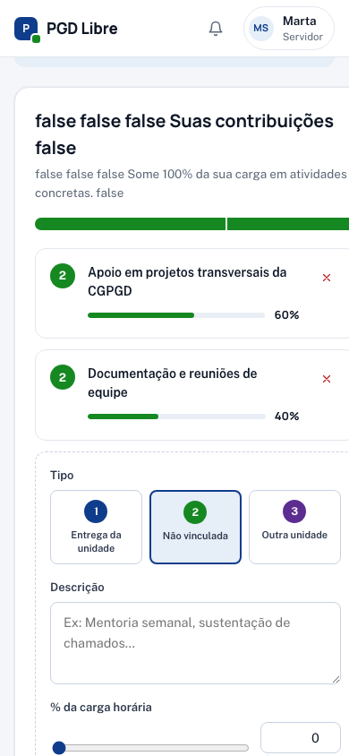

# Criar meu Plano de Trabalho

No PGD Livre, **você é o autor do seu Plano de Trabalho**. Esta página explica como propor um plano do zero ou reaproveitando um plano anterior.

## Quando criar um plano

- Você entrou no PGD agora e ainda não tem um plano vigente.
- O plano anterior encerrou e você precisa pactuar o do próximo período.
- Você quer atualizar contribuições, percentuais ou critérios e abrir um novo ciclo.

## Dois caminhos

| Caminho | Quando usar |
|---|---|
| **Criar do zero** | Primeira vez no PGD, ou as atividades mudaram bastante. |
| **Clonar plano anterior** | Você já teve plano antes e as contribuições continuam parecidas. |

→ [Pular para a seção de Clonar](#reaproveitar-um-plano-anterior-clonar)

## Como acessar

Menu superior → **Meu Plano**. Se você ainda não tem plano vigente, verá dois botões:



Clique em **"Criar do zero"** para abrir o wizard em `/meu-plano/criar`.

## Wizard de criação — 5 passos

### Passo 1 — Período e vínculo com o Plano de Entregas



| Campo | O que preencher |
|---|---|
| **Data de início** | Quando o plano começa a vigorar |
| **Data de fim** | Quando o plano encerra |
| **Plano de Entregas vinculado** | O PE da sua unidade (a chefia já configurou) |

!!! tip "Duração recomendada"
    Planos de até 12 meses são mais fáceis de acompanhar. Você pode pactuar planos mais curtos se estiver em período de experiência ou prevê mudança de atribuições.

### Passo 2 — Carga horária

Informe o total de horas que você terá disponível no período, descontando férias previstas, afastamentos planejados e feriados.

### Passo 3 — Critérios de avaliação

Descreva os critérios que serão usados pela chefia para avaliar seu desempenho. Devem ser **verificáveis** e **combinados com a chefia previamente**.

**Exemplos de critérios:**

- "Qualidade e pontualidade das entregas conforme cronograma."
- "Participação ativa nas reuniões de equipe."
- "Resolução de chamados dentro do SLA acordado."

### Passo 4 — Contribuições



As contribuições são as atividades que você vai executar. A soma dos percentuais precisa ser **exatamente 100%**.

| Campo | O que preencher |
|---|---|
| **Descrição** | O que a atividade envolve (seja claro e verificável) |
| **Percentual** | Quanto do seu tempo essa atividade representa |
| **Tipo** | 1 (atividade da unidade), 2 (suporte), 3 (cross-unit) |

**Exemplo:**

```
60% → Apoio em projetos transversais da CGPGD (tipo 1)
40% → Documentação e reuniões de equipe (tipo 2)
```

### Passo 5 — Revisão e envio



Confira todas as informações. Quando estiver tudo certo, clique em **"Assinar e enviar para chefia"**.

Para assinar, você precisa confirmar 3 itens:

1. Li e entendi o conteúdo do Plano de Trabalho.
2. Concordo com as contribuições, percentuais e critérios.
3. Estou ciente de que esta assinatura tem valor formal de pactuação.

Só depois dos 3 checks o botão "Assinar" fica habilitado.

## O que acontece depois

- O plano passa para o status **"Aguardando assinatura da chefia"**.
- Sua chefia recebe notificação para revisar.
- A chefia pode: **assinar e ativar** (vira "Em execução"), **devolver para ajustes** (volta para você editar) ou **ajustar diretamente** (você revisa o que mudou e reassina).

→ [Saiba como funciona quando a chefia ajusta](revisar-plano.md)

## Posso salvar como rascunho?

Sim. Em qualquer passo do wizard, suas alterações são salvas automaticamente como **rascunho**. Você pode fechar a aba e voltar depois para continuar de onde parou — basta acessar **Meu Plano** → seu rascunho aparecerá listado.

Em modo rascunho, você edita livremente: campos, contribuições, percentuais. Nada disso é visto pela chefia até você clicar em "Assinar e enviar".

---

## Reaproveitar um plano anterior (Clonar)

Se você já teve um Plano de Trabalho concluído ou avaliado, dá para clonar todo o conteúdo dele em segundos e ajustar só o que mudou.

### Quando aparece o botão "Clonar"

O botão **"Clonar plano anterior"** aparece na tela `/meu-plano` quando você tem pelo menos um plano em status **Concluído** ou **Avaliado**.

### Passo a passo

1. Em **Meu Plano**, clique em **"Clonar plano anterior"**. Um modal abre listando seus planos anteriores.

   

2. Escolha o plano que quer clonar.
3. Preencha as **datas do novo plano** (início e fim).
4. Clique em **"Clonar e editar"**.

Você é redirecionado para `/meu-plano/<novo_id>/editar`. O plano já está em **Rascunho** com todo o conteúdo copiado, pronto para ajustes.

### O que é copiado e o que não é

| Copiado | Não copiado |
|---|---|
| Contribuições (descrição, percentual, tipo) | Assinaturas |
| Critérios de avaliação | Datas (você define as novas) |
| Carga horária base | Vínculo com Plano de Entregas (precisa selecionar o vigente) |

Após ajustar o que for necessário, siga o fluxo normal: revisar → "Assinar e enviar para chefia".

---

## No celular

O wizard de criação roda igual em mobile — os 5 passos aparecem em coluna, os botões "Voltar" e "Próximo" ficam no rodapé.

{ width="320" }

Na etapa de **contribuições** (passo 4), o teclado virtual pode cobrir o campo de descrição — role a tela após digitar o percentual para ver a lista das contribuições já adicionadas.

{ width="320" }

---

## Veja também

- [Revisar plano ajustado pela chefia](revisar-plano.md) — quando a chefia ajusta e devolve para você reassinar
- [Meu Plano de Trabalho](meu-plano.md) — entender estados, contribuições e histórico
- [Pactuação bilateral](../conceitos/pactuacao-bilateral.md) — o conceito e o diagrama completo de estados
