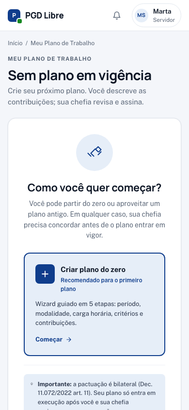
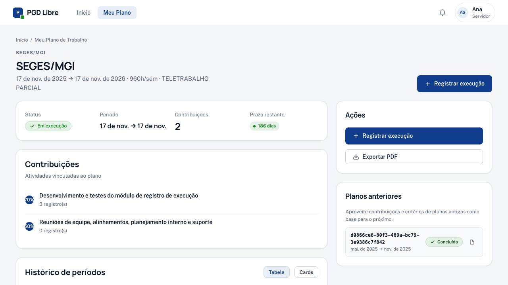

# Meu Plano de Trabalho

O **Plano de Trabalho** é o documento que define quais atividades você vai executar e em que proporção. No PGD Livre, ele é **pactuado** entre você e sua chefia: você propõe, ela revisa e ambos assinam.

## Como acessar

Menu superior → **Meu Plano** (ou acesse `/meu-plano` diretamente)

## Quando você não tem plano ainda

Se você ainda não pactuou um plano, a tela aparece em **estado vazio** com dois caminhos:


- **Criar do zero** — abre o wizard `/meu-plano/criar` em 5 passos. → [Guia completo](criar-plano.md)
- **Clonar plano anterior** — disponível se você já teve plano concluído. Copia contribuições, critérios e carga horária para um novo plano em rascunho. → [Como clonar](criar-plano.md#reaproveitar-um-plano-anterior-clonar)

### No celular

Em telas menores que 640px, os dois CTAs ("Criar do zero" e "Clonar plano anterior") empilham em coluna única para garantir alvos de toque grandes. O card de planos anteriores fica abaixo dos CTAs principais.

{ width="320" }

O modal de clonar (quando você toca em "Clonar plano anterior") ocupa a tela inteira no celular — o conteúdo do plano atual continua acessível ao fechar.

## O que você encontra quando tem plano ativo



### Informações gerais do plano

| Campo | O que significa |
|---|---|
| **Status** | Estado da pactuação ou execução (ver tabela abaixo) |
| **Modalidade** | Teletrabalho Integral, Parcial ou Presencial |
| **Período** | Data de início e fim do plano |
| **Unidade** | Sua unidade de execução (ex.: CGPGD) |
| **Horas disponíveis** | Total de horas previstas no período |

### Suas contribuições

As contribuições são as atividades que você executa. Cada uma tem:

- **Descrição** — o que a atividade envolve
- **Percentual** — quanto do seu tempo ela representa (a soma deve ser 100%)
- **Tipo** — se é uma atividade da sua unidade (tipo 1 e 2) ou de outra unidade (tipo 3 — cross-unit)

**Exemplo:**
```
70% → Desenvolvimento de sistemas (tipo 1 — CGPGD)
30% → Suporte técnico à equipe (tipo 2 — CGPGD)
```

### Histórico de períodos avaliativos

Para cada período, você vê:

- **Status:** Aberto / Registrado / Avaliado / Encerrado
- **Sua descrição** (após enviar o registro)
- **Nota e justificativa** da chefia (após avaliação)
- **Recurso** (se você contestou)

## Estados de pactuação

Antes de o plano entrar em execução, ele passa por estados de pactuação:

| Estado | O que significa | O que você pode fazer |
|---|---|---|
| **Rascunho (você)** | Você está elaborando o plano | Editar livremente; assinar e enviar quando pronto |
| **Aguardando chefia** | Você enviou; chefia precisa revisar e assinar | Aguardar; pode cancelar se quiser refazer |
| **Aguardando você** | Chefia ajustou e assinou; falta sua assinatura | [Revisar o que mudou e assinar](revisar-plano.md) (ou devolver) |
| **Em execução** | Plano pactuado e ativo | Registrar execução mensal |
| **Concluído** | O período encerrou; aguardando avaliação final | Acompanhar avaliações |
| **Avaliado** | Todos os períodos foram avaliados | Histórico (pode clonar para o próximo plano) |

→ [Diagrama completo de estados](../conceitos/pactuacao-bilateral.md)

## Quando seu plano não aparece

Se você acessa **Meu Plano** e a tela está em estado vazio, é porque você ainda não tem plano vigente. **No fluxo padrão, é você quem cria** — não precisa esperar a chefia.

→ [Criar meu Plano de Trabalho](criar-plano.md)

Em casos excepcionais (servidor recém-chegado, ausência prolongada), a chefia pode criar o plano para você. Nesse caso, você receberá uma notificação para revisar e assinar.

!!! tip "Próximo passo"
    Quando o plano estiver pactuado e o período atual aberto, você verá o botão **"Registrar execução"**. [Saiba como registrar →](registrar-execucao.md)
