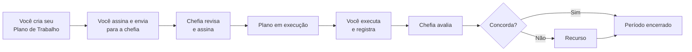
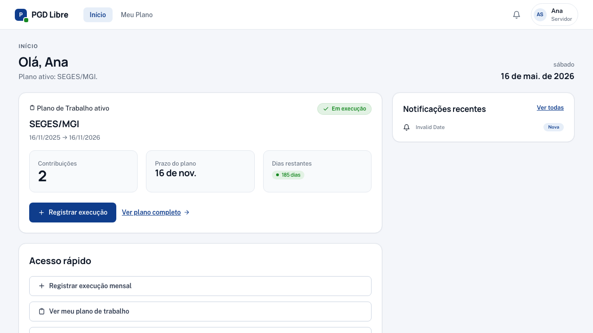
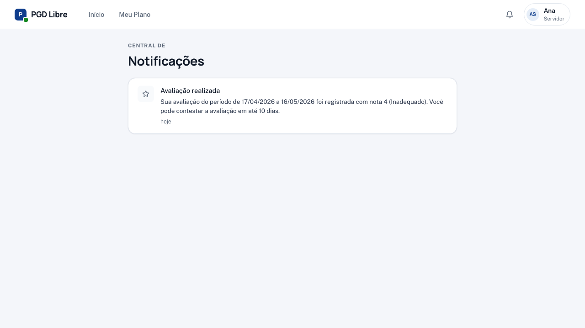

# Visão geral — Servidor

Como servidor no PGD Libre, **você é o autor do seu Plano de Trabalho** — propõe o que vai fazer, e a chefia revisa e assina junto com você. Depois, executa as atividades e registra mensalmente.

## O que você faz no sistema

## Sua tela principal

Ao fazer login, você vê o **Dashboard** com:

- **Aguardando sua ação** — destaque para planos em rascunho ou aguardando sua assinatura
- **Plano de Trabalho ativo** — status, modalidade e dias restantes para o próximo registro
- **Última avaliação** — nota e data da avaliação mais recente
- **Notificações recentes** — prazos, avaliações publicadas, respostas a recursos

Acesse o sino no canto superior para ver todas as notificações:

## Seus prazos

Fique atento a dois prazos principais:

| Prazo | Quando | O que acontece se perder |
|---|---|---|
| **Registro de execução** | Até o último dia do período avaliativo | Período fica sem registro; pode impactar a avaliação |
| **Contestação de avaliação** | 10 dias após a publicação da nota | Perde o direito ao recurso naquele período |

!!! warning "Pílula de urgência"
    Quando faltam 7 dias ou menos para um prazo, o sistema exibe uma pílula colorida no dashboard. **Vermelho** = vencido ou hoje. **Amarelo** = menos de 7 dias. **Verde** = dentro do prazo.

## Guias disponíveis

- [Criar meu Plano de Trabalho](criar-plano.md) — passo a passo do wizard, incluindo clonagem de plano anterior
- [Revisar plano ajustado pela chefia](revisar-plano.md) — o que fazer quando a chefia ajusta e devolve
- [Meu Plano de Trabalho](meu-plano.md) — como entender seu plano, contribuições e estados de pactuação
- [Registrar Execução](registrar-execucao.md) — passo a passo para enviar o registro mensal
- [Minhas Avaliações](avaliacoes.md) — o que cada nota significa e como ver o histórico
- [Contestar uma Avaliação](contestar-avaliacao.md) — como abrir e acompanhar um recurso
- [Referência rápida](referencia-rapida.md) — atalhos e respostas rápidas para o dia a dia
